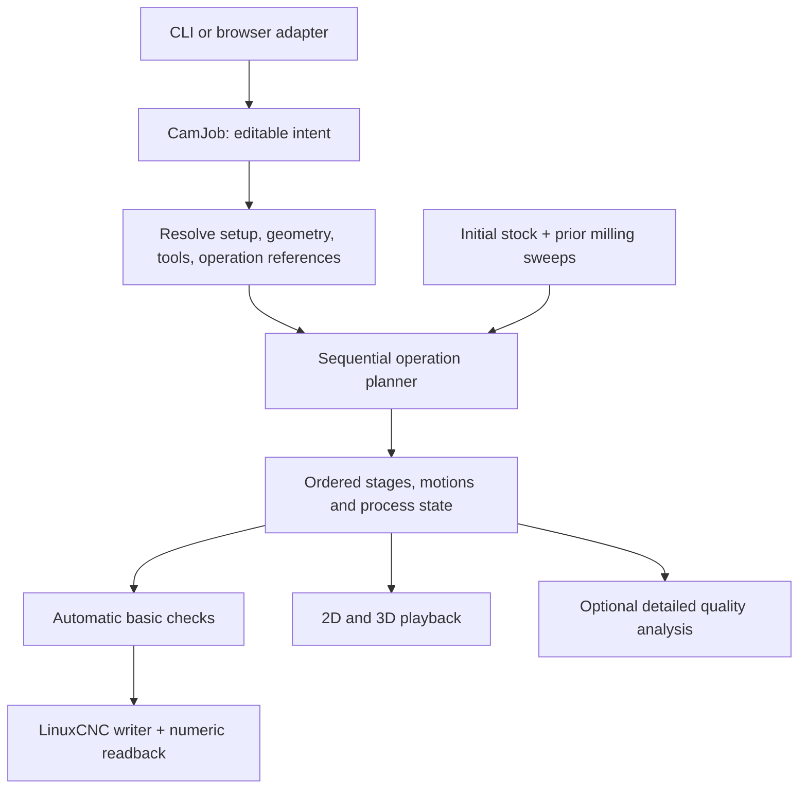

# 2.5D CAM: architecture and implementation handoff

Date: 2026-09-09\
Status: design and implementation plan only; none of the capabilities proposed here are claimed as implemented.\
Baseline inspected: engine 0.7.7, job schema 3, legacy plan schema 1, UI transport `ui-7`.

This document expands the agreed direction into contracts and small implementation slices. It is written so an implementing agent can work through one slice at a time without inventing the machining model. The user requested documentation only at this stage. Do not interpret the existence of this document as a request to begin implementation.

The existing [architecture](architecture.md), [technical design](technical-design.md), [implementation plan](implementation-plan.md), and [web UI plan](web-ui.md) describe the V-carve product and its history. For the proposed expansion, this document replaces their one-operation/two-tool scope and mandatory M5 export gate. Their numerical, geometry, persistence, and machine-contract requirements still apply where compatible. Do not rewrite historical milestone results as if the new design had already shipped.

Reading guide: start with [decisions](#1-decisions-and-scope) and [invariants](#3-invariants), then the [document contract](#5-canonical-document-contract), [coordinates](#6-setup-coordinates-and-height-references), and [planning contract](#8-planning-and-execution-contracts). Operation algorithms are in [Profile](#10-milling-profile-algorithm), [Face](#11-facing-algorithm), [Knife](#12-passive-drag-knife-algorithm), and [Flat V-carve](#13-flat-v-carve-compatibility-and-later-rest-machining). Use the [implementation slices](#18-implementation-slices-and-stop-conditions) and [fixture matrix](#19-acceptance-fixtures-and-validation-commands) as the work checklist.

## 1. Decisions and scope

### 1.1 Product decisions

1. A job contains one setup and an ordered list of operations.
2. First-class operations are `flat_vcarve`, `face`, `profile`, and `drag_knife`.
3. Keep Flat V-carve as one user-facing operation with endmill and V-bit execution stages. General pocketing and independently editable V-carve rest stages are later work.
4. Stock has physical XY dimensions, thickness, and a selectable work origin. Artwork placement is independent of work zero.
5. Profile includes depth passes, inside/outside/on compensation, tabs, radial finishing allowance and pass, and entry/exit controls.
6. Face starts with rectangular coverage, including stock-wide facing without an SVG, and explicit extensions.
7. The knife is a **passive swiveling knife on the existing XYZ/LinuxCNC router**, as confirmed by the user. No commanded A/C axis is involved.
8. Simulation is the ordinary inspection workflow. Detailed stock-quality verification becomes an optional advanced analysis. Automatic input, motion, completeness, and output checks remain.
9. Rust owns geometry, planning, machining constraints, stock queries used by planning, and output. TypeScript owns editing and visual simulation.
10. Preserve the native and WebAssembly products. Each released feature must work through both adapters.

### 1.2 Initial release boundary

Include one rectangular stock setup, SVG artwork, rectangular facing, closed-contour milling profiles, passive knife paths, existing flat V-carving, a shared timeline, and ordered LinuxCNC export. Add open-chain import before declaring knife support complete.

Defer general pockets, multiple setups/work offsets in one job, arbitrary 3D stock, rotary/tangential knives, native G2/G3 output, adaptive clearing, automatic tool grouping across operations, CAD drawing tools beyond the face rectangle, fixture/holder models, and physical detached-part simulation. A surfacing cutter may initially use the existing flat-bottom cutter envelope with explicit entry capability; an insert face-mill catalogue is not necessary.

These are scope choices, not permanent restrictions on the model.

### 1.3 Implementation method

- Implement in the order in section 18. Finish the acceptance criteria of a slice before starting the next.
- Introduce the new orchestration around the existing V-carve engine before extracting its algorithms.
- Use tagged enums and concrete structs. Do not introduce a plugin registry, trait hierarchy for every setting, database, or additional service.
- Keep missing editable values distinct from invalid supplied values. Never invent feeds, spindle speeds, machine positions, tool lengths, or knife offsets.
- Preserve exact supplied zeroes where meaningful, including zero finishing allowance and zero lead length when the lead is disabled.
- New unsupported combinations must produce a specific diagnostic. Do not silently substitute a plunge for a ramp, remove tabs, choose a different contour, or change an operation's order.
- Numerical-budget exhaustion means incomplete/inconclusive generation, not successful truncation.
- Example dimensions in section 19 are synthetic test data, not cutting recommendations.

## 2. Existing implementation: read this before editing

Paths below are relative to the repository root. Rows describe the inspected code, not the proposed model.

| Area | Existing files | Current assumption and required response |
| --- | --- | --- |
| Portable job | `flat-v-carve/crates/cam-core/src/job.rs` | `Job.operation` is singular, selection is global, exactly two tools are required, and stock has thickness only. Add a new canonical model with migration. |
| SVG | `crates/cam-core/src/svg/{mod,path,style}.rs` under `flat-v-carve/` | Import yields filled closed regions; subpaths must close. Preserve regions while adding independently addressable contours/chains. |
| Endmill clearing | `flat-v-carve/crates/cam-core/src/pocket/` | `Context` needs a V-bit angle and depth-dependent target. This is V-carve roughing, not a generic vertical-wall pocket. |
| V-bit planning | `flat-v-carve/crates/cam-core/src/vcarve/` | `CombinedPlan` embeds an `EndmillPlan`, one transition, and separate V-bit motions. Wrap this initially. |
| Motion | `flat-v-carve/crates/cam-core/src/motion.rs` | Linear XYZ moves already carry tool and operation IDs. Cutting is currently inferred from `MotionKind`. New semantics must separate feed motion from material effects. |
| Stock | `flat-v-carve/crates/cam-core/src/stock.rs` and `stock/` | Queries are organized around endmill/V-bit sweeps. Generalize composition over a sequence; keep analytical primitives. |
| Post | `flat-v-carve/crates/cam-core/src/post/{mod,profile,reader}.rs` | Two stages/tool mappings, required RPM, M5-gated export, strict numeric readback. All need the new execution contract. |
| Retained plans | `flat-v-carve/crates/cam-core/src/vcarve/retained.rs` | Private receipts bind service-owned plans. Preserve that trust boundary when generalizing. |
| Tool library | `flat-v-carve/crates/cam-core/src/tool_library.rs`, `cam-storage/src/tool_library.rs` | Endmill/V-bit slots and five cutting values. Apply presets to operation assignments, and add typed knife geometry/settings. |
| Shared DTOs | `flat-v-carve/crates/cam-service/src/` | `Stage` is `Endmill` or `Combined`. Replace this with operation scope and generic execution stages. |
| Native execution | `flat-v-carve/crates/cam-server/src/{planning,planning_worker,artifact,motion_preview,exporting}.rs` | Retained files, bounded previews, leases and cancellation are reusable. |
| Browser execution | `flat-v-carve/crates/cam-wasm/src/lib.rs`, `flat-v-carve/web/src/service/wasm/` | Admission, ledger and worker types repeat stage assumptions. Change them with the service DTOs. |
| UI state | `flat-v-carve/web/src/state/{draft,workspace,computation,profile,library}.ts` | Drafts, undo, recovery and current-plan identity need operation IDs and new setup settings. |
| UI flow | `flat-v-carve/web/src/App.tsx`, `components/SetupEditors.tsx` | Six-step V-carve workflow. Replace composition after the new core is usable. |
| Simulation | `flat-v-carve/web/src/sim/{setup,engine,protocol,store,session,renderer}.ts` | Stock XY is inferred; ownership/stats assume two cutter roles; tool indices are currently `Uint8`. Generalize explicitly. |

Do not change dependency/toolchain versions merely to implement this design. Use the pinned versions unless an identified requirement cannot be met with them.

## 3. Invariants

These are implementation requirements and should become meaningful regression assertions.

1. All planned motion coordinates use setup coordinates: mm, right-handed XY, Z up, original stock top at Z=0.
2. Changing work zero changes the output coordinate transform, not artwork-to-stock placement or planned removal.
3. Facing does not change the setup coordinate system or silently reset Z zero.
4. An operation may depend only on enabled preceding operations. Forward references and cycles are invalid.
5. Toolpath order, tool changes, and process-state changes are part of the plan identity.
6. Rest material is derived from actual recorded removal, including entries and cutting links. Intended target geometry is not evidence of removal.
7. Display heightfields are never authoritative input to Rust planning or export eligibility.
8. Every tab affects every applicable rough and finish pass. A finishing pass cannot erase a tab.
9. A knife's offset is the distance from pivot to cutting tip. It is not a milling radius or an XY machine datum offset.
10. A passive knife has no commanded orientation axis. Lifting it into air does not establish a new orientation.
11. A feed move need not remove stock, and a spindle-off move need not be a rapid. Knife alignment/swivels must retain this distinction.
12. Export uses the exact current ordered plan and setup/profile transform. It cannot regain eligibility by editing a cached status or recomputing a public hash.
13. Budget limits, smoothing and rounding cannot remove semantic breakpoints such as tab rises, depth changes, stage boundaries, or knife swivels.
14. Editing disabled operations may leave machining results reusable; enabling them must invalidate the affected sequence. Initial implementation may conservatively replan the entire job.
15. A visual preview, generated toolpath, basic-check result and detailed-quality result are separate states.

## 4. Proposed modules and ownership

Keep the existing crates. Add focused modules in `cam-core` as each slice needs them:

```text
cam-core/src/
  project.rs             # CamJob schema 4, editable setup/tools/operations
  project/migrate.rs     # v1/v2/v3 -> canonical schema 4
  setup.rs               # stock bounds, height references, output transform
  contours.rs            # contour catalogue, selection resolution, anchors
  operations/mod.rs      # typed operation settings + dispatcher
  operations/flat_vcarve.rs # compatibility adapter to existing planners
  operations/face.rs
  operations/profile.rs
  operations/profile/tabs.rs
  operations/drag_knife.rs
  toolpath.rs            # candidate paths, intent, mandatory breakpoints
  linking.rs             # shared conservative entry/retract/link construction
  sequence.rs            # ordered plan, stage assembly, process events
  stock/history.rs       # prefix stock queries using recorded milling sweeps
  checks.rs              # basic plan and operation-specific motion checks
  post/                  # existing writer/reader, extended to sequence plans
```

`project::CamJob` is the new public canonical model. Initially leave `job::Job` as the legacy schema-3 model used by the existing V-carve code. Name imports `LegacyJob` in new code so it is impossible to mistake one for the other. Do not make new Profile/Face planners construct fake legacy jobs with dummy V-bits.

Public loading/importing services return `CamJob`; the compatibility adapter alone turns a Flat V-carve operation into a `LegacyJob`. Retire legacy types only in a later cleanup after the adapter is no longer needed. Tests of the old algorithms can continue using legacy fixtures.



No TypeScript implementation of offsets, tab geometry, blade compensation, lead feasibility, or rest-stock proofs is permitted. The existing TypeScript simulation may keep its visual milling sweep implementation, with cross-check fixtures against Rust.

## 5. Canonical document contract

### 5.1 Versioning

Use job schema **4** for the first operation-based document. New plan envelopes use `artifact_kind: "operation_plan"`, schema **1**; this is a different artifact kind from the old endmill/combined plans. Use UI transport **`ui-8`** for the incompatible operation DTOs. The generic LinuxCNC profile becomes schema **2**. If those identifiers have been used by intervening work, use the next available version and update all boundaries together.

Code blocks here describe contracts; they are not copy-paste implementations. Derive strict Serde/Zod structures and test the actual serialized shapes.

```text
CamJob
  schema_version: 4
  name: String
  source: Option<SourceSnapshot>          # None is valid for face-only jobs
  import: ImportOptions                  # keep existing placement semantics
  setup: SetupSettings
  tools: Vec<JobTool>                    # stable IDs; no fixed role/count of two
  operations: Vec<Operation>             # this array defines execution order
  tolerances: PlanningTolerances
  legacy_machine_profile: Option<...>    # preserved old descriptive metadata

Operation
  id: OperationId
  name: String
  enabled: bool
  settings: OperationSettings            # tagged enum, no irrelevant fields

OperationSettings
  FlatVcarve(FlatVcarveSettings)
  Face(FaceSettings)
  Profile(ProfileSettings)
  DragKnife(DragKnifeSettings)
```

Keep a single embedded SVG source for now; a source collection is unnecessary for this release. An operation's selection belongs in its settings. There is no second global machining selection. Viewport selection/visibility is UI state and does not change machining until assigned to an operation.

### 5.2 Editable versus resolved values

Editable numeric fields may be unset (`Option`). Validate supplied values immediately, but allow incomplete jobs to save. A separate resolver produces fully populated planning inputs and lists missing fields by operation ID. Do not scatter `unwrap()` through planners or use zero as a missing-value sentinel.

```text
resolve_operation(job, operation_id, preceding_outputs)
    -> Result<ResolvedOperation, Vec<LocatedDiagnostic>>

ResolvedOperation
  validated tool geometry and cutting parameters
  concrete selected geometry
  top_z / bottom_z in setup coordinates
  positive, resolved tolerances and resource limits
  explicit allowed-cut / protected geometry
  resolved dependency IDs
```

Do not require facing fields for a profile or V-bit fields for a knife. Disabled incomplete operations are saveable and excluded from planning readiness. Structural errors such as duplicate IDs remain document errors even in disabled operations.

### 5.3 Tools and operation assignments

Separate cutter geometry/capability from cutting parameters:

```text
JobTool
  id, name
  geometry: Option<Endmill | Vbit | DragKnife>
  capabilities: geometry-appropriate entry capabilities

MillingAssignment
  tool_id
  spindle_rpm
  spindle_direction: Option<Clockwise | Counterclockwise>
  cutting_feed_mm_min
  plunge_feed_mm_min
  max_stepdown_mm
  stepover_mm                         # required only where used

KnifeAssignment
  tool_id
  cutting_feed_mm_min
  plunge_feed_mm_min
  swivel_feed_mm_min
  max_stepdown_mm
```

Operations may use the same job tool with different parameters. Flat V-carve has two milling assignments, one per internal stage. Keep one authoritative plunge-capability value when migrating the old duplicated slot/dimensions representation; reject conflicting old values with the existing validator before migration.

New Face/Profile planning requires an explicit spindle direction. The nullable direction exists to preserve old jobs that stored it only in a separately saved machine profile; section 14.4 defines how that compatibility case is resolved. Never make Profile traversal depend on an output-only value that can change without invalidating its plan.

The tool library still stores named geometry and reusable cutting presets. Applying a preset copies values into the selected operation assignment. Editing the library later never changes a saved job. A knife geometry contains `blade_offset_mm` and `max_cut_depth_mm`; spindle RPM, stepover, and conical geometry do not apply to it. Add typed knife presets when knife support ships.

### 5.4 IDs and references

Use stable string IDs for operations, job tools, source components and contours. IDs are not array positions. Renaming or reordering an operation preserves its ID. Duplicating it creates a new ID and copies settings, not derived plans.

Unknown geometry/tool/dependency references produce located errors. Deleting an operation referenced by a later height reference must leave an explicit unresolved reference until corrected; do not silently switch that height to stock top.

## 6. Setup, coordinates and height references

### 6.1 Stock and artwork

```text
SetupSettings
  stock:
    thickness_mm: Option<f64>
    xy: Option<RectStockXY>
  work_zero:
    xy: SetupOrigin | StockAnchor | CustomPoint
    z: StockTop | StockBottom
  clearance_above_stock_mm: Option<f64>
  start_xy_mm: Option<Point>              # in setup coordinates

RectStockXY
  min_x_mm, min_y_mm, width_mm, length_mm

StockAnchor
  x_fraction: 0 | 0.5 | 1
  y_fraction: 0 | 0.5 | 1
```

The XY rectangle can start anywhere in setup coordinates. Internal stock top is always 0 and bottom is `-thickness_mm`. `SetupOrigin` means XY=(0,0) even if stock XY is still unset; it preserves legacy coordinates. `StockAnchor` resolves against physical stock dimensions.

Preserve the existing artwork formula:

```text
setup_XY = scale * rotate(page_XY - import.placement.origin_mm)
```

Do not reinterpret the old `origin_mm` as work zero. A future UI may present ordinary translation fields by converting to/from this formula in one place, with round-trip tests.

### 6.2 Output transform

Let the selected work-zero point in setup coordinates be `(wx, wy, wz)`:

```text
output_x = setup_x - wx
output_y = setup_y - wy
output_z = setup_z - wz

StockTop:    wz = 0
StockBottom: wz = -stock_thickness
```

Example: stock is 100 x 60 x 8 mm at XY=(0,0), and work zero is stock center/bottom. A planned point (10,20,-2) exports as (-40,-10,6). Clearance Z=5 exports as Z=13. The artwork and removal stay in the same place if work zero changes.

Apply this transform once before output formatting, and invert it after numeric readback. The machine profile's known startup/M6 return positions are already expressed in the selected controller work frame; do not subtract work zero from them again. Changing work zero invalidates output and requires the setup-dependent machine assumptions to remain explicit.

Only one authority selects Z datum: `setup.work_zero`. Profile schema 2 must not also carry a competing `z_datum`. Preserve existing macro-managed/tool-table TLO behavior and G54-family selection. Work-zero selection describes the intended setup; it does not set offsets on a connected machine.

### 6.3 Heights

Represent each operation top/bottom height as a reference plus signed Z offset, positive upward:

```text
HeightRef
  reference: StockTop | StockBottom | OperationTop | FaceResult(operation_id)
  offset_mm: f64
```

`OperationTop` is legal only for a bottom height, and resolves to that operation's already resolved top. `FaceResult` can reference only an enabled preceding face operation. A face result publishes a plane and its covered region, not a claim that the whole stock has that height.

Example: face top=stock top, bottom=stock top minus 0.5. Profile/carve top=`FaceResult(face_1)`, bottom=operation top minus 2.0. These resolve to top=-0.5 and bottom=-2.5. The stock bottom remains -8; the output transform is unchanged.

Require the affected geometry to lie within the referenced face's established planar coverage. Crossing a partially faced boundary must produce `SURFACE_REFERENCE_OUTSIDE_COVERAGE`. Initial Flat V-carve support after facing is limited to a uniformly faced top over its selected target, with any entry/cutter interaction beyond that area independently checked.

Validate `top_z > bottom_z` for positive-depth operations. Generate layers as `max(bottom_z, top_z - n*stepdown)` with the final depth assigned exactly. Depth is operation-local; do not use `Motion::depth()` as a substitute for depth below an operation's top.

### 6.4 Through cutting

Profiles and knives may set `through_cut_allowance_mm >= 0`. This is permission to travel below material bottom by at most that amount; it does not move the bottom or extend stock thickness. Without it, lower cutting Z cannot be below stock bottom.

Use `bottom = StockBottom + offset(-allowance)` for a through cut. Validate the requested bottom against the explicit allowance and tool capability. Flat V-carve keeps its existing no-through-cut target constraint initially. Material removal is clipped at stock bottom; below-bottom tool travel remains visible in playback.

## 7. Geometry selections and anchors

### 7.1 Keep regions and contours distinct

The importer must expose a catalogue before unioning the selections of an operation:

```text
GeometryCatalogue
  filled_components: existing normalized regions with outer/hole relationships
  contours: closed boundary chains with source and component lineage
  open_chains: explicit centerlines, added with the knife milestone

Contour
  id, source_id, component_id
  closed
  vertices in setup coordinates
  source-space parameterization and geometry fingerprint
  role: outer | hole | open
  parent_contour_id, when applicable
```

Flat V-carve resolves component selection into a filled union as today. Profile and knife resolve contour IDs; they must not erase internal selected boundaries by unioning all chosen shapes first. Face rectangles are operation geometry and require no source SVG.

For Profile, label compensation explicitly as inside/outside/on **each selected closed contour**. Do not infer compensation from winding alone. Provide a UI helper that chooses outside for outer edges and inside for hole edges, but store the resulting explicit side per contour. Show arrows and the compensated path.

Normalize a canonical geometric orientation for signed-offset calculations and keep traversal direction separate. Reversing a traversal must not change which side is retained. For open milling contours, use left/right/on relative to stored chain direction when that feature is introduced; the first milling release may reject open selections.

### 7.2 Manual anchors

```text
ContourAnchor
  contour_id
  source_geometry_fingerprint
  fraction_along_source_contour: [0,1)
```

Use anchors for starts and tabs. Parameterization is independent of generated offset vertices and execution direction. Physical tab width and lead lengths remain mm in setup space when artwork scale changes.

Placement edits transform anchors with their contour and recheck fit. If SVG edits change topology or the source fingerprint, mark anchors unresolved; no nearest-contour guessing. An implementing agent may initially require manual reattachment after any source-geometry change. This is preferable to an apparently valid tab on the wrong edge.

### 7.3 Open-chain import

Add a separate contour/centerline import mode. Preserve source subpath order and do not implicitly close endpoints. Ignore stroke width only when explicitly treating the stroke as a centerline; make that interpretation visible. Do not weaken the existing fill importer or turn a stroked outline into two parallel knife cuts by accident. Text, clones and unsupported SVG effects retain existing diagnostics.

Bound approximation error after placement. Resource limits and topology diagnostics apply to open chains too. Near-zero segments may be removed only within a declared budget and without deleting corners needed for knife orientation.

## 8. Planning and execution contracts

### 8.1 Public service flow

Use one core flow for CLI, HTTP and WASM:

```text
load_or_migrate_job(bytes) -> CamJob
inspect_job(CamJob) -> geometry catalogue + editing diagnostics
resolve_job(CamJob, scope) -> resolved setup + ordered operations
plan_job(resolved_job, limits) -> OperationPlan
check_plan(OperationPlan) -> BasicCheckReport
export_plan(checked_plan, machine_profile, layout) -> ExportBundle
analyze_quality(checked_plan, options) -> QualityReport       # optional
```

`scope` initially supports all enabled operations or a prefix ending at an operation ID. Prefix planning allows inspection of stock after an operation without implying it can be executed alone. Do not add arbitrary stock-dependent subset export in the initial implementation.

An operation planner receives its resolved geometry/settings, immutable setup, preceding stock view, and resource budget. It returns stages, diagnostics, and named outputs such as a face plane. It does not write files, emit G-code, mutate earlier results, or look up UI state.

### 8.2 Minimal executable plan

```text
OperationPlan
  artifact_kind, schema_version, engine_version
  job_snapshot
  input_fingerprint, execution_fingerprint
  operation_results: Vec<OperationResult>
  stages: Vec<ExecutionStage>
  motions: Vec<PlannedMotion>
  execution: Vec<ExecutionItem>
  preparation_requirements               # unresolved legacy process/profile fields
  generation_diagnostics

OperationResult
  operation_id
  generation_status: complete | empty | incomplete | inconclusive
  stage_ids
  stock_before_id, stock_after_id
  named_outputs                         # e.g. face plane + covered region

ExecutionStage
  stage_id, operation_id, tool_id
  role: face | profile_rough | profile_finish | vcarve_rough | vcarve_finish | knife
  motion_range: [first, end)             # end-exclusive, global motion indices
  entry_position, exit_position

ExecutionItem
  ToolChange(tool_id)
  SetProcessIntent(process)
  RunStage(stage_id)

ProcessIntent
  spindle: Off | Milling(rpm, optional_direction)
  coolant: Off | UseMachineProfile
  path_control: UseMachineProfile | ExactPath

PreparedProcessState                     # export preparation; no unresolved fields
  spindle: Off | On(rpm, direction)
  coolant: Off | Flood | Mist
  path_control: ExactPath | Blend(tolerance, optional_merge_tolerance)

PlannedMotion
  id, operation_id, stage_id, tool_id
  contour_id: optional
  pass_id, layer
  interpolation: rapid | linear_feed
  purpose: clearance | approach | entry | rough | finish | tab_transition |
           lead_in | lead_out | knife_cut | knife_align | knife_swivel
  effect: none | milling_sweep | knife_trace
  start, end: Position
  feed_mm_min: optional                 # required for every linear_feed
```

This is a new representation; old `motion::Motion` can remain inside the legacy adapter. When adapting, reproduce the old writer's actual interpolation for each kind rather than assuming every `Approach` is a rapid. Keep the stock-effect semantics used by the old engine.

Store motions once, with ranges referring into the array. Require every motion to belong to exactly one stage and every nonempty stage to be executed exactly once. Validate stage order and tool/process state independently of human-readable labels. Layer numbers are local to an operation/pass; they are not globally unique IDs.

`ProcessIntent` permits the legacy unresolved-direction case and defers the selected milling path-control mode to export preparation. A `PreparedExecution` binds the immutable plan to a profile and fully resolved process state; only that form can produce G-code. Fingerprint the resolved state with the output. No null direction or `UseMachineProfile` marker may reach the writer. Knife intent always resolves to spindle off and exact path in this release.

### 8.3 Assembly and transitions

1. Resolve operations in document order, ignoring disabled ones.
2. Start from original stock and an empty removal history.
3. Plan an operation against its input stock view.
4. Run basic checks, record its actual milling sweeps, and publish named outputs only if their prerequisites are established.
5. Append its ordered stages and process changes. Carry the actual final motion position into ordinary same-tool linking.
6. Stop dependent planning if a required previous result is incomplete. Retain the partial plan for inspection, with export unavailable for that sequence.
7. End each independently postable stage at clearance. Use deterministic ordering within the stage; nearest-path optimization must respect nesting and explicit start constraints.

At a tool change, the postprocessor owns the bridge from the declared M6 return position to the next stage's entry. Preserve the current machine contract rather than fabricating a continuous XYZ line through an unknown macro. Setup-plan simulation displays a tool-change boundary; an emitted-program preview may additionally show the known post-generated bridges. Macro-internal motion remains outside the model.

Initially retract to the global clearance for disconnected contours and operation transitions. Do not generalize the existing stay-down optimization until the new stock checks can establish each link. A later optimization must preserve the same observable order and material result.

### 8.4 Geometry-to-motion order

The following order avoids tabs or corners being erased by downstream work:

```text
selection -> compensated candidate geometry -> contour/pass order
          -> starts + leads + depth schedule
          -> tab or knife semantic construction
          -> tolerance-bounded linearization
          -> feed/retract/link assembly
          -> whole-motion checks -> recorded execution
```

Keep mandatory breakpoints while simplifying: tab top/bottom transitions, entry endpoints, pass changes, lead tangencies, knife corner endpoints, and all process/stage boundaries. Any later simplification must recheck the swept geometry and cannot bridge across a semantic boundary merely because the points are close.

For an arc radius `r` and permitted chord error `e`, bound subdivision angle by `2*acos(1-e/r)` when `0 < e < r`; handle zero/small radius and larger error limits explicitly. Allocate error across import, offset, linearization and formatting instead of independently spending the full tolerance at every stage. Never relax a requested tolerance after a budget failure.

## 9. Stock history and dependencies

### 9.1 Authoritative stock

For supported flat-bottom/conical milling, a top-accessible height surface is sufficient. Compose the existing sweep queries over an ordered prefix:

```text
StockHistory
  initial rectangular prism (or explicit legacy unknown XY)
  ordered milling sweep batches, each with tool geometry and stage identity

StockView(prefix)
  material_top_at(xy)
  removal_at_slice(z)
  can_traverse_without_cutting(tool, motion)
  established_planar_region(z)
```

These are conceptual methods; reuse existing analytical queries and spatial indices instead of building a voxel engine. For a point in the stock rectangle, top height is the lowest surface reached by the preceding valid milling sweeps, clamped at stock bottom. Outside the stock rectangle there is no material. Preserve conservative bounds where the existing query is bounded rather than exact.

The history records sweep batches plus prefix identities, not a full duplicated mesh for every operation. Cache spatial indices and selected slices on demand. Do not union all possible depths eagerly. Adding operations must not multiply the flower job's memory by the number of full copies of its stock model.

Knife traces do not imply that stock has been milled away. Initially they leave this material-height model unchanged and add a separate cutting trace. Do not use a knife operation as evidence of cleared space for subsequent milling or simulate detached parts falling away.

### 9.2 Dependencies and invalidation

Execution order always contributes to the sequence identity even when two operations appear geometrically disjoint. Named height references and rest machining add explicit dependencies.

Initial implementation: replan the entire enabled sequence after a machining edit. Correct coarse invalidation is preferable to incorrect partial reuse. Later, use a prefix hash:

```text
prefix[0] = hash(initial stock + artwork placement + geometry + planning settings)
prefix[i+1] = hash(prefix[i] + operation[i] + used tool snapshot + actual execution)
```

Separate the machining fingerprint from output identity. Work zero/profile/output precision changes invalidate export; they need not regenerate setup-coordinate motions. Camera, visibility and play position changes invalidate neither. An operation edit invalidates that operation and all following stock-dependent results. If the first implementation invalidates all following results regardless of overlap, that is acceptable.

### 9.3 Legacy stock bounds

Old jobs have no physical XY dimensions. Migration must not claim that a rectangle derived from artwork is measured stock. Keep `setup.stock.xy = null` until supplied or set with the fit action.

For compatibility, a legacy Flat V-carve-only job may continue through its old unbounded-XY assumptions. Its simulator may show the existing inferred display rectangle, explicitly identified as inferred. New Face/Profile/Knife operations require physical XY stock. Adding those operations cannot quietly convert inferred bounds into physical bounds.

## 10. Milling profile algorithm

### 10.1 Settings

| Setting | Contract |
| --- | --- |
| Contours | Explicit contour IDs and per-contour inside/outside/on side. |
| Tool/cutting | One milling assignment; no V-bit required. |
| Heights | Top/bottom references, stepdown, optional through allowance. |
| Direction | Climb or conventional relative to cutter rotation and retained side. On-contour uses an explicit traversal direction because there is no retained side. |
| Order | Inner-before-outer default; explicit ordered contours are allowed. |
| Start | Automatic deterministic start or `ContourAnchor`. |
| Finish | Enabled flag, nonnegative radial allowance, optional finishing feed; depth-stepped finish initially. |
| Entry | Plunge or contour ramp with angle/feed and explicit ramp capability. |
| Lead-in/out | None, tangent line(length), or tangent arc(radius, sweep angle), with feeds. |
| Tabs | Enabled, width, height, rectangular/ramped shape, placement mode and anchors. |

MVP finishing is one pass at the final radial offset, performed in depth increments. Multiple radial finish passes, separate axial allowance, spring passes and full-height wall finishing are optional later additions. Do not expose an unimplemented toggle.

### 10.2 Offset and depth construction

1. Resolve and normalize each contour, its containment and retained side.
2. Obtain cutter radius `R` and radial finish allowance `a`.
3. Rough centerline offset magnitude is `R+a`; final centerline magnitude is `R`, on the explicitly selected side. On-contour is zero offset and cannot use radial allowance in the first release.
4. Use the existing polygon-offset adapter for closed offsets. Retain provenance when an offset splits. Vanishing or ambiguous selected contours produce diagnostics; do not omit them and report success.
5. Check the cutter sweep against the protected side and other retained contours, including islands. If the cutter cannot represent an inside corner, show the actual reachable shape/residual rather than shrinking the tool or gouging the part.
6. Generate depth levels, ending exactly at bottom and respecting maximum stepdown.
7. Prefer completing the rough and finish work of an inner contour before an enclosing final cutout. No tool optimization may pull that cutout earlier.
8. Apply tab and lead constraints to all paths, then generate recorded motions and check their actual sweeps.

For positive allowance, cutting the rough slot and moving to the final offset can increase lateral engagement. Do not assume the finish pass is an air move. Check its entry and use its cutting feed. The tool's actual flute reach is checked against material still present around its shank, not merely `bottom-top` after facing.

### 10.3 Tabs: geometry and Z envelope

Define tab height as **remaining material above stock bottom**, independent of through allowance:

```text
tab_top_z = -stock_thickness_mm + tab_height_mm
```

Example: 8 mm stock, 2 mm tab, 0.2 mm through allowance gives ordinary bottom=-8.2 and tab top=-6.0. Calculating tab top as `cut_bottom + tab_height` would incorrectly leave a 1.8 mm bridge.

Tab width describes a minimum full-height bridge along the source contour. Build a tab footprint spanning that contour interval across the complete rough-and-finish cut corridor. Its protected material occupies stock bottom through tab top. A cutter center must stay at or above tab top whenever its footprint intersects this protected volume.

Do not simply raise Z for `width` mm along the centerline. The tool can cut under both ends of the intended tab. On a straight edge, the center interval needing the tab-top restriction is widened by the cutter radius at both ends; use dilation of the protected footprint for the general case. Include numerical margins.

For each candidate pass, compute the Z lower bound imposed by tabs, then use:

```text
commanded_z(s) = max(pass_z(s), tab_required_z(s))
```

Split motions exactly at envelope breakpoints. A rectangular tab uses feed-controlled vertical rise/lower moves at legal positions. A ramped tab adds explicit shoulder lengths outside the minimum full-height bridge; those shoulders must also satisfy the protected-volume test. The first implementation may restrict tabs to sufficiently long straight contour spans, returning a located error for a tab too near a corner.

Automatic placement distributes a count or spacing along eligible spans, excluding starts/leads/corners and already occupied intervals. If the requested count cannot fit, report the deficit; do not silently return fewer tabs. Manual placement takes precedence, and overlapping tab footprints merge conservatively. Store resolved placements in the plan so the preview shows exactly what was generated.

Reject nonsensical heights/widths and tab placements that consume the whole contour or make the selected entry impossible. Passes above tab top are unchanged. Deep rough and all finish passes retain the tabs. Tabs on non-through profiles are permitted if their height intersects the cut; otherwise show an ineffectual-tab diagnostic.

### 10.4 Entry and exit

Treat these separately:

- **Depth entry:** plunge or a linear ramp along the compensated contour.
- **Horizontal lead:** line or arc blending into/out of that contour.
- **Clearance link:** travel between disconnected cuts.

For a depth drop `dz` and maximum ramp angle `alpha`, the ramp requires horizontal path length at least `abs(dz)/tan(alpha)`. Initially require it to fit on a supported continuous path section without traversing a tab; do not wrap over a tab or choose a helix automatically. Multi-revolution contour ramps can be a later extension.

Choose a start before constructing the lead, then check the full lead cutter sweep against retained geometry and tab volumes. Do not place a lead simply on the closest geometric side of the contour. Arc leads must have correct tangent continuity and stay within the allowed cut domain. Lead-out cannot cut through the newly finished retained wall.

If a configured lead does not fit, return `PROFILE_LEAD_NO_SPACE` with the affected contour and candidate location. The user may shorten it, choose another start, or select another strategy. Do not silently shorten or disable it.

## 11. Facing algorithm

### 11.1 Settings and area meaning

`area` is `entire_stock` or an explicit setup-coordinate rectangle. An imported closed region is later work. Store four nonnegative area margins and separate nonnegative entry/exit overrun distances along the pass direction. Also store top/bottom heights, stepdown, stepover, pass angle, zigzag/one-way pattern, and milling assignment.

The selected rectangle is a **coverage request**, not a wall that clips the cutter. Face milling may remove adjacent material as the cutter overlaps its edges. The plan must expose both the requested coverage and the actual allowed sweep envelope; the preview shows this overhang before generation/export. Do not claim that all unselected material immediately beside a partial face remains intact. A strict protected-boundary face mode is outside the initial scope.

Derive the maximum allowed envelope from settings, independently of generated paths: expand the requested coverage in both scan directions by the maximum entry/exit overrun, then dilate by the cutter radius plus the numerical reserve. The actual sweep must fit inside this envelope. A buggy candidate path cannot authorize itself by expanding the allowed envelope to match its own motions.

Area margins expand the desired coverage rectangle. Travel overrun adds approach/exit travel, not additional face-depth semantics. Neither changes physical stock bounds. Cutting outside stock is air; cutting outside the requested coverage but inside the declared sweep envelope is part of this face operation.

### 11.2 Deterministic raster construction

1. Expand the rectangle by its per-side margins.
2. Transform the coverage polygon into scan coordinates using the chosen pass angle. For a rotated rectangle, use its polygon intersections; do not replace it with a larger bounding rectangle and claim the same area.
3. Generate parallel rows with spacing at most the chosen stepover, which must be positive and no greater than tool diameter minus the numerical coverage reserve.
4. Include first/last rows and extend row endpoints enough that the union of cutter sweeps covers the rectangle, including corners. Add requested travel overrun after establishing coverage.
5. Check the candidate pattern against the settings-derived allowed envelope and show the actual swept region in the 2D preview. Reject a requested explicit containment constraint the initial face operation cannot satisfy.
6. Repeat the pattern at each depth layer, ending exactly at bottom.
7. For one-way cutting, retract between rows. For zigzag, a cutting-height cross-row link is allowed only as a checked intended cut within this layer's allowed envelope, or a proved air move. Otherwise retract.
8. Establish planar coverage from the actual final-depth sweeps intersected with original material. Compare against the requested stock-intersecting area and report missed strips.

A first implementation may support only 0/90-degree passes while the scan-polygon helper is introduced, but do not claim arbitrary angle support before the rotated-area fixture passes. Use an endmill/flat-bottom tool that matches the cutter envelope; tool entry capability is independent of its flat shape.

If the entry cutter footprint is wholly outside stock, descent there does not require plunging into material. For a partial interior face with no such entry, require a supported plunge/ramp and its feed. Being outside the requested face rectangle is not equivalent to being outside stock.

Publish `FaceResult { z, covered_region, source_operation_id, execution_fingerprint }` only for established flat coverage. It is not a global update to stock-top Z.

## 12. Passive drag-knife algorithm

### 12.1 Geometry and state

The programmed XY point is the blade holder's pivot. Programmed Z is the cutting tip's height under the tool-length contract. The visible blade tip in XY is offset from that pivot.

For an ideal no-slip blade on a smooth desired tip path `p(s)`, let `t(s)` be its unit forward tangent and `d` the blade offset. Then the candidate holder path is:

```text
q(s) = p(s) + d*t(s)
```

This is a project derivation of the ideal drag geometry. It is not a guarantee of physical blade tracking. It shows why adding a constant X/Y offset or milling-radius compensation is incorrect.

At a sharp corner `p`, incoming/outgoing tangents differ. The ideal swivel moves the holder around a radius-`d` arc centered on `p`, from `p+d*t_in` to `p+d*t_out`, while the tip remains approximately at the corner. Use signed turn angle and explicitly handle concave corners, tiny segments and near-180-degree reversals. An ambiguous reversal may be rejected in the first release rather than choosing an arbitrary swivel direction.

The blade must retain some material engagement during passive swivels; the manufacturer's/CAM references describe using a shallower swivel depth rather than lifting fully clear. Blade offset, swivel depth and corner behavior are documented by [Vectric](https://docs.vectric.com/docs/V12.0/AlphaCAM/ENU/Help/form/drag-knife-toolpath/index.html). Our planner must represent this contact and must not rotate the drawn blade in midair to pretend the physical knife followed it.

### 12.2 Settings

| Setting | Meaning |
| --- | --- |
| Tool offset | Positive pivot-to-tip distance in mm, from the job's knife geometry. |
| Cut top/bottom | Height references and through allowance as for profiles. |
| Stepdown | Maximum added depth per pass. |
| Swivel depth | Positive depth below the operation's top at which the blade remains engaged during corner actions. |
| Corner threshold | Angle above which explicit corner handling is requested; it does not waive tip-path error checks for smaller turns. |
| Feeds | Cutting, descent and swivel feeds; no spindle speed. |
| Start/closure | Explicit start or deterministic candidate, optional closure overlap in mm. |
| Alignment | Initial known heading for a cold start and an explicit alignment lead/contact sequence. |

For each pass, effective swivel depth must be positive and no deeper than that pass. Resolve it as `min(configured_swivel_depth, pass_depth)` and report the resolved value; shallow passes may swivel at full pass depth. Knife cut depth must not exceed its declared capability.

### 12.3 Alignment is state, not a drawing option

Maintain `KnifeState = Unknown | KnownHeading(angle)` across the knife stage. A tool load begins unknown. Establish its initial heading from an explicit setup convention/setting; do not default it silently to +X. A known-heading alignment contact move may then turn into the first cut. Put its entire trace in the preview, in a declared sacrificial area if it marks stock.

Carry the modeled outgoing heading across same-tool lifts and disconnected contours under an explicitly documented assumption that the holder retains orientation while lifted. Do not reset it to the next contour tangent. The next entry must include the necessary contact turn/alignment from the carried state. Tool changes or manual reorientation invalidate that state.

A straight sacrificial lead can help align a blade, but do not claim it establishes an arbitrary unknown heading exactly. Automatic blind alignment without an initial orientation assumption is deferred. If the available material/lead space cannot support the alignment, return `KNIFE_ALIGNMENT_UNAVAILABLE`.

### 12.4 Planner order

1. Resolve selected centerlines/closed contours and choose their order, preserving inner-before-outer where applicable.
2. Clean degenerate segments with source-error and corner constraints; distinguish smooth-curve approximation vertices from actual sharp corners.
3. Choose the start and construct the initial/contact alignment from modeled heading.
4. Construct the ideal pivot path for straight/smooth sections; insert corner swivel actions at the appropriate Z.
5. Re-enter to the pass depth after each lifted swivel. Preserve all swivel and plunge endpoints.
6. For a closed contour, handle the closing corner and optional overlap exactly once; neither omit the last corner nor double-cut an uncontrolled loop.
7. Repeat depth passes, maintaining heading and accounting for the starting stock contact assumptions.
8. Linearize within a knife tip-path error budget. A small holder chord error alone is not sufficient evidence of tip-path accuracy.
9. Produce holder motions and a blade-tip/orientation trace for visualization, bound to the exact plan.
10. Run checks on alignment, contact depth, intended-tip deviation, material marking, and spindle-off process state.

For small turns below the explicit swivel threshold, use a continuous compensated construction or check accumulated tip deviation. Do not simply omit all such corners: many small ignored turns around a curve can accumulate a large error.

### 12.5 Independent kinematic replay

Add a separate numerical replay of the emitted holder polyline under an ideal no-slip blade model. For holder trajectory `q(t)`, heading unit vector `u(theta)` and its perpendicular `n(theta)`, the model is:

```text
tip = q - d*u(theta)
theta_dot = dot(q_dot, n(theta)) / d       # while contact is established
```

This follows by requiring zero lateral velocity at the tip. Replay using adaptive numerical steps and a stated numerical error budget; compare to the intended tip path with fixtures and convergence checks. It is an engineering check of the model, not a prediction of blade flex/material tearing. During a fully lifted move, retain the assumed heading instead of using this contact equation.

Begin with straight segments and right-angle convex corners, then curved paths, concave corners, disconnected contours and closure. Budget exhaustion is inconclusive. Do not expose arbitrary knife contours as supported until their corner/alignment cases pass.

Knife stages require spindle off, coolant off and explicit path control. Start with exact-path mode for knife output; do not inherit the milling blend tolerance that could change swivel geometry. LinuxCNC distinguishes G61 exact path from G61.1 exact stop; do not treat them as synonyms. See its [path-control documentation](https://linuxcnc.org/docs/stable/html/gcode/g-code.html#gcode:g61-g61.1).

## 13. Flat V-carve compatibility and later rest machining

### 13.1 Adapter first

Wrap the current endmill and combined planners. Construct a legacy job using only the selected Flat V-carve operation's component IDs, assignments, depth/allowance/quality settings and legacy planning controls. Preserve the existing V-bit target geometry and final-finish family checks.

Map the old output into generic rough/finish stages without modifying its internal motion order. Preserve candidate/execution evidence as operation-specific analysis data. The generic outer plan owns global IDs; maintain a mapping to legacy motion IDs rather than accidentally colliding IDs across multiple V-carve operations.

Migration must preserve endmill-only behavior: if a legacy job has no `vbit_planning`, record Flat V-carve execution mode `endmill_only`; otherwise record `combined`. Keep an explicit UI choice to change that mode later. Do not infer from the existence of a V-bit tool that the V-bit stage should execute.

### 13.2 Facing before V-carve

The legacy engine assumes local top Z=0. For a V-carve operation whose resolved top is `z_top`, use an adapter-local frame:

```text
local_z = setup_z - z_top
setup_z = local_z + z_top
local_stock_thickness = physical_thickness + z_top
local_clearance = setup_clearance_z - z_top
```

For 8 mm stock faced to -0.5, local stock thickness is 7.5 and a setup clearance of +5 becomes local clearance +5.5. A local carve cut at -2 maps to setup Z=-2.5. Translate all local motions, query coordinates, targets and reported Z values consistently; shifting output motions alone is insufficient.

Admit this adapter mode only when the referenced face established a uniform plane across the V-carve target and material relevant to entries/clearance is accounted for. In the initial adapter, exclude overlapping prior profile/pocket/knife work that would invalidate the assumed fresh planar starting surface. Multiple disjoint V-carve operations may conservatively plan from intact local stock if all their motion interactions pass the shared checks.

Do not feed arbitrary prior removal into the legacy planner by substituting a raster screenshot. A later extraction can replace its endmill-specific stock input with `StockView` while preserving the target and final finish.

### 13.3 Why generic pocketing is later

The present endmill center region changes with depth to preserve the V-shaped wall. A plain pocket to the full SVG boundary at full depth can remove that wall. Future generic pocketing needs an independent vertical-wall target, explicit floor/wall allowances and a planner that does not require a V-bit.

Reuse polygon offsets, depth scheduling, entry/link construction and analytical stock primitives where their contracts match. Do not rename the existing `pocket` module and expose it as a generic pocket without changing its target model.

If linked rough/rest operations are eventually exposed, bind the V-bit stage to a shared target ID and exact preceding stock prefix. Editing or reordering the roughing operation invalidates the rest stage. Keep the one-operation Flat V-carve preset as the normal workflow even after advanced separation exists.

## 14. Checks, quality analysis and export

### 14.1 Three separate outcomes

| Outcome | When computed | Meaning |
| --- | --- | --- |
| Editing validation | During editing/open/save | Structure and supplied values are valid; missing required machining settings may remain. |
| Basic checks | During planning and output generation | Current complete motions satisfy supported operation constraints, tool/process state and numeric output rules. |
| Detailed quality | Explicit advanced action | Operation-specific stock/finish analysis, initially the existing V-carve M5 checks. |

Use separate report fields, not one overloaded `passed` boolean:

```text
generation_status: complete | empty | incomplete | inconclusive
basic_checks: passed | failed | inconclusive
detailed_quality: not_run | unsupported | passed | failed | inconclusive
export_status: ready | blocked
```

`export_status=ready` requires executable motions, complete generation, passed basic checks and valid machine preparation/readback. It does not require `detailed_quality=passed`. UI wording should say "Toolpaths generated" / "Output checks passed", not "Verified safe".

### 14.2 Required automatic checks

- All referenced IDs and selected geometry resolve; values are finite and the required tool/operation capabilities exist.
- Depth schedule, cutter reach, through allowance, per-pass completeness and required finishing are satisfied.
- Every executable stage is accounted for and has the right tool and process state.
- Every linear feed motion has a positive feed. Rapids and non-removal moves have valid transitions; below-clearance XY travel must satisfy the supported stock/operation checks.
- Profile sweeps preserve retained geometry and tabs. Lead and entry feasibility is checked along whole moves, not just endpoints.
- Face final sweeps cover the requested material within the declared tolerance and allowed envelope.
- Knife motion respects contact/alignment assumptions, cut/swivel depths and the accepted tip-path error budget.
- Plan identity and generation evidence correspond to the current settings and motions.
- Emitted numeric motions preserve order, required travel, direction, process state and the supported motion semantics after transformation/rounding.

These are bounded operation checks, not an instruction to run M5 on every new operation. Use analytical segment checks or bounded geometry where needed; an unresolved required check blocks that plan, while an optional detailed analysis being unrun/inconclusive does not.

A proven invalid motion remains a blocking issue regardless of which analysis discovers it. Cosmetic finish-quality findings remain in the quality report. Do not hide a previously located gouge by switching UI tabs or relabeling it a warning.

### 14.3 Removing the implicit M5 gate

The present `post::process()` calls `verify_motions` before writing and performs emitted stock verification afterward. Refactor its pipeline into:

```text
trusted current plan / reconstructed imported plan
    -> basic operation and sequence checks
    -> resolve machine setup + process state
    -> transform coordinates
    -> format numeric output
    -> independent numeric readback
    -> inverse transform + compare/recheck required motion semantics
    -> publish exact bytes and basic report
```

Keep `analyze_quality()` separate. Do not move M5 into a differently named mandatory callback or retain the old "combined plan only" admission condition. Also do not implement the change as `skip_validation=true` around the old function; that would skip checks that still matter.

Detailed M5 initially supports compatible Flat V-carve stages with their actual local frame and stock assumptions. Unsupported combinations return `unsupported` for that analysis scope. Do not compare a facing/profile job to a V-shaped target, and do not add imaginary V-bit settings merely to make the old verifier accept it.

### 14.4 Generic LinuxCNC profile and process preparation

Profile schema 2 keeps controller work offset, output precision, startup/M6 contract, T/H mappings, length-compensation mode, dwell and supported path control. Map each active job tool ID exactly once; permit any supported number of tools. A T number identifies a physical job tool, not an operation assignment or cutting preset.

Milling spindle direction affects climb/conventional path construction. Store it with the milling assignment and include it in the machining fingerprint. It is required before generating a new Profile operation. The post must output that direction; changing it is a machining edit that requires replanning. Profile schema 2 must not retain a second editable spindle direction in its T/H mapping after migration.

Legacy jobs did not store this direction in their cutting assignments. Keep it unset during job migration, and fill it from an explicitly imported/applied legacy machine profile rather than guessing. The compatibility Flat V-carve planner may generate geometry while it is unset, since no newly selected climb/conventional constraint depends on it, but preparing executable process events/export requires resolving it. Record unresolved process fields in the plan's preparation requirements; they are not executable state.

When migrating a profile schema 1, move its `z_datum` to `setup.work_zero.z` and spindle directions to the relevant assignments as one undoable document/profile application. Keep a single authoritative value afterward. Preserve T/H mappings and known startup/M6 positions verbatim. The old job's free-text M6 block remains descriptive metadata and never becomes a reviewed controller contract automatically.

A knife stage emits explicit spindle-off and coolant-off state after any tool change, followed by its path-control mode. Do not express off as an RPM of zero in a milling assignment. Extend both writer and reader to handle a sequence such as Face(T1, spindle on) -> Knife(T3, off) -> Profile(T1, on), re-establishing state each time. Do not infer that M6 leaves the spindle in the desired state.

Coordinate formatting happens after work-zero transformation. Retain the existing precision-increase behavior when necessary to preserve a motion; recheck tab rises, tiny leads and knife swivels in particular. If the permitted output precision cannot represent a required move, report a failure instead of deleting it.

For milling, retain explicit machine path-control settings and report their relationship to the programmed path. For the initial knife mode use G61 exact path. Support native G2/G3 only in a later change that updates the writer, readback, stock checks, simulation and tolerances together.

### 14.5 Program layout

Default to one ordered program. Also support sequential files split at contiguous tool stages, e.g.:

```text
01-face-T1.ngc
02-vcarve-rough-T1.ngc
03-vcarve-finish-T2.ngc
04-profile-T1.ngc
```

Adjacent compatible same-tool stages may share a file, without changing operation order or process settings. Do not use a map keyed by tool ID to collect all T1 motions together. The old "per tool" label should become "Sequential files" when a tool can recur.

Every file establishes its required modal/process state and lists stock/ordering prerequisites in a companion manifest. Those comments/manifests describe dependencies; they are not authoritative input to the numeric reader. Prefix export is supported; arbitrary late-operation export with unexplained starting stock is deferred.

### 14.6 Imported versus retained plans

Hashes are identity checks, not proof of trusted generation: a user can edit motions and recompute a public hash. Keep the private receipt pattern for plans held by their generating native service/WASM ledger, binding all execution stages and process requirements.

For externally supplied new plan files, the initial conservative implementation reloads the embedded job, replans with the same supported engine/settings, and compares execution before allowing export. It may still display the supplied plan as untrusted inspection data. Do not accept a receipt serialized alongside a user plan as trusted. A later independent reconstruction path may replace replanning only after it checks the same completeness/operation semantics.

Old saved plans are not converted into new trusted executable plans. Offer extraction/migration of their embedded job and require regeneration. Old engine fingerprints must not be edited to match the current engine.

## 15. Browser workflow and simulation

### 15.1 UI structure

Use a persistent workspace with Setup, an Operations list, a 2D/3D viewport, and Export. An advanced analysis drawer replaces the mandatory-looking Verification step.

The operations list supports add, rename, duplicate, enable/disable, reorder, select and delete. Each row shows its tool(s), depth summary and current generation status. Flat V-carve expands to show its rough/V-bit stages without requiring users to manage separate operations.

Selecting an operation activates its geometry highlights and inspector. Assign the current geometry selection explicitly to that operation. Ordinary viewport inspection must not rewrite its selection. Tabs and start/lead handles are edited against the active contour, with keyboard-accessible alternatives to dragging.

Setup shows physical stock, artwork placement and work zero together. A work-zero change moves the axis marker, not the artwork. The rectangle-face editor provides numeric bounds and a viewport rectangle, with margins and travel overrun shown separately.

Keep draft text, grouped undo/redo and missing/invalid states from the current UI. Operation-specific form state is keyed by operation ID, not its current list index. Reordering cannot put one operation's unfinished numeric text into another operation.

### 15.2 Simulation model

Retain the tiled heightfield for the supported milling surfaces. Initialize it from physical stock, including nonzero XY minimums. At cells emptied to stock bottom, render an actual hole/empty cell rather than an opaque bottom face that hides a cut-through slot. Preserve a visible stock side/bottom where material exists. Detached pieces remain in place.

Replace endmill/V-bit-only ownership and `stageRemovedMm3: [number, number]` with dynamic stage/operation mappings. Decide and validate index capacity before serializing typed arrays: retaining 8-bit tool indices with an explicit 256-tool cap is acceptable, but operation/stage ownership must not wrap at two or 255. Use a larger ownership type where required and update worker schemas together.

Include operation/stage/pass in the compact motion store and timeline. Milling effect uses the relevant cutter envelope. Knife effect uses the separate trace and heading display; it does not lower a fictitious cylindrical channel into the stock.

The simulator must consume the complete ordered motion stream through the existing paging mechanism. A bounded 2D preview page is not a complete simulation. Show loading/incomplete state until all required motion data is available, and preserve cancellation and memory bounds.

Timeline checkpoints should support stock after any stage/operation, scrubbing, and replay. Cache tiles/checkpoints within a budget instead of keeping a full stock copy at every motion. Filters change displayed paths/colors, not the material history being simulated. Hiding a roughing path must not restore its removed stock.

### 15.3 Inspection features by release

Required with stock/facing: physical stock outline, origin marker, target surface Z and real rectangle in 3D.

Required with completed Profile: visible tabs and through cuts, operation-boundary playback, current tool/operation, and a depth probe or simple X/Y section adequate to inspect remaining tab height. Do not let a coarse visual grid imply that a sub-cell tab is absent; show resolved tab geometry as an overlay and report display resolution.

Required with Knife: separate pivot/tip traces, modeled blade orientation, alignment/swivel segments and cut depth. Clearly distinguish intended tip path from replayed tip path when they differ.

Optional later: arbitrary section planes, holder/fixture models, material appearance and simulation of detaching stock. Camera polish is not a prerequisite for correct facing/profile paths.

### 15.4 Status and freshness

Maintain separate editing revision, machining fingerprint, prepared-output identity, engine version and task sequence. Reject stale replies from both HTTP and WASM. Successful task completion may contain an incomplete plan; a transport/task success must not imply export readiness.

Changes to motion-affecting settings make the old plan visibly stale. Changes to machine datum/format/profile stale the output. Visibility, camera, active inspector and simulation playhead do not stale either. Imported/applied spindle direction is a motion-affecting change where Profile uses it.

## 16. Persistence, migration and compatibility

### 16.1 Migration table

Load schema 1/2 through the existing schema-3 migration/validator first, then migrate the validated legacy structure into schema 4. Preserve missing fields.

| Legacy field | Schema-4 destination |
| --- | --- |
| `name`, embedded `source`, `import` | Same intent; source becomes optional for future source-free jobs. |
| `stock.thickness_mm` | `setup.stock.thickness_mm`; stock XY stays null. |
| `operation.id` | One enabled Flat V-carve operation with the same ID. |
| `selected_region_ids` | That Flat V-carve operation's component selection. |
| Endmill/V-bit geometry and capabilities | Job tool snapshots preserving IDs. |
| Per-tool RPM/feed/stepdown/stepover | The corresponding Flat V-carve stage assignment. |
| Depth, wall allowance, ridge/detail limits | The corresponding Flat V-carve settings. |
| `endmill_planning.clearance_z_mm`, `start_xy_mm` | Shared setup travel settings; preserve null block if unset. |
| Endmill strategy/entry/budgets | Flat V-carve rough-stage settings. |
| V-bit planning controls | Flat V-carve finish-stage settings; preserve absence and endmill-only mode. |
| Tolerances | Existing resolved/supplied values; do not relax them. |
| Descriptive `machine_profile` | `legacy_machine_profile` until reviewed profile application. |
| Legacy placement origin | Unchanged artwork placement; never convert it into a stock anchor. |

Initial work zero is `SetupOrigin`/`StockTop` for the document's internal coordinate interpretation. Applying an existing schema-1 LinuxCNC profile transfers its actual Z-datum choice into setup as described in section 14.4 before export. Do not claim an old job alone contains all separately saved export settings.

Old JSON files remain unchanged on disk until the user saves a new snapshot. The new UI offers schema-4 downloads; no lossy back-export to schema 3 is required. New schema fields/enums are strict, and unsupported future versions are rejected with the current draft preserved.

### 16.2 Wire and task contracts

Update `cam-service` first, then both adapters and Zod contracts. Replace `stage: endmill|combined` with `plan_scope: all_enabled|through_operation` and operation IDs; generic results include operation summaries, stages, motion pages and analysis capabilities. Retain monotonic task sequence, request idempotency, instance/engine identity and cancellation semantics.

Replace `planningStages` capability enumeration with supported operation kinds and optional features, e.g. closed/open contours, ramped tabs, rotated facing and knife replay. Advertise only implemented features. A partially migrated transport must not accept a new job and silently plan only its first operation.

Bump structural contract checks and fixtures alongside DTOs. Update `web/scripts/check-rust-contract.mjs` and the projections it checks; adding only Zod fields is not sufficient. Preserve the native artifact-file leases, bounded replies and full-plan streaming behavior. Preserve the WASM ledger's equivalent ownership/eviction rules.

### 16.3 Recovery and library migration

Version the browser recovery envelope independently of portable jobs. Migrate representable legacy job values while retaining unfinished text, explicit/default distinction, tool-library labels and valid undo history where feasible. If recovery cannot be migrated safely, preserve its bytes and offer opening the old snapshot; do not replace it with an empty job.

Migrate library geometry/presets separately from jobs. Job snapshots do not gain a live mutable dependency on a library record. Removing a library record cannot invalidate a job that already copied it. Applying a preset to one operation must not update every other operation using that tool ID.

## 17. Diagnostics, limits and performance

Use located diagnostics with stable codes and enough context for an agent/UI to resolve them:

```text
Diagnostic
  code, severity, message
  operation_id?, stage_id?, contour_id?, tool_id?
  field_path?                           # e.g. operations[op-id].tabs.height_mm
  location?                             # point/bounds in setup coordinates
  related_operation_ids?
```

Suggested new codes: `SETUP_STOCK_XY_REQUIRED`, `HEIGHT_REFERENCE_FORWARD`, `SURFACE_REFERENCE_OUTSIDE_COVERAGE`, `PROFILE_OFFSET_UNAVAILABLE`, `PROFILE_LEAD_NO_SPACE`, `PROFILE_TAB_NO_SPACE`, `PROFILE_TAB_PROTECTION_FAILED`, `FACE_COVERAGE_INCOMPLETE`, `KNIFE_ALIGNMENT_UNAVAILABLE`, `KNIFE_TIP_ERROR`, `PROCESS_SPINDLE_STATE`, `PLAN_DEPENDENCY_STALE`, and `POST_SEQUENCE_MISMATCH`.

Keep per-operation budgets and add aggregate job limits for motions, stages, geometry and retained analysis. Document defaults and platform-specific limits at the shared service boundary; do not multiply per-operation maxima into unlimited job memory. Check limits before allocation and during candidate generation. Native/WASM may have different resource ceilings but identical machining meaning.

Keep progress coarse and useful: resolving geometry, operation N/M, constructing paths, checking paths, assembling output. Preserve worker cancellation. Avoid hashing/serializing the full SVG or prior stock after every small motion; fingerprint immutable snapshots once and reference them.

Record before/after planning time, peak or approximate retained memory, motion count and output size for the real flower job and a mixed-operation fixture. Do not add a broad performance rewrite to the feature work unless measurements show a regression or limit failure.

## 18. Implementation slices and stop conditions

This section is an execution checklist for a future implementation task. Every slice is planned, not implemented. The first useful milling release ends at E3; the full requested operation set ends at F3. G is optional.

| Slice | Depends on | Implementation boundary | Acceptance / stop condition |
| --- | --- | --- | --- |
| **A1: canonical model** | None | Add `project::CamJob`, operation enums, setup, assignments and strict migration. Keep legacy algorithms unchanged. | Old complete/incomplete jobs round-trip through migration with all values and selection preserved; Face can exist with no source. Tests for duplicate/unresolved IDs and unknown schemas pass. |
| **A2: sequence contract** | A1 | Add generic motions/stages/execution and the Flat V-carve adapter. Use original stock-top geometry initially. | Migrated flower and synthetic M4 jobs produce equivalent legacy motion geometry/order and completeness; two independent operations have distinct identities. |
| **A3: core checks/post split** | A2 | Separate basic generation/output checks from M5; generic ordered writer/reader, profile migration and trusted retained-plan handling. | New sequence export works without running detailed quality. Altered motion order/process state and forged imported receipts are rejected. Legacy V-carve quality remains callable. |
| **A4: both adapters** | A3 | Add `ui-8` DTOs, native/WASM dispatch and basic operation-list editing/recovery. | One migrated V-carve operation opens, plans, simulates and exports in CLI, live UI and WASM. No supported adapter drops extra operations. |
| **B1: physical stock** | A4 | Stock dimensions/placement, origin presets, output transforms, real rectangle in previews. | Center/bottom-zero numeric fixture passes readback; origin changes output only; legacy unknown-XY behavior remains explicit. |
| **B2: stock prefixes/heights** | B1 | Add history queries, ordered dependencies and concrete height references. | Two synthetic stages accumulate removal correctly; forward refs fail; changing an earlier operation stales the suffix. |
| **C1: face core** | B2 | Rectangle raster at 0/90 degrees, depth layers, extensions, entry logic and coverage checks. | Face-only job without SVG has complete coverage and valid transitions, including non-plunging entry outside actual stock. |
| **C2: face workflow** | C1 | UI area/margin controls, rotated scan helper if advertised, face outputs and uniform-top V-carve adapter. | Face -> V-carve fixture uses the faced plane and original work zero correctly in simulation and numeric output; partial-face reference crossing is rejected. |
| **D1: contour catalogue** | B1 | Stable closed-contour IDs, holes, explicit side and anchors. | Reversing source winding preserves compensation meaning; selecting one hole does not select every boundary; placement moves anchors correctly. |
| **D2: basic profile** | D1, B2 | Offsets, cutting direction, depth passes, through allowance, deterministic start/order and simple plunge entry. | Inside/outside circle and nested-cutout fixtures have expected center radius, depth and sequence. New profiles need no V-bit. |
| **D3: profile workflow** | D2, C2 | UI profile editing, combined sequence export and stock/timeline display. | Face -> V-carve -> Profile with a recurring tool preserves tool/process/order and complete material history in both adapters. |
| **E1: tabs** | D3 | Protected tab footprints, rectangular tabs, manual/automatic placement; add ramped shoulders before advertising them. | Actual sweeps retain minimum tab width/height, including through allowance and every depth pass. Impossible count/corner placement reports a located error. |
| **E2: finishing** | E1 | Radial allowance and depth-stepped final contour with separate feed. | Rough offset and final offset match requested allowance; finish motion preserves all tabs. No change to legacy V-carve allowances. |
| **E3: entries/inspection** | E2 | Contour ramps, straight/arc leads, start editing and tab/depth inspection. | Leads and ramps pass the retained-geometry/tab checks; narrow invalid entry is rejected. Mixed milling fixture is usable from UI through export. First useful milling release. |
| **F1: knife data/import** | E3 | Knife tool/presets, open-chain importer, spindle-off stage preparation and pivot/tip display contract. | Open paths stay open; stroke centerlines are not doubled; tool changes do not turn the spindle on for the knife. No unsupported knife planner advertised yet. |
| **F2: knife geometry** | F1 | Known-heading alignment, straight/smooth compensation, corner swivels, depth/closure handling and independent replay. | Square/curve/concave/disconnected/closure fixtures meet tip-error budgets; impossible alignment and ambiguous reversal are explicit. |
| **F3: knife workflow** | F2 | UI settings, trace/orientation playback, exact-path post/readback and regression checks. | Complete knife job works on native and WASM; emitted motion replay agrees with plan within tolerance; full requested software feature set. |
| **G: later operations** | F3 | General pocket target, arbitrary face regions, optional linked rest stages or native arcs, each separately scoped. | Each has its own reviewed contract and fixtures; do not start automatically as part of A-F. |

Do not make A1-A4 a repository-wide renaming exercise. Preserve legacy code behind the adapter, then remove only assumptions encountered by a slice. Conversely, do not call A complete while native output works but the shipped WASM/UI still assumes exactly two stages.

Each slice should report changed files, behavior, test evidence and remaining unsupported cases. Update this table's status only after those results exist. Software fixture success does not imply a physical machining trial occurred.

## 19. Acceptance fixtures and validation commands

### 19.1 Required fixture matrix

Use small analytic fixtures wherever possible. Measurements below are independent expected results, not copies of planner-generated arrays.

| Fixture | Expected invariant |
| --- | --- |
| Legacy flower and M3/M4 jobs | Migration preserves settings, missing fields, selection, endmill-only/combined mode, and equivalent legacy motion geometry/order. |
| Stock 100 x 60 x 8, center/bottom zero | Setup point (10,20,-2) reads back from output (-40,-10,6); clearance +5 becomes +13. |
| Face 0.5, then carve 2 below it | Carve top=-0.5, bottom=-2.5, stock bottom=-8; bottom-zero output reaches +5.5. |
| Partial face then crossing carve | Surface reference fails outside established planar coverage; no assumed global surface shift. |
| Rectangle face, awkward width/stepover | Last strip and all corners are covered; extra end rows do not disappear due to integer division. |
| Face angle 30 degrees | Sweep coverage matches the rotated requested rectangle and declared overlap envelope, not an unreported bounding rectangle. Required only when arbitrary angles are advertised. |
| Interior face with non-plunging cutter | Being outside face selection but inside stock does not authorize a plunge. |
| Circle radius 20, cutter radius 3 | Outside final center radius=23; inside=17. With rough allowance 0.5, radii are 23.5 and 16.5. On-contour stays at 20. |
| Reversed winding/nested holes | Retained side and hole-first ordering remain consistent. |
| 8 mm stock, depth 8.2, stepdown 3 | Cutting layers end at -3, -6, -8.2; below-stock permission is explicit. |
| Tab height 2 on same stock | Minimum full-height bridge top=-6 regardless of -8.2 cut bottom; actual cutter sweeps leave requested width. |
| Tabs + finish + ramp/lead | Every deep rough/finish pass protects tabs; leads do not pass through them; blocked ramps do not become plunges. |
| Offset collapse / tool too large | Selected contour is diagnosed rather than silently skipped. |
| Face T1 -> V-bit T2 -> Profile T1 | Execution and sequential files retain T1/T2/T1 order, feeds and spindle re-establishment. |
| Knife right-angle corner, offset 1 | For a tip corner (10,0), incoming +X and outgoing +Y holder endpoints are (11,0) and (10,1), with ideal swivel centered at (10,0). |
| Knife many small curve turns | Accumulated tip error stays within budget; threshold does not discard compensation at every small vertex. |
| Knife disconnected contours | Second contour uses carried heading/contact alignment; no teleport to its tangent. |
| Knife closed contour / overlap | Closing swivel and requested overlap occur once, with no omitted seam or duplicate uncontrolled loop. |
| Knife full retract | Blade heading does not rotate by applying the contact equation in air. |
| Knife stage between milling stages | Spindle/coolant off during knife motion; later milling restores its own state. |
| Rounded tiny tab/swivel motion | Export raises precision or fails; it never deletes required Z/XY actions. |
| Changed artifact/recomputed hash | Imported plan cannot gain export eligibility from a public hash or bundled private-looking receipt. |
| Stale native/WASM response | Editing/reordering before completion cannot attach the old result to the new sequence. |
| Visibility and operation reorder | Visibility does not change simulated removal; reorder invalidates dependent results and preserves form ownership. |

Include a fixture where no tool changes are needed but the same cutter uses different feeds/RPM in consecutive operations. This catches implementations that treat tool identity as cutting-preset identity.

### 19.2 Test placement

- Core geometry/operations/sequence checks: new integration tests under `flat-v-carve/crates/cam-core/tests/`, grouped by operation and setup/sequence behavior.
- Migration fixtures: representative schema 1/2/3 jobs plus partially configured jobs; retain originals rather than overwriting them with schema 4.
- CLI: `cam-app/tests/` for source-free jobs, scope, import/regeneration and ordered export.
- DTO/WASM: `cam-service`, `cam-wasm/src/tests.rs`, frontend contract tests and adapter parity cases.
- UI state and simulation: `web/tests/`, especially per-operation draft recovery and `web/tests/sim/`.
- Native end-to-end: existing live integration harness, extended with the mixed and knife jobs.

Use analytical distances, cutter sweeps or independently replayed output for geometry assertions. Avoid tests that assert only that an internal helper's return value equals another invocation of the same helper. Do not require screenshots to prove machining geometry; use them for UI/visual regressions.

### 19.3 Commands for future implementation

From `flat-v-carve/`, use the repository's pinned toolchain. Run relevant focused tests during a slice; at integration boundaries run the appropriate existing checks:

```powershell
cargo fmt --all -- --check
cargo clippy --workspace --all-targets --locked -- -D warnings
cargo test --workspace --locked
pnpm --dir web test
pnpm --dir web check:contracts
pnpm --dir web typecheck
pnpm --dir web build
cargo build --release --locked --workspace
pnpm --dir web check:live
```

`web build` includes the WASM build and needs the documented prerequisites. The live harness needs the matching built executables/assets. Use the build/distribution instructions in the [workspace README](../../flat-v-carve/README.md) when validating the portable EXE. Do not claim a skipped platform/build check passed.

These commands are instructions for implementation. This document-only task does not require compiling or running the application.

## 20. Common implementation mistakes to prevent

| Mistake | Required alternative |
| --- | --- |
| Add more nullable fields to the single old operation | Add typed operation variants to `CamJob`. |
| Use one global selection for all operations | Store selection per operation and keep viewport inspection separate. |
| Treat existing `pocket` as general pocketing | Preserve its sloped-target role; add a new target/planner later. |
| Move artwork when work zero changes | Change the setup-to-output transform only. |
| Set stock thickness to the post-face thickness | Keep original stock fixed; use operation-local top references. |
| Shift only V-carve motions after facing | Translate its target/query/report/clearance frame consistently. |
| Define tab height from overcut bottom | Reference physical stock bottom. |
| Raise Z for only the nominal tab width | Account for the whole cutter footprint and all pass offsets. |
| Apply tabs only to roughing | Apply the same protected volumes to finishing and links. |
| Treat outside face selection as air | Check actual stock bounds/material. |
| Add a constant knife XY offset | Use tangent-dependent holder compensation and corner/alignment state. |
| Turn the drawn knife while fully lifted | Preserve the passive state assumption and align in contact. |
| Treat blade heading as an A/C command | Keep output XYZ-only. |
| Count knife motion as endmill stock removal | Use a knife trace without fictitious milled volume. |
| Hide verification UI but still run M5 on export | Split the core export pipeline as specified. |
| Skip all checks when M5 is optional | Retain basic operation/sequence/readback checks. |
| Trust public hashes or user-supplied receipts | Use retained trusted state or reconstruct/replan imported intent. |
| Group all motions by tool ID | Preserve contiguous execution order and repeated tools. |
| Update only HTTP or only WASM | Change shared DTOs and validate both adapters in the same slice. |
| Simulate only the first motion page | Load the complete ordered stream or show incomplete state. |
| Use operation array indices as identity | Use stable operation IDs for drafts, references, results and ownership. |

## 21. References and decision provenance

- User requirements and confirmation in the planning conversation: facing/profile/tabs/finishing/leads, stock dimensions/origin, passive XYZ knife, simulation-centered workflow, pocketing optional, no implementation during planning.
- Current repository implementation: the source map in section 2 and the existing design documents linked at the top. Repository behavior takes precedence over old summary text when they differ.
- [Autodesk 2D Contour reference](https://help.autodesk.com/view/fusion360/ENU/?contextId=MFG-REF-2D-CONTOUR-CMD): comparison for contour selection, tabs, passes and linking controls. This document's specific algorithms and release order are project decisions.
- [Vectric Drag Knife Toolpath](https://docs.vectric.com/docs/V12.0/AlphaCAM/ENU/Help/form/drag-knife-toolpath/index.html): blade offset, corner swivels, contact depth and initial-orientation assumptions.
- [LinuxCNC G-code reference](https://linuxcnc.org/docs/stable/html/gcode/g-code.html#gcode:g61-g61.1): exact-path/exact-stop/blending distinction and supported output semantics.

No new physical machine tests, performance measurements or implementation results are asserted by this plan. Record those separately as the slices are completed.
