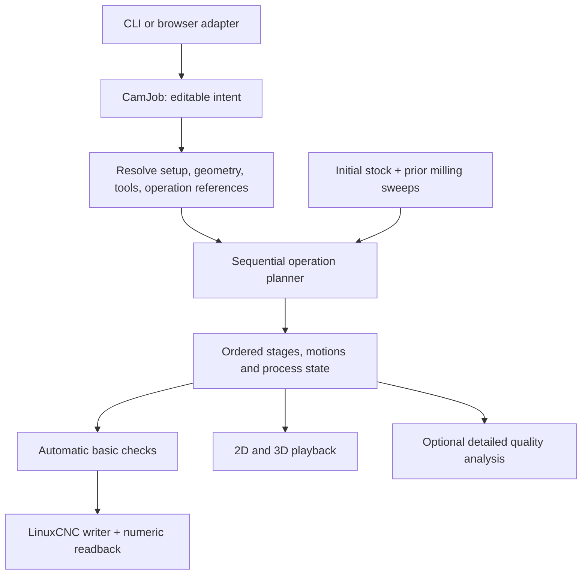

# 2.5D CAM: architecture and implementation handoff

Date: 2026-09-09\
Status: baseline design plus the 2026-09-10 UI architecture addendum; implementation evidence is tracked in [the checklist](2.5d-cam-checklist.md).\
Original baseline inspected: engine 0.7.7, job schema 3, legacy plan schema 1, UI transport `ui-7`. The addendum inspects the implementation through F2 (`886c87a`).

This document expands the agreed direction into contracts and small implementation slices. It is written so an implementing agent can work through one slice at a time without inventing the machining model. The current request updates planning documents only. Existing implementation is recorded in the checklist; new work in the addendum is not implemented by this documentation change.

**Current design precedence:** [section 22](#22-addendum-ui-driven-backend-contracts-2026-09-10) reconciles the [new UI plan](2.5d-cam-ui-plan.md) with the implemented backend. It supersedes the single-source model, the new UI's TypeScript ownership, and the original mixed UI/backend F3 scope below. Sections 1-21 otherwise retain the original design and historical module map; their future-tense wording is not a current progress report. The checklist is the progress authority.

The existing [architecture](architecture.md), [technical design](technical-design.md), and [implementation plan](implementation-plan.md) describe the V-carve product and its history. For the proposed expansion, this document replaces their one-operation/two-tool scope and mandatory M5 export gate. Their numerical, geometry, persistence, and machine-contract requirements still apply where compatible. Do not rewrite historical milestone results as if the new design had already shipped.

Reading guide: start with [decisions](#1-decisions-and-scope) and [invariants](#3-invariants), then the [document contract](#5-canonical-document-contract), [coordinates](#6-setup-coordinates-and-height-references), and [planning contract](#8-planning-and-execution-contracts). Operation algorithms are in [Profile](#10-milling-profile-algorithm), [Face](#11-facing-algorithm), [Knife](#12-passive-drag-knife-algorithm), and [Flat V-carve](#13-flat-v-carve-compatibility-and-later-rest-machining). Use the [implementation slices](#18-implementation-slices-and-stop-conditions) and [fixture matrix](#19-acceptance-fixtures-and-validation-commands) as the work checklist.

## 1. Decisions and scope

### 1.1 Product decisions

1. A job contains one setup and an ordered list of operations.
2. First-class operations are `flat_vcarve`, `face`, `profile`, and `drag_knife`.
3. Keep Flat V-carve as one user-facing operation with endmill and V-bit execution stages. General pocketing and independently editable V-carve rest stages are later work.
4. Stock has physical XY dimensions, thickness, and a selectable work origin. Artwork placement is independent of work zero.
5. Profile includes depth passes, inside/outside/on compensation, tabs, radial finishing allowance and pass, and entry/exit controls.
6. Face starts with rectangular coverage, including stock-wide facing without an SVG, and explicit extensions.
7. The knife is a **passive swiveling knife on the existing XYZ/LinuxCNC router**, as confirmed by the user. No commanded A/C axis is involved.
8. Simulation is the ordinary inspection workflow. Detailed stock-quality verification becomes an optional advanced analysis. Automatic input, motion, completeness, and output checks remain.
9. Rust owns geometry, planning, machining constraints, stock queries used by planning, and output. TypeScript owns editing and visual simulation.
10. Preserve the native and WebAssembly products. Each released feature must work through both adapters.

### 1.2 Initial release boundary

Include one rectangular stock setup, SVG artwork, rectangular facing, closed-contour milling profiles, passive knife paths, existing flat V-carving, a shared timeline, and ordered LinuxCNC export. Add open-chain import before declaring knife support complete.

Defer general pockets, multiple setups/work offsets in one job, arbitrary 3D stock, rotary/tangential knives, native G2/G3 output, adaptive clearing, automatic tool grouping across operations, CAD drawing tools beyond the face rectangle, fixture/holder models, and physical detached-part simulation. A surfacing cutter may initially use the existing flat-bottom cutter envelope with explicit entry capability; an insert face-mill catalogue is not necessary.

These are scope choices, not permanent restrictions on the model.

### 1.3 Implementation method

- Implement in the order in section 18. Finish the acceptance criteria of a slice before starting the next.
- Introduce the new orchestration around the existing V-carve engine before extracting its algorithms.
- Use tagged enums and concrete structs. Do not introduce a plugin registry, trait hierarchy for every setting, database, or additional service.
- Keep missing editable values distinct from invalid supplied values. Never invent feeds, spindle speeds, machine positions, tool lengths, or knife offsets.
- Preserve exact supplied zeroes where meaningful, including zero finishing allowance and zero lead length when the lead is disabled.
- New unsupported combinations must produce a specific diagnostic. Do not silently substitute a plunge for a ramp, remove tabs, choose a different contour, or change an operation's order.
- Numerical-budget exhaustion means incomplete/inconclusive generation, not successful truncation.
- Example dimensions in section 19 are synthetic test data, not cutting recommendations.

## 2. Existing implementation: read this before editing

Paths below are relative to the repository root. Rows describe the inspected code, not the proposed model.

| Area | Existing files | Current assumption and required response |
| --- | --- | --- |
| Portable job | `flat-v-carve/crates/cam-core/src/job.rs` | `Job.operation` is singular, selection is global, exactly two tools are required, and stock has thickness only. Add a new canonical model with migration. |
| SVG | `crates/cam-core/src/svg/{mod,path,style}.rs` under `flat-v-carve/` | Import yields filled closed regions; subpaths must close. Preserve regions while adding independently addressable contours/chains. |
| Endmill clearing | `flat-v-carve/crates/cam-core/src/pocket/` | `Context` needs a V-bit angle and depth-dependent target. This is V-carve roughing, not a generic vertical-wall pocket. |
| V-bit planning | `flat-v-carve/crates/cam-core/src/vcarve/` | `CombinedPlan` embeds an `EndmillPlan`, one transition, and separate V-bit motions. Wrap this initially. |
| Motion | `flat-v-carve/crates/cam-core/src/motion.rs` | Linear XYZ moves already carry tool and operation IDs. Cutting is currently inferred from `MotionKind`. New semantics must separate feed motion from material effects. |
| Stock | `flat-v-carve/crates/cam-core/src/stock.rs` and `stock/` | Queries are organized around endmill/V-bit sweeps. Generalize composition over a sequence; keep analytical primitives. |
| Post | `flat-v-carve/crates/cam-core/src/post/{mod,profile,reader}.rs` | Two stages/tool mappings, required RPM, M5-gated export, strict numeric readback. All need the new execution contract. |
| Retained plans | `flat-v-carve/crates/cam-core/src/vcarve/retained.rs` | Private receipts bind service-owned plans. Preserve that trust boundary when generalizing. |
| Tool library | `flat-v-carve/crates/cam-core/src/tool_library.rs`, `cam-storage/src/tool_library.rs` | Endmill/V-bit slots and five cutting values. Apply presets to operation assignments, and add typed knife geometry/settings. |
| Shared DTOs | `flat-v-carve/crates/cam-service/src/` | `Stage` is `Endmill` or `Combined`. Replace this with operation scope and generic execution stages. |
| Native execution | `flat-v-carve/crates/cam-server/src/{planning,planning_worker,artifact,motion_preview,exporting}.rs` | Retained files, bounded previews, leases and cancellation are reusable. |
| Browser execution | `flat-v-carve/crates/cam-gui/src/{worker,platform,compute}.rs` | The browser worker and native child repeat stage assumptions. Change them with the service DTOs. |
| UI state | `flat-v-carve/crates/cam-gui/src/{state,app,session,recovery}.rs` | Drafts, undo, recovery and current-plan identity need operation IDs and new setup settings. |
| UI flow | `flat-v-carve/crates/cam-gui/src/{pages,workspace_ui,operation_list}.rs` | Six-step V-carve workflow. Replace composition after the new core is usable. |
| Simulation | `flat-v-carve/crates/cam-gui/src/{sim,scene,stock_render}.rs` | Stock XY is inferred; ownership/stats assume two cutter roles; tool indices are currently `Uint8`. Generalize explicitly. |

Do not change dependency/toolchain versions merely to implement this design. Use the pinned versions unless an identified requirement cannot be met with them.

## 3. Invariants

These are implementation requirements and should become meaningful regression assertions.

1. All planned motion coordinates use setup coordinates: mm, right-handed XY, Z up, original stock top at Z=0.
2. Changing work zero changes the output coordinate transform, not artwork-to-stock placement or planned removal.
3. Facing does not change the setup coordinate system or silently reset Z zero.
4. An operation may depend only on enabled preceding operations. Forward references and cycles are invalid.
5. Toolpath order, tool changes, and process-state changes are part of the plan identity.
6. Rest material is derived from actual recorded removal, including entries and cutting links. Intended target geometry is not evidence of removal.
7. Display heightfields are never authoritative input to Rust planning or export eligibility.
8. Every tab affects every applicable rough and finish pass. A finishing pass cannot erase a tab.
9. A knife's offset is the distance from pivot to cutting tip. It is not a milling radius or an XY machine datum offset.
10. A passive knife has no commanded orientation axis. Lifting it into air does not establish a new orientation.
11. A feed move need not remove stock, and a spindle-off move need not be a rapid. Knife alignment/swivels must retain this distinction.
12. Export uses the exact current ordered plan and setup/profile transform. It cannot regain eligibility by editing a cached status or recomputing a public hash.
13. Budget limits, smoothing and rounding cannot remove semantic breakpoints such as tab rises, depth changes, stage boundaries, or knife swivels.
14. Editing disabled operations may leave machining results reusable; enabling them must invalidate the affected sequence. Initial implementation may conservatively replan the entire job.
15. A visual preview, generated toolpath, basic-check result and detailed-quality result are separate states.

## 4. Proposed modules and ownership

Keep the existing crates. Add focused modules in `cam-core` as each slice needs them:

```text
cam-core/src/
  project.rs             # CamJob schema 4, editable setup/tools/operations
  project/migrate.rs     # v1/v2/v3 -> canonical schema 4
  setup.rs               # stock bounds, height references, output transform
  contours.rs            # contour catalogue, selection resolution, anchors
  operations/mod.rs      # typed operation settings + dispatcher
  operations/flat_vcarve.rs # compatibility adapter to existing planners
  operations/face.rs
  operations/profile.rs
  operations/profile/tabs.rs
  operations/drag_knife.rs
  toolpath.rs            # candidate paths, intent, mandatory breakpoints
  linking.rs             # shared conservative entry/retract/link construction
  sequence.rs            # ordered plan, stage assembly, process events
  stock/history.rs       # prefix stock queries using recorded milling sweeps
  checks.rs              # basic plan and operation-specific motion checks
  post/                  # existing writer/reader, extended to sequence plans
```

`project::CamJob` is the new public canonical model. Initially leave `job::Job` as the legacy schema-3 model used by the existing V-carve code. Name imports `LegacyJob` in new code so it is impossible to mistake one for the other. Do not make new Profile/Face planners construct fake legacy jobs with dummy V-bits.

Public loading/importing services return `CamJob`; the compatibility adapter alone turns a Flat V-carve operation into a `LegacyJob`. Retire legacy types only in a later cleanup after the adapter is no longer needed. Tests of the old algorithms can continue using legacy fixtures.



No TypeScript implementation of offsets, tab geometry, blade compensation, lead feasibility, or rest-stock proofs is permitted. The existing TypeScript simulation may keep its visual milling sweep implementation, with cross-check fixtures against Rust.

## 5. Canonical document contract

### 5.1 Versioning

**Addendum:** schema 4 is now implemented. Its single-source shape below is the migration input, not the collection model for the new UI. See section 22.2 for schema 5 and artwork ownership.

Use job schema **4** for the first operation-based document. New plan envelopes use `artifact_kind: "operation_plan"`, schema **1**; this is a different artifact kind from the old endmill/combined plans. Use UI transport **`ui-8`** for the incompatible operation DTOs. The generic LinuxCNC profile becomes schema **2**. If those identifiers have been used by intervening work, use the next available version and update all boundaries together.

Code blocks here describe contracts; they are not copy-paste implementations. Derive strict Serde structures and test the actual serialized shapes.

```text
CamJob
  schema_version: 4
  name: String
  source: Option<SourceSnapshot>          # None is valid for face-only jobs
  import: ImportOptions                  # keep existing placement semantics
  setup: SetupSettings
  tools: Vec<JobTool>                    # stable IDs; no fixed role/count of two
  operations: Vec<Operation>             # this array defines execution order
  tolerances: PlanningTolerances
  legacy_machine_profile: Option<...>    # preserved old descriptive metadata

Operation
  id: OperationId
  name: String
  enabled: bool
  settings: OperationSettings            # tagged enum, no irrelevant fields

OperationSettings
  FlatVcarve(FlatVcarveSettings)
  Face(FaceSettings)
  Profile(ProfileSettings)
  DragKnife(DragKnifeSettings)
```

Keep a single embedded SVG source for now; a source collection is unnecessary for this release. An operation's selection belongs in its settings. There is no second global machining selection. Viewport selection/visibility is UI state and does not change machining until assigned to an operation.

### 5.2 Editable versus resolved values

Editable numeric fields may be unset (`Option`). Validate supplied values immediately, but allow incomplete jobs to save. A separate resolver produces fully populated planning inputs and lists missing fields by operation ID. Do not scatter `unwrap()` through planners or use zero as a missing-value sentinel.

```text
resolve_operation(job, operation_id, preceding_outputs)
    -> Result<ResolvedOperation, Vec<LocatedDiagnostic>>

ResolvedOperation
  validated tool geometry and cutting parameters
  concrete selected geometry
  top_z / bottom_z in setup coordinates
  positive, resolved tolerances and resource limits
  explicit allowed-cut / protected geometry
  resolved dependency IDs
```

Do not require facing fields for a profile or V-bit fields for a knife. Disabled incomplete operations are saveable and excluded from planning readiness. Structural errors such as duplicate IDs remain document errors even in disabled operations.

### 5.3 Tools and operation assignments

Separate cutter geometry/capability from cutting parameters:

```text
JobTool
  id, name
  geometry: Option<Endmill | Vbit | DragKnife>
  capabilities: geometry-appropriate entry capabilities

MillingAssignment
  tool_id
  spindle_rpm
  spindle_direction: Option<Clockwise | Counterclockwise>
  cutting_feed_mm_min
  plunge_feed_mm_min
  max_stepdown_mm
  stepover_mm                         # required only where used

KnifeAssignment
  tool_id
  cutting_feed_mm_min
  plunge_feed_mm_min
  swivel_feed_mm_min
  max_stepdown_mm
```

Operations may use the same job tool with different parameters. Flat V-carve has two milling assignments, one per internal stage. Keep one authoritative plunge-capability value when migrating the old duplicated slot/dimensions representation; reject conflicting old values with the existing validator before migration.

New Face/Profile planning requires an explicit spindle direction. The nullable direction exists to preserve old jobs that stored it only in a separately saved machine profile; section 14.4 defines how that compatibility case is resolved. Never make Profile traversal depend on an output-only value that can change without invalidating its plan.

The tool library still stores named geometry and reusable cutting presets. Applying a preset copies values into the selected operation assignment. Editing the library later never changes a saved job. A knife geometry contains `blade_offset_mm` and `max_cut_depth_mm`; spindle RPM, stepover, and conical geometry do not apply to it. Add typed knife presets when knife support ships.

### 5.4 IDs and references

Use stable string IDs for operations, job tools, source components and contours. IDs are not array positions. Renaming or reordering an operation preserves its ID. Duplicating it creates a new ID and copies settings, not derived plans.

Unknown geometry/tool/dependency references produce located errors. Deleting an operation referenced by a later height reference must leave an explicit unresolved reference until corrected; do not silently switch that height to stock top.

## 6. Setup, coordinates and height references

### 6.1 Stock and artwork

```text
SetupSettings
  stock:
    thickness_mm: Option<f64>
    xy: Option<RectStockXY>
  work_zero:
    xy: SetupOrigin | StockAnchor | CustomPoint
    z: StockTop | StockBottom
  clearance_above_stock_mm: Option<f64>
  start_xy_mm: Option<Point>              # in setup coordinates

RectStockXY
  min_x_mm, min_y_mm, width_mm, length_mm

StockAnchor
  x_fraction: 0 | 0.5 | 1
  y_fraction: 0 | 0.5 | 1
```

The XY rectangle can start anywhere in setup coordinates. Internal stock top is always 0 and bottom is `-thickness_mm`. `SetupOrigin` means XY=(0,0) even if stock XY is still unset; it preserves legacy coordinates. `StockAnchor` resolves against physical stock dimensions.

Preserve the existing artwork formula:

```text
setup_XY = scale * rotate(page_XY - import.placement.origin_mm)
```

Do not reinterpret the old `origin_mm` as work zero. A future UI may present ordinary translation fields by converting to/from this formula in one place, with round-trip tests.

### 6.2 Output transform

Let the selected work-zero point in setup coordinates be `(wx, wy, wz)`:

```text
output_x = setup_x - wx
output_y = setup_y - wy
output_z = setup_z - wz

StockTop:    wz = 0
StockBottom: wz = -stock_thickness
```

Example: stock is 100 x 60 x 8 mm at XY=(0,0), and work zero is stock center/bottom. A planned point (10,20,-2) exports as (-40,-10,6). Clearance Z=5 exports as Z=13. The artwork and removal stay in the same place if work zero changes.

Apply this transform once before output formatting, and invert it after numeric readback. The machine profile's known startup/M6 return positions are already expressed in the selected controller work frame; do not subtract work zero from them again. Changing work zero invalidates output and requires the setup-dependent machine assumptions to remain explicit.

Only one authority selects Z datum: `setup.work_zero`. Profile schema 2 must not also carry a competing `z_datum`. Preserve existing macro-managed/tool-table TLO behavior and G54-family selection. Work-zero selection describes the intended setup; it does not set offsets on a connected machine.

### 6.3 Heights

Represent each operation top/bottom height as a reference plus signed Z offset, positive upward:

```text
HeightRef
  reference: StockTop | StockBottom | OperationTop | FaceResult(operation_id)
  offset_mm: f64
```

`OperationTop` is legal only for a bottom height, and resolves to that operation's already resolved top. `FaceResult` can reference only an enabled preceding face operation. A face result publishes a plane and its covered region, not a claim that the whole stock has that height.

Example: face top=stock top, bottom=stock top minus 0.5. Profile/carve top=`FaceResult(face_1)`, bottom=operation top minus 2.0. These resolve to top=-0.5 and bottom=-2.5. The stock bottom remains -8; the output transform is unchanged.

Require the affected geometry to lie within the referenced face's established planar coverage. Crossing a partially faced boundary must produce `SURFACE_REFERENCE_OUTSIDE_COVERAGE`. Initial Flat V-carve support after facing is limited to a uniformly faced top over its selected target, with any entry/cutter interaction beyond that area independently checked.

Validate `top_z > bottom_z` for positive-depth operations. Generate layers as `max(bottom_z, top_z - n*stepdown)` with the final depth assigned exactly. Depth is operation-local; do not use `Motion::depth()` as a substitute for depth below an operation's top.

### 6.4 Through cutting

Profiles and knives may set `through_cut_allowance_mm >= 0`. This is permission to travel below material bottom by at most that amount; it does not move the bottom or extend stock thickness. Without it, lower cutting Z cannot be below stock bottom.

Use `bottom = StockBottom + offset(-allowance)` for a through cut. Validate the requested bottom against the explicit allowance and tool capability. Flat V-carve keeps its existing no-through-cut target constraint initially. Material removal is clipped at stock bottom; below-bottom tool travel remains visible in playback.

## 7. Geometry selections and anchors

### 7.1 Keep regions and contours distinct

The importer must expose a catalogue before unioning the selections of an operation:

```text
GeometryCatalogue
  filled_components: existing normalized regions with outer/hole relationships
  contours: closed boundary chains with source and component lineage
  open_chains: explicit centerlines, added with the knife milestone

Contour
  id, source_id, component_id
  closed
  vertices in setup coordinates
  source-space parameterization and geometry fingerprint
  role: outer | hole | open
  parent_contour_id, when applicable
```

Flat V-carve resolves component selection into a filled union as today. Profile and knife resolve contour IDs; they must not erase internal selected boundaries by unioning all chosen shapes first. Face rectangles are operation geometry and require no source SVG.

For Profile, label compensation explicitly as inside/outside/on **each selected closed contour**. Do not infer compensation from winding alone. Provide a UI helper that chooses outside for outer edges and inside for hole edges, but store the resulting explicit side per contour. Show arrows and the compensated path.

Normalize a canonical geometric orientation for signed-offset calculations and keep traversal direction separate. Reversing a traversal must not change which side is retained. For open milling contours, use left/right/on relative to stored chain direction when that feature is introduced; the first milling release may reject open selections.

### 7.2 Manual anchors

```text
ContourAnchor
  contour_id
  source_geometry_fingerprint
  fraction_along_source_contour: [0,1)
```

Use anchors for starts and tabs. Parameterization is independent of generated offset vertices and execution direction. Physical tab width and lead lengths remain mm in setup space when artwork scale changes.

Placement edits transform anchors with their contour and recheck fit. If SVG edits change topology or the source fingerprint, mark anchors unresolved; no nearest-contour guessing. An implementing agent may initially require manual reattachment after any source-geometry change. This is preferable to an apparently valid tab on the wrong edge.

### 7.3 Open-chain import

Add a separate contour/centerline import mode. Preserve source subpath order and do not implicitly close endpoints. Ignore stroke width only when explicitly treating the stroke as a centerline; make that interpretation visible. Do not weaken the existing fill importer or turn a stroked outline into two parallel knife cuts by accident. Text, clones and unsupported SVG effects retain existing diagnostics.

Bound approximation error after placement. Resource limits and topology diagnostics apply to open chains too. Near-zero segments may be removed only within a declared budget and without deleting corners needed for knife orientation.

## 8. Planning and execution contracts

### 8.1 Public service flow

Use one core flow for CLI, HTTP and WASM:

```text
load_or_migrate_job(bytes) -> CamJob
inspect_job(CamJob) -> geometry catalogue + editing diagnostics
resolve_job(CamJob, scope) -> resolved setup + ordered operations
plan_job(resolved_job, limits) -> OperationPlan
check_plan(OperationPlan) -> BasicCheckReport
export_plan(checked_plan, machine_profile, layout) -> ExportBundle
analyze_quality(checked_plan, options) -> QualityReport       # optional
```

`scope` initially supports all enabled operations or a prefix ending at an operation ID. Prefix planning allows inspection of stock after an operation without implying it can be executed alone. Do not add arbitrary stock-dependent subset export in the initial implementation.

An operation planner receives its resolved geometry/settings, immutable setup, preceding stock view, and resource budget. It returns stages, diagnostics, and named outputs such as a face plane. It does not write files, emit G-code, mutate earlier results, or look up UI state.

### 8.2 Minimal executable plan

```text
OperationPlan
  artifact_kind, schema_version, engine_version
  job_snapshot
  input_fingerprint, execution_fingerprint
  operation_results: Vec<OperationResult>
  stages: Vec<ExecutionStage>
  motions: Vec<PlannedMotion>
  execution: Vec<ExecutionItem>
  preparation_requirements               # unresolved legacy process/profile fields
  generation_diagnostics

OperationResult
  operation_id
  generation_status: complete | empty | incomplete | inconclusive
  stage_ids
  stock_before_id, stock_after_id
  named_outputs                         # e.g. face plane + covered region

ExecutionStage
  stage_id, operation_id, tool_id
  role: face | profile_rough | profile_finish | vcarve_rough | vcarve_finish | knife
  motion_range: [first, end)             # end-exclusive, global motion indices
  entry_position, exit_position

ExecutionItem
  ToolChange(tool_id)
  SetProcessIntent(process)
  RunStage(stage_id)

ProcessIntent
  spindle: Off | Milling(rpm, optional_direction)
  coolant: Off | UseMachineProfile
  path_control: UseMachineProfile | ExactPath

PreparedProcessState                     # export preparation; no unresolved fields
  spindle: Off | On(rpm, direction)
  coolant: Off | Flood | Mist
  path_control: ExactPath | Blend(tolerance, optional_merge_tolerance)

PlannedMotion
  id, operation_id, stage_id, tool_id
  contour_id: optional
  pass_id, layer
  interpolation: rapid | linear_feed
  purpose: clearance | approach | entry | rough | finish | tab_transition |
           lead_in | lead_out | knife_cut | knife_align | knife_swivel
  effect: none | milling_sweep | knife_trace
  start, end: Position
  feed_mm_min: optional                 # required for every linear_feed
```

This is a new representation; old `motion::Motion` can remain inside the legacy adapter. When adapting, reproduce the old writer's actual interpolation for each kind rather than assuming every `Approach` is a rapid. Keep the stock-effect semantics used by the old engine.

Store motions once, with ranges referring into the array. Require every motion to belong to exactly one stage and every nonempty stage to be executed exactly once. Validate stage order and tool/process state independently of human-readable labels. Layer numbers are local to an operation/pass; they are not globally unique IDs.

`ProcessIntent` permits the legacy unresolved-direction case and defers the selected milling path-control mode to export preparation. A `PreparedExecution` binds the immutable plan to a profile and fully resolved process state; only that form can produce G-code. Fingerprint the resolved state with the output. No null direction or `UseMachineProfile` marker may reach the writer. Knife intent always resolves to spindle off and exact path in this release.

### 8.3 Assembly and transitions

1. Resolve operations in document order, ignoring disabled ones.
2. Start from original stock and an empty removal history.
3. Plan an operation against its input stock view.
4. Run basic checks, record its actual milling sweeps, and publish named outputs only if their prerequisites are established.
5. Append its ordered stages and process changes. Carry the actual final motion position into ordinary same-tool linking.
6. Stop dependent planning if a required previous result is incomplete. Retain the partial plan for inspection, with export unavailable for that sequence.
7. End each independently postable stage at clearance. Use deterministic ordering within the stage; nearest-path optimization must respect nesting and explicit start constraints.

At a tool change, the postprocessor owns the bridge from the declared M6 return position to the next stage's entry. Preserve the current machine contract rather than fabricating a continuous XYZ line through an unknown macro. Setup-plan simulation displays a tool-change boundary; an emitted-program preview may additionally show the known post-generated bridges. Macro-internal motion remains outside the model.

Initially retract to the global clearance for disconnected contours and operation transitions. Do not generalize the existing stay-down optimization until the new stock checks can establish each link. A later optimization must preserve the same observable order and material result.

### 8.4 Geometry-to-motion order

The following order avoids tabs or corners being erased by downstream work:

```text
selection -> compensated candidate geometry -> contour/pass order
          -> starts + leads + depth schedule
          -> tab or knife semantic construction
          -> tolerance-bounded linearization
          -> feed/retract/link assembly
          -> whole-motion checks -> recorded execution
```

Keep mandatory breakpoints while simplifying: tab top/bottom transitions, entry endpoints, pass changes, lead tangencies, knife corner endpoints, and all process/stage boundaries. Any later simplification must recheck the swept geometry and cannot bridge across a semantic boundary merely because the points are close.

For an arc radius `r` and permitted chord error `e`, bound subdivision angle by `2*acos(1-e/r)` when `0 < e < r`; handle zero/small radius and larger error limits explicitly. Allocate error across import, offset, linearization and formatting instead of independently spending the full tolerance at every stage. Never relax a requested tolerance after a budget failure.

## 9. Stock history and dependencies

### 9.1 Authoritative stock

For supported flat-bottom/conical milling, a top-accessible height surface is sufficient. Compose the existing sweep queries over an ordered prefix:

```text
StockHistory
  initial rectangular prism (or explicit legacy unknown XY)
  ordered milling sweep batches, each with tool geometry and stage identity

StockView(prefix)
  material_top_at(xy)
  removal_at_slice(z)
  can_traverse_without_cutting(tool, motion)
  established_planar_region(z)
```

These are conceptual methods; reuse existing analytical queries and spatial indices instead of building a voxel engine. For a point in the stock rectangle, top height is the lowest surface reached by the preceding valid milling sweeps, clamped at stock bottom. Outside the stock rectangle there is no material. Preserve conservative bounds where the existing query is bounded rather than exact.

The history records sweep batches plus prefix identities, not a full duplicated mesh for every operation. Cache spatial indices and selected slices on demand. Do not union all possible depths eagerly. Adding operations must not multiply the flower job's memory by the number of full copies of its stock model.

Knife traces do not imply that stock has been milled away. Initially they leave this material-height model unchanged and add a separate cutting trace. Do not use a knife operation as evidence of cleared space for subsequent milling or simulate detached parts falling away.

### 9.2 Dependencies and invalidation

Execution order always contributes to the sequence identity even when two operations appear geometrically disjoint. Named height references and rest machining add explicit dependencies.

Initial implementation: replan the entire enabled sequence after a machining edit. Correct coarse invalidation is preferable to incorrect partial reuse. Later, use a prefix hash:

```text
prefix[0] = hash(initial stock + artwork placement + geometry + planning settings)
prefix[i+1] = hash(prefix[i] + operation[i] + used tool snapshot + actual execution)
```

Separate the machining fingerprint from output identity. Work zero/profile/output precision changes invalidate export; they need not regenerate setup-coordinate motions. Camera, visibility and play position changes invalidate neither. An operation edit invalidates that operation and all following stock-dependent results. If the first implementation invalidates all following results regardless of overlap, that is acceptable.

### 9.3 Legacy stock bounds

Old jobs have no physical XY dimensions. Migration must not claim that a rectangle derived from artwork is measured stock. Keep `setup.stock.xy = null` until supplied or set with the fit action.

For compatibility, a legacy Flat V-carve-only job may continue through its old unbounded-XY assumptions. Its simulator may show the existing inferred display rectangle, explicitly identified as inferred. New Face/Profile/Knife operations require physical XY stock. Adding those operations cannot quietly convert inferred bounds into physical bounds.

## 10. Milling profile algorithm

### 10.1 Settings

| Setting | Contract |
| --- | --- |
| Contours | Explicit contour IDs and per-contour inside/outside/on side. |
| Tool/cutting | One milling assignment; no V-bit required. |
| Heights | Top/bottom references, stepdown, optional through allowance. |
| Direction | Climb or conventional relative to cutter rotation and retained side. On-contour uses an explicit traversal direction because there is no retained side. |
| Order | Inner-before-outer default; explicit ordered contours are allowed. |
| Start | Automatic deterministic start or `ContourAnchor`. |
| Finish | Enabled flag, nonnegative radial allowance, optional finishing feed; depth-stepped finish initially. |
| Entry | Plunge or contour ramp with angle/feed and explicit ramp capability. |
| Lead-in/out | None, tangent line(length), or tangent arc(radius, sweep angle), with feeds. |
| Tabs | Enabled, width, height, rectangular/ramped shape, placement mode and anchors. |

MVP finishing is one pass at the final radial offset, performed in depth increments. Multiple radial finish passes, separate axial allowance, spring passes and full-height wall finishing are optional later additions. Do not expose an unimplemented toggle.

### 10.2 Offset and depth construction

1. Resolve and normalize each contour, its containment and retained side.
2. Obtain cutter radius `R` and radial finish allowance `a`.
3. Rough centerline offset magnitude is `R+a`; final centerline magnitude is `R`, on the explicitly selected side. On-contour is zero offset and cannot use radial allowance in the first release.
4. Use the existing polygon-offset adapter for closed offsets. Retain provenance when an offset splits. Vanishing or ambiguous selected contours produce diagnostics; do not omit them and report success.
5. Check the cutter sweep against the protected side and other retained contours, including islands. If the cutter cannot represent an inside corner, show the actual reachable shape/residual rather than shrinking the tool or gouging the part.
6. Generate depth levels, ending exactly at bottom and respecting maximum stepdown.
7. Prefer completing the rough and finish work of an inner contour before an enclosing final cutout. No tool optimization may pull that cutout earlier.
8. Apply tab and lead constraints to all paths, then generate recorded motions and check their actual sweeps.

For positive allowance, cutting the rough slot and moving to the final offset can increase lateral engagement. Do not assume the finish pass is an air move. Check its entry and use its cutting feed. The tool's actual flute reach is checked against material still present around its shank, not merely `bottom-top` after facing.

### 10.3 Tabs: geometry and Z envelope

Define tab height as **remaining material above stock bottom**, independent of through allowance:

```text
tab_top_z = -stock_thickness_mm + tab_height_mm
```

Example: 8 mm stock, 2 mm tab, 0.2 mm through allowance gives ordinary bottom=-8.2 and tab top=-6.0. Calculating tab top as `cut_bottom + tab_height` would incorrectly leave a 1.8 mm bridge.

Tab width describes a minimum full-height bridge along the source contour. Build a tab footprint spanning that contour interval across the complete rough-and-finish cut corridor. Its protected material occupies stock bottom through tab top. A cutter center must stay at or above tab top whenever its footprint intersects this protected volume.

Do not simply raise Z for `width` mm along the centerline. The tool can cut under both ends of the intended tab. On a straight edge, the center interval needing the tab-top restriction is widened by the cutter radius at both ends; use dilation of the protected footprint for the general case. Include numerical margins.

For each candidate pass, compute the Z lower bound imposed by tabs, then use:

```text
commanded_z(s) = max(pass_z(s), tab_required_z(s))
```

Split motions exactly at envelope breakpoints. A rectangular tab uses feed-controlled vertical rise/lower moves at legal positions. A ramped tab adds explicit shoulder lengths outside the minimum full-height bridge; those shoulders must also satisfy the protected-volume test. The first implementation may restrict tabs to sufficiently long straight contour spans, returning a located error for a tab too near a corner.

Automatic placement distributes a count or spacing along eligible spans, excluding starts/leads/corners and already occupied intervals. If the requested count cannot fit, report the deficit; do not silently return fewer tabs. Manual placement takes precedence, and overlapping tab footprints merge conservatively. Store resolved placements in the plan so the preview shows exactly what was generated.

Reject nonsensical heights/widths and tab placements that consume the whole contour or make the selected entry impossible. Passes above tab top are unchanged. Deep rough and all finish passes retain the tabs. Tabs on non-through profiles are permitted if their height intersects the cut; otherwise show an ineffectual-tab diagnostic.

### 10.4 Entry and exit

Treat these separately:

- **Depth entry:** plunge or a linear ramp along the compensated contour.
- **Horizontal lead:** line or arc blending into/out of that contour.
- **Clearance link:** travel between disconnected cuts.

For a depth drop `dz` and maximum ramp angle `alpha`, the ramp requires horizontal path length at least `abs(dz)/tan(alpha)`. Initially require it to fit on a supported continuous path section without traversing a tab; do not wrap over a tab or choose a helix automatically. Multi-revolution contour ramps can be a later extension.

Choose a start before constructing the lead, then check the full lead cutter sweep against retained geometry and tab volumes. Do not place a lead simply on the closest geometric side of the contour. Arc leads must have correct tangent continuity and stay within the allowed cut domain. Lead-out cannot cut through the newly finished retained wall.

If a configured lead does not fit, return `PROFILE_LEAD_NO_SPACE` with the affected contour and candidate location. The user may shorten it, choose another start, or select another strategy. Do not silently shorten or disable it.

## 11. Facing algorithm

### 11.1 Settings and area meaning

`area` is `entire_stock` or an explicit setup-coordinate rectangle. An imported closed region is later work. Store four nonnegative area margins and separate nonnegative entry/exit overrun distances along the pass direction. Also store top/bottom heights, stepdown, stepover, pass angle, zigzag/one-way pattern, and milling assignment.

The selected rectangle is a **coverage request**, not a wall that clips the cutter. Face milling may remove adjacent material as the cutter overlaps its edges. The plan must expose both the requested coverage and the actual allowed sweep envelope; the preview shows this overhang before generation/export. Do not claim that all unselected material immediately beside a partial face remains intact. A strict protected-boundary face mode is outside the initial scope.

Derive the maximum allowed envelope from settings, independently of generated paths: expand the requested coverage in both scan directions by the maximum entry/exit overrun, then dilate by the cutter radius plus the numerical reserve. The actual sweep must fit inside this envelope. A buggy candidate path cannot authorize itself by expanding the allowed envelope to match its own motions.

Area margins expand the desired coverage rectangle. Travel overrun adds approach/exit travel, not additional face-depth semantics. Neither changes physical stock bounds. Cutting outside stock is air; cutting outside the requested coverage but inside the declared sweep envelope is part of this face operation.

### 11.2 Deterministic raster construction

1. Expand the rectangle by its per-side margins.
2. Transform the coverage polygon into scan coordinates using the chosen pass angle. For a rotated rectangle, use its polygon intersections; do not replace it with a larger bounding rectangle and claim the same area.
3. Generate parallel rows with spacing at most the chosen stepover, which must be positive and no greater than tool diameter minus the numerical coverage reserve.
4. Include first/last rows and extend row endpoints enough that the union of cutter sweeps covers the rectangle, including corners. Add requested travel overrun after establishing coverage.
5. Check the candidate pattern against the settings-derived allowed envelope and show the actual swept region in the 2D preview. Reject a requested explicit containment constraint the initial face operation cannot satisfy.
6. Repeat the pattern at each depth layer, ending exactly at bottom.
7. For one-way cutting, retract between rows. For zigzag, a cutting-height cross-row link is allowed only as a checked intended cut within this layer's allowed envelope, or a proved air move. Otherwise retract.
8. Establish planar coverage from the actual final-depth sweeps intersected with original material. Compare against the requested stock-intersecting area and report missed strips.

A first implementation may support only 0/90-degree passes while the scan-polygon helper is introduced, but do not claim arbitrary angle support before the rotated-area fixture passes. Use an endmill/flat-bottom tool that matches the cutter envelope; tool entry capability is independent of its flat shape.

If the entry cutter footprint is wholly outside stock, descent there does not require plunging into material. For a partial interior face with no such entry, require a supported plunge/ramp and its feed. Being outside the requested face rectangle is not equivalent to being outside stock.

Publish `FaceResult { z, covered_region, source_operation_id, execution_fingerprint }` only for established flat coverage. It is not a global update to stock-top Z.

## 12. Passive drag-knife algorithm

### 12.1 Geometry and state

The programmed XY point is the blade holder's pivot. Programmed Z is the cutting tip's height under the tool-length contract. The visible blade tip in XY is offset from that pivot.

For an ideal no-slip blade on a smooth desired tip path `p(s)`, let `t(s)` be its unit forward tangent and `d` the blade offset. Then the candidate holder path is:

```text
q(s) = p(s) + d*t(s)
```

This is a project derivation of the ideal drag geometry. It is not a guarantee of physical blade tracking. It shows why adding a constant X/Y offset or milling-radius compensation is incorrect.

At a sharp corner `p`, incoming/outgoing tangents differ. The ideal swivel moves the holder around a radius-`d` arc centered on `p`, from `p+d*t_in` to `p+d*t_out`, while the tip remains approximately at the corner. Use signed turn angle and explicitly handle concave corners, tiny segments and near-180-degree reversals. An ambiguous reversal may be rejected in the first release rather than choosing an arbitrary swivel direction.

The blade must retain some material engagement during passive swivels; the manufacturer's/CAM references describe using a shallower swivel depth rather than lifting fully clear. Blade offset, swivel depth and corner behavior are documented by [Vectric](https://docs.vectric.com/docs/V12.0/AlphaCAM/ENU/Help/form/drag-knife-toolpath/index.html). Our planner must represent this contact and must not rotate the drawn blade in midair to pretend the physical knife followed it.

### 12.2 Settings

| Setting | Meaning |
| --- | --- |
| Tool offset | Positive pivot-to-tip distance in mm, from the job's knife geometry. |
| Cut top/bottom | Height references and through allowance as for profiles. |
| Stepdown | Maximum added depth per pass. |
| Swivel depth | Positive depth below the operation's top at which the blade remains engaged during corner actions. |
| Corner threshold | Angle above which explicit corner handling is requested; it does not waive tip-path error checks for smaller turns. |
| Feeds | Cutting, descent and swivel feeds; no spindle speed. |
| Start/closure | Explicit start or deterministic candidate, optional closure overlap in mm. |
| Alignment | Initial known heading for a cold start and an explicit alignment lead/contact sequence. |

For each pass, effective swivel depth must be positive and no deeper than that pass. Resolve it as `min(configured_swivel_depth, pass_depth)` and report the resolved value; shallow passes may swivel at full pass depth. Knife cut depth must not exceed its declared capability.

### 12.3 Alignment is state, not a drawing option

Maintain `KnifeState = Unknown | KnownHeading(angle)` across the knife stage. A tool load begins unknown. Establish its initial heading from an explicit setup convention/setting; do not default it silently to +X. A known-heading alignment contact move may then turn into the first cut. Put its entire trace in the preview, in a declared sacrificial area if it marks stock.

Carry the modeled outgoing heading across same-tool lifts and disconnected contours under an explicitly documented assumption that the holder retains orientation while lifted. Do not reset it to the next contour tangent. The next entry must include the necessary contact turn/alignment from the carried state. Tool changes or manual reorientation invalidate that state.

A straight sacrificial lead can help align a blade, but do not claim it establishes an arbitrary unknown heading exactly. Automatic blind alignment without an initial orientation assumption is deferred. If the available material/lead space cannot support the alignment, return `KNIFE_ALIGNMENT_UNAVAILABLE`.

### 12.4 Planner order

1. Resolve selected centerlines/closed contours and choose their order, preserving inner-before-outer where applicable.
2. Clean degenerate segments with source-error and corner constraints; distinguish smooth-curve approximation vertices from actual sharp corners.
3. Choose the start and construct the initial/contact alignment from modeled heading.
4. Construct the ideal pivot path for straight/smooth sections; insert corner swivel actions at the appropriate Z.
5. Re-enter to the pass depth after each lifted swivel. Preserve all swivel and plunge endpoints.
6. For a closed contour, handle the closing corner and optional overlap exactly once; neither omit the last corner nor double-cut an uncontrolled loop.
7. Repeat depth passes, maintaining heading and accounting for the starting stock contact assumptions.
8. Linearize within a knife tip-path error budget. A small holder chord error alone is not sufficient evidence of tip-path accuracy.
9. Produce holder motions and a blade-tip/orientation trace for visualization, bound to the exact plan.
10. Run checks on alignment, contact depth, intended-tip deviation, material marking, and spindle-off process state.

For small turns below the explicit swivel threshold, use a continuous compensated construction or check accumulated tip deviation. Do not simply omit all such corners: many small ignored turns around a curve can accumulate a large error.

### 12.5 Independent kinematic replay

Implementation note (F2): the equations below use a forward-tangent heading. The
implemented `blade_heading_deg` points from pivot toward tip, 180 degrees opposite.
Preserve that implemented convention and use the corresponding equations in
[section 22.10](#2210-f3-revised-rust-knife-integration-and-output-evidence).

Add a separate numerical replay of the emitted holder polyline under an ideal no-slip blade model. For holder trajectory `q(t)`, heading unit vector `u(theta)` and its perpendicular `n(theta)`, the model is:

```text
tip = q - d*u(theta)
theta_dot = dot(q_dot, n(theta)) / d       # while contact is established
```

This follows by requiring zero lateral velocity at the tip. Replay using adaptive numerical steps and a stated numerical error budget; compare to the intended tip path with fixtures and convergence checks. It is an engineering check of the model, not a prediction of blade flex/material tearing. During a fully lifted move, retain the assumed heading instead of using this contact equation.

Begin with straight segments and right-angle convex corners, then curved paths, concave corners, disconnected contours and closure. Budget exhaustion is inconclusive. Do not expose arbitrary knife contours as supported until their corner/alignment cases pass.

Knife stages require spindle off, coolant off and explicit path control. Start with exact-path mode for knife output; do not inherit the milling blend tolerance that could change swivel geometry. LinuxCNC distinguishes G61 exact path from G61.1 exact stop; do not treat them as synonyms. See its [path-control documentation](https://linuxcnc.org/docs/stable/html/gcode/g-code.html#gcode:g61-g61.1).

## 13. Flat V-carve compatibility and later rest machining

### 13.1 Adapter first

Wrap the current endmill and combined planners. Construct a legacy job using only the selected Flat V-carve operation's component IDs, assignments, depth/allowance/quality settings and legacy planning controls. Preserve the existing V-bit target geometry and final-finish family checks.

Map the old output into generic rough/finish stages without modifying its internal motion order. Preserve candidate/execution evidence as operation-specific analysis data. The generic outer plan owns global IDs; maintain a mapping to legacy motion IDs rather than accidentally colliding IDs across multiple V-carve operations.

Migration must preserve endmill-only behavior: if a legacy job has no `vbit_planning`, record Flat V-carve execution mode `endmill_only`; otherwise record `combined`. Keep an explicit UI choice to change that mode later. Do not infer from the existence of a V-bit tool that the V-bit stage should execute.

### 13.2 Facing before V-carve

The legacy engine assumes local top Z=0. For a V-carve operation whose resolved top is `z_top`, use an adapter-local frame:

```text
local_z = setup_z - z_top
setup_z = local_z + z_top
local_stock_thickness = physical_thickness + z_top
local_clearance = setup_clearance_z - z_top
```

For 8 mm stock faced to -0.5, local stock thickness is 7.5 and a setup clearance of +5 becomes local clearance +5.5. A local carve cut at -2 maps to setup Z=-2.5. Translate all local motions, query coordinates, targets and reported Z values consistently; shifting output motions alone is insufficient.

Admit this adapter mode only when the referenced face established a uniform plane across the V-carve target and material relevant to entries/clearance is accounted for. In the initial adapter, exclude overlapping prior profile/pocket/knife work that would invalidate the assumed fresh planar starting surface. Multiple disjoint V-carve operations may conservatively plan from intact local stock if all their motion interactions pass the shared checks.

Do not feed arbitrary prior removal into the legacy planner by substituting a raster screenshot. A later extraction can replace its endmill-specific stock input with `StockView` while preserving the target and final finish.

### 13.3 Why generic pocketing is later

The present endmill center region changes with depth to preserve the V-shaped wall. A plain pocket to the full SVG boundary at full depth can remove that wall. Future generic pocketing needs an independent vertical-wall target, explicit floor/wall allowances and a planner that does not require a V-bit.

Reuse polygon offsets, depth scheduling, entry/link construction and analytical stock primitives where their contracts match. Do not rename the existing `pocket` module and expose it as a generic pocket without changing its target model.

If linked rough/rest operations are eventually exposed, bind the V-bit stage to a shared target ID and exact preceding stock prefix. Editing or reordering the roughing operation invalidates the rest stage. Keep the one-operation Flat V-carve preset as the normal workflow even after advanced separation exists.

## 14. Checks, quality analysis and export

### 14.1 Three separate outcomes

| Outcome | When computed | Meaning |
| --- | --- | --- |
| Editing validation | During editing/open/save | Structure and supplied values are valid; missing required machining settings may remain. |
| Basic checks | During planning and output generation | Current complete motions satisfy supported operation constraints, tool/process state and numeric output rules. |
| Detailed quality | Explicit advanced action | Operation-specific stock/finish analysis, initially the existing V-carve M5 checks. |

Use separate report fields, not one overloaded `passed` boolean:

```text
generation_status: complete | empty | incomplete | inconclusive
basic_checks: passed | failed | inconclusive
detailed_quality: not_run | unsupported | passed | failed | inconclusive
export_status: ready | blocked
```

`export_status=ready` requires executable motions, complete generation, passed basic checks and valid machine preparation/readback. It does not require `detailed_quality=passed`. UI wording should say "Toolpaths generated" / "Output checks passed", not "Verified safe".

### 14.2 Required automatic checks

- All referenced IDs and selected geometry resolve; values are finite and the required tool/operation capabilities exist.
- Depth schedule, cutter reach, through allowance, per-pass completeness and required finishing are satisfied.
- Every executable stage is accounted for and has the right tool and process state.
- Every linear feed motion has a positive feed. Rapids and non-removal moves have valid transitions; below-clearance XY travel must satisfy the supported stock/operation checks.
- Profile sweeps preserve retained geometry and tabs. Lead and entry feasibility is checked along whole moves, not just endpoints.
- Face final sweeps cover the requested material within the declared tolerance and allowed envelope.
- Knife motion respects contact/alignment assumptions, cut/swivel depths and the accepted tip-path error budget.
- Plan identity and generation evidence correspond to the current settings and motions.
- Emitted numeric motions preserve order, required travel, direction, process state and the supported motion semantics after transformation/rounding.

These are bounded operation checks, not an instruction to run M5 on every new operation. Use analytical segment checks or bounded geometry where needed; an unresolved required check blocks that plan, while an optional detailed analysis being unrun/inconclusive does not.

A proven invalid motion remains a blocking issue regardless of which analysis discovers it. Cosmetic finish-quality findings remain in the quality report. Do not hide a previously located gouge by switching UI tabs or relabeling it a warning.

### 14.3 Removing the implicit M5 gate

The present `post::process()` calls `verify_motions` before writing and performs emitted stock verification afterward. Refactor its pipeline into:

```text
trusted current plan / reconstructed imported plan
    -> basic operation and sequence checks
    -> resolve machine setup + process state
    -> transform coordinates
    -> format numeric output
    -> independent numeric readback
    -> inverse transform + compare/recheck required motion semantics
    -> publish exact bytes and basic report
```

Keep `analyze_quality()` separate. Do not move M5 into a differently named mandatory callback or retain the old "combined plan only" admission condition. Also do not implement the change as `skip_validation=true` around the old function; that would skip checks that still matter.

Detailed M5 initially supports compatible Flat V-carve stages with their actual local frame and stock assumptions. Unsupported combinations return `unsupported` for that analysis scope. Do not compare a facing/profile job to a V-shaped target, and do not add imaginary V-bit settings merely to make the old verifier accept it.

### 14.4 Generic LinuxCNC profile and process preparation

Profile schema 2 keeps controller work offset, output precision, startup/M6 contract, T/H mappings, length-compensation mode, dwell and supported path control. Map each active job tool ID exactly once; permit any supported number of tools. A T number identifies a physical job tool, not an operation assignment or cutting preset.

Milling spindle direction affects climb/conventional path construction. Store it with the milling assignment and include it in the machining fingerprint. It is required before generating a new Profile operation. The post must output that direction; changing it is a machining edit that requires replanning. Profile schema 2 must not retain a second editable spindle direction in its T/H mapping after migration.

Legacy jobs did not store this direction in their cutting assignments. Keep it unset during job migration, and fill it from an explicitly imported/applied legacy machine profile rather than guessing. The compatibility Flat V-carve planner may generate geometry while it is unset, since no newly selected climb/conventional constraint depends on it, but preparing executable process events/export requires resolving it. Record unresolved process fields in the plan's preparation requirements; they are not executable state.

When migrating a profile schema 1, move its `z_datum` to `setup.work_zero.z` and spindle directions to the relevant assignments as one undoable document/profile application. Keep a single authoritative value afterward. Preserve T/H mappings and known startup/M6 positions verbatim. The old job's free-text M6 block remains descriptive metadata and never becomes a reviewed controller contract automatically.

A knife stage emits explicit spindle-off and coolant-off state after any tool change, followed by its path-control mode. Do not express off as an RPM of zero in a milling assignment. Extend both writer and reader to handle a sequence such as Face(T1, spindle on) -> Knife(T3, off) -> Profile(T1, on), re-establishing state each time. Do not infer that M6 leaves the spindle in the desired state.

Coordinate formatting happens after work-zero transformation. Retain the existing precision-increase behavior when necessary to preserve a motion; recheck tab rises, tiny leads and knife swivels in particular. If the permitted output precision cannot represent a required move, report a failure instead of deleting it.

For milling, retain explicit machine path-control settings and report their relationship to the programmed path. For the initial knife mode use G61 exact path. Support native G2/G3 only in a later change that updates the writer, readback, stock checks, simulation and tolerances together.

### 14.5 Program layout

Default to one ordered program. Also support sequential files split at contiguous tool stages, e.g.:

```text
01-face-T1.ngc
02-vcarve-rough-T1.ngc
03-vcarve-finish-T2.ngc
04-profile-T1.ngc
```

Adjacent compatible same-tool stages may share a file, without changing operation order or process settings. Do not use a map keyed by tool ID to collect all T1 motions together. The old "per tool" label should become "Sequential files" when a tool can recur.

Every file establishes its required modal/process state and lists stock/ordering prerequisites in a companion manifest. Those comments/manifests describe dependencies; they are not authoritative input to the numeric reader. Prefix export is supported; arbitrary late-operation export with unexplained starting stock is deferred.

### 14.6 Imported versus retained plans

Hashes are identity checks, not proof of trusted generation: a user can edit motions and recompute a public hash. Keep the private receipt pattern for plans held by their generating native service/WASM ledger, binding all execution stages and process requirements.

For externally supplied new plan files, the initial conservative implementation reloads the embedded job, replans with the same supported engine/settings, and compares execution before allowing export. It may still display the supplied plan as untrusted inspection data. Do not accept a receipt serialized alongside a user plan as trusted. A later independent reconstruction path may replace replanning only after it checks the same completeness/operation semantics.

Old saved plans are not converted into new trusted executable plans. Offer extraction/migration of their embedded job and require regeneration. Old engine fingerprints must not be edited to match the current engine.

## 15. Browser workflow and simulation

**Addendum:** this section records the original web UI implementation route. The React/Three.js UI it describes has since been removed. The shared Rust UI is governed by the [UI plan](2.5d-cam-ui-plan.md) and section 22.9. Keep the machining/display distinctions below, but do not rebuild these controls in a retired client to complete revised F3.

### 15.1 UI structure

Use a persistent workspace with Setup, an Operations list, a 2D/3D viewport, and Export. An advanced analysis drawer replaces the mandatory-looking Verification step.

The operations list supports add, rename, duplicate, enable/disable, reorder, select and delete. Each row shows its tool(s), depth summary and current generation status. Flat V-carve expands to show its rough/V-bit stages without requiring users to manage separate operations.

Selecting an operation activates its geometry highlights and inspector. Assign the current geometry selection explicitly to that operation. Ordinary viewport inspection must not rewrite its selection. Tabs and start/lead handles are edited against the active contour, with keyboard-accessible alternatives to dragging.

Setup shows physical stock, artwork placement and work zero together. A work-zero change moves the axis marker, not the artwork. The rectangle-face editor provides numeric bounds and a viewport rectangle, with margins and travel overrun shown separately.

Keep draft text, grouped undo/redo and missing/invalid states from the current UI. Operation-specific form state is keyed by operation ID, not its current list index. Reordering cannot put one operation's unfinished numeric text into another operation.

### 15.2 Simulation model

Retain the tiled heightfield for the supported milling surfaces. Initialize it from physical stock, including nonzero XY minimums. At cells emptied to stock bottom, render an actual hole/empty cell rather than an opaque bottom face that hides a cut-through slot. Preserve a visible stock side/bottom where material exists. Detached pieces remain in place.

Replace endmill/V-bit-only ownership and `stageRemovedMm3: [number, number]` with dynamic stage/operation mappings. Decide and validate index capacity before serializing typed arrays: retaining 8-bit tool indices with an explicit 256-tool cap is acceptable, but operation/stage ownership must not wrap at two or 255. Use a larger ownership type where required and update worker schemas together.

Include operation/stage/pass in the compact motion store and timeline. Milling effect uses the relevant cutter envelope. Knife effect uses the separate trace and heading display; it does not lower a fictitious cylindrical channel into the stock.

The simulator must consume the complete ordered motion stream through the existing paging mechanism. A bounded 2D preview page is not a complete simulation. Show loading/incomplete state until all required motion data is available, and preserve cancellation and memory bounds.

Timeline checkpoints should support stock after any stage/operation, scrubbing, and replay. Cache tiles/checkpoints within a budget instead of keeping a full stock copy at every motion. Filters change displayed paths/colors, not the material history being simulated. Hiding a roughing path must not restore its removed stock.

### 15.3 Inspection features by release

Required with stock/facing: physical stock outline, origin marker, target surface Z and real rectangle in 3D.

Required with completed Profile: visible tabs and through cuts, operation-boundary playback, current tool/operation, and a depth probe or simple X/Y section adequate to inspect remaining tab height. Do not let a coarse visual grid imply that a sub-cell tab is absent; show resolved tab geometry as an overlay and report display resolution.

Required with Knife: separate pivot/tip traces, modeled blade orientation, alignment/swivel segments and cut depth. Clearly distinguish intended tip path from replayed tip path when they differ.

Optional later: arbitrary section planes, holder/fixture models, material appearance and simulation of detaching stock. Camera polish is not a prerequisite for correct facing/profile paths.

### 15.4 Status and freshness

Maintain separate editing revision, machining fingerprint, prepared-output identity, engine version and task sequence. Reject stale replies from both HTTP and WASM. Successful task completion may contain an incomplete plan; a transport/task success must not imply export readiness.

Changes to motion-affecting settings make the old plan visibly stale. Changes to machine datum/format/profile stale the output. Visibility, camera, active inspector and simulation playhead do not stale either. Imported/applied spindle direction is a motion-affecting change where Profile uses it.

## 16. Persistence, migration and compatibility

### 16.1 Migration table

Load schema 1/2 through the existing schema-3 migration/validator first, then migrate the validated legacy structure into schema 4. Preserve missing fields.

| Legacy field | Schema-4 destination |
| --- | --- |
| `name`, embedded `source`, `import` | Same intent; source becomes optional for future source-free jobs. |
| `stock.thickness_mm` | `setup.stock.thickness_mm`; stock XY stays null. |
| `operation.id` | One enabled Flat V-carve operation with the same ID. |
| `selected_region_ids` | That Flat V-carve operation's component selection. |
| Endmill/V-bit geometry and capabilities | Job tool snapshots preserving IDs. |
| Per-tool RPM/feed/stepdown/stepover | The corresponding Flat V-carve stage assignment. |
| Depth, wall allowance, ridge/detail limits | The corresponding Flat V-carve settings. |
| `endmill_planning.clearance_z_mm`, `start_xy_mm` | Shared setup travel settings; preserve null block if unset. |
| Endmill strategy/entry/budgets | Flat V-carve rough-stage settings. |
| V-bit planning controls | Flat V-carve finish-stage settings; preserve absence and endmill-only mode. |
| Tolerances | Existing resolved/supplied values; do not relax them. |
| Descriptive `machine_profile` | `legacy_machine_profile` until reviewed profile application. |
| Legacy placement origin | Unchanged artwork placement; never convert it into a stock anchor. |

Initial work zero is `SetupOrigin`/`StockTop` for the document's internal coordinate interpretation. Applying an existing schema-1 LinuxCNC profile transfers its actual Z-datum choice into setup as described in section 14.4 before export. Do not claim an old job alone contains all separately saved export settings.

Old JSON files remain unchanged on disk until the user saves a new snapshot. The new UI offers schema-4 downloads; no lossy back-export to schema 3 is required. New schema fields/enums are strict, and unsupported future versions are rejected with the current draft preserved.

### 16.2 Wire and task contracts

Update `cam-service` first, then both adapters and their typed contracts. Replace `stage: endmill|combined` with `plan_scope: all_enabled|through_operation` and operation IDs; generic results include operation summaries, stages, motion pages and analysis capabilities. Retain monotonic task sequence, request idempotency, instance/engine identity and cancellation semantics.

Replace `planningStages` capability enumeration with supported operation kinds and optional features, e.g. closed/open contours, ramped tabs, rotated facing and knife replay. Advertise only implemented features. A partially migrated transport must not accept a new job and silently plan only its first operation.

Bump structural contract checks and fixtures alongside DTOs. Update every consumer of the changed DTOs, including the GUI projections; adding fields in only one place is not sufficient. Preserve the native artifact-file leases, bounded replies and full-plan streaming behavior. Preserve the browser worker's equivalent ownership and eviction rules.

### 16.3 Recovery and library migration

Version the browser recovery envelope independently of portable jobs. Migrate representable legacy job values while retaining unfinished text, explicit/default distinction, tool-library labels and valid undo history where feasible. If recovery cannot be migrated safely, preserve its bytes and offer opening the old snapshot; do not replace it with an empty job.

Migrate library geometry/presets separately from jobs. Job snapshots do not gain a live mutable dependency on a library record. Removing a library record cannot invalidate a job that already copied it. Applying a preset to one operation must not update every other operation using that tool ID.

## 17. Diagnostics, limits and performance

Use located diagnostics with stable codes and enough context for an agent/UI to resolve them:

```text
Diagnostic
  code, severity, message
  operation_id?, stage_id?, contour_id?, tool_id?
  field_path?                           # e.g. operations[op-id].tabs.height_mm
  location?                             # point/bounds in setup coordinates
  related_operation_ids?
```

Suggested new codes: `SETUP_STOCK_XY_REQUIRED`, `HEIGHT_REFERENCE_FORWARD`, `SURFACE_REFERENCE_OUTSIDE_COVERAGE`, `PROFILE_OFFSET_UNAVAILABLE`, `PROFILE_LEAD_NO_SPACE`, `PROFILE_TAB_NO_SPACE`, `PROFILE_TAB_PROTECTION_FAILED`, `FACE_COVERAGE_INCOMPLETE`, `KNIFE_ALIGNMENT_UNAVAILABLE`, `KNIFE_TIP_ERROR`, `PROCESS_SPINDLE_STATE`, `PLAN_DEPENDENCY_STALE`, and `POST_SEQUENCE_MISMATCH`.

Keep per-operation budgets and add aggregate job limits for motions, stages, geometry and retained analysis. Document defaults and platform-specific limits at the shared service boundary; do not multiply per-operation maxima into unlimited job memory. Check limits before allocation and during candidate generation. Native/WASM may have different resource ceilings but identical machining meaning.

Keep progress coarse and useful: resolving geometry, operation N/M, constructing paths, checking paths, assembling output. Preserve worker cancellation. Avoid hashing/serializing the full SVG or prior stock after every small motion; fingerprint immutable snapshots once and reference them.

Record before/after planning time, peak or approximate retained memory, motion count and output size for the real flower job and a mixed-operation fixture. Do not add a broad performance rewrite to the feature work unless measurements show a regression or limit failure.

## 18. Implementation slices and stop conditions

This section defines the original slices; [the checklist](2.5d-cam-checklist.md) records their actual completion and limitations. As of 2026-09-10 it records A1-F2 complete and F3 not started. F3 is now a Rust-only integration slice, detailed in section 22.10. Completing it establishes backend knife support, not completion of the new UI or the whole user-facing product. New UI-required backend slices are listed in section 22.11; G remains separately scoped optional operation work.

| Slice | Depends on | Implementation boundary | Acceptance / stop condition |
| --- | --- | --- | --- |
| **A1: canonical model** | None | Add `project::CamJob`, operation enums, setup, assignments and strict migration. Keep legacy algorithms unchanged. | Old complete/incomplete jobs round-trip through migration with all values and selection preserved; Face can exist with no source. Tests for duplicate/unresolved IDs and unknown schemas pass. |
| **A2: sequence contract** | A1 | Add generic motions/stages/execution and the Flat V-carve adapter. Use original stock-top geometry initially. | Migrated flower and synthetic M4 jobs produce equivalent legacy motion geometry/order and completeness; two independent operations have distinct identities. |
| **A3: core checks/post split** | A2 | Separate basic generation/output checks from M5; generic ordered writer/reader, profile migration and trusted retained-plan handling. | New sequence export works without running detailed quality. Altered motion order/process state and forged imported receipts are rejected. Legacy V-carve quality remains callable. |
| **A4: both adapters** | A3 | Add `ui-8` DTOs, native/WASM dispatch and basic operation-list editing/recovery. | One migrated V-carve operation opens, plans, simulates and exports in CLI, live UI and WASM. No supported adapter drops extra operations. |
| **B1: physical stock** | A4 | Stock dimensions/placement, origin presets, output transforms, real rectangle in previews. | Center/bottom-zero numeric fixture passes readback; origin changes output only; legacy unknown-XY behavior remains explicit. |
| **B2: stock prefixes/heights** | B1 | Add history queries, ordered dependencies and concrete height references. | Two synthetic stages accumulate removal correctly; forward refs fail; changing an earlier operation stales the suffix. |
| **C1: face core** | B2 | Rectangle raster at 0/90 degrees, depth layers, extensions, entry logic and coverage checks. | Face-only job without SVG has complete coverage and valid transitions, including non-plunging entry outside actual stock. |
| **C2: face workflow** | C1 | UI area/margin controls, rotated scan helper if advertised, face outputs and uniform-top V-carve adapter. | Face -> V-carve fixture uses the faced plane and original work zero correctly in simulation and numeric output; partial-face reference crossing is rejected. |
| **D1: contour catalogue** | B1 | Stable closed-contour IDs, holes, explicit side and anchors. | Reversing source winding preserves compensation meaning; selecting one hole does not select every boundary; placement moves anchors correctly. |
| **D2: basic profile** | D1, B2 | Offsets, cutting direction, depth passes, through allowance, deterministic start/order and simple plunge entry. | Inside/outside circle and nested-cutout fixtures have expected center radius, depth and sequence. New profiles need no V-bit. |
| **D3: profile workflow** | D2, C2 | UI profile editing, combined sequence export and stock/timeline display. | Face -> V-carve -> Profile with a recurring tool preserves tool/process/order and complete material history in both adapters. |
| **E1: tabs** | D3 | Protected tab footprints, rectangular tabs, manual/automatic placement; add ramped shoulders before advertising them. | Actual sweeps retain minimum tab width/height, including through allowance and every depth pass. Impossible count/corner placement reports a located error. |
| **E2: finishing** | E1 | Radial allowance and depth-stepped final contour with separate feed. | Rough offset and final offset match requested allowance; finish motion preserves all tabs. No change to legacy V-carve allowances. |
| **E3: entries/inspection** | E2 | Contour ramps, straight/arc leads, start editing and tab/depth inspection. | Leads and ramps pass the retained-geometry/tab checks; narrow invalid entry is rejected. Mixed milling fixture is usable from UI through export. First useful milling release. |
| **F1: knife data/import** | E3 | Knife tool/presets, open-chain importer, spindle-off stage preparation and pivot/tip display contract. | Open paths stay open; stroke centerlines are not doubled; tool changes do not turn the spindle on for the knife. No unsupported knife planner advertised yet. |
| **F2: knife geometry** | F1 | Known-heading alignment, straight/smooth compensation, corner swivels, depth/closure handling and independent replay. | Square/curve/concave/disconnected/closure fixtures meet tip-error budgets; impossible alignment and ambiguous reversal are explicit. |
| **F3: knife Rust integration** | F2 | Complete numeric modal readback and replay of actual emitted coordinates; expose bounded knife evidence and typed knife commands through Rust CLI/service/WASM; establish prefix-stock contact or reject unsupported contact. Reuse F1/F2, with no egui controls or renderer work. | A knife-only job and supported mixed sequence run through Rust APIs; decoded output independently preserves process/heading/tip behavior; stale or inconclusive evidence cannot authorize output. See section 22.10. UI completion is tracked separately. |
| **G: later operations** | F3 | General pocket target, arbitrary face regions, optional linked rest stages or native arcs, each separately scoped. | Each has its own reviewed contract and fixtures; do not start automatically as part of A-F. |

Do not make A1-A4 a repository-wide renaming exercise. Preserve legacy code behind the adapter, then remove only assumptions encountered by a slice. Conversely, do not call A complete while native output works but the shipped WASM/UI still assumes exactly two stages.

Each slice should report changed files, behavior, test evidence and remaining unsupported cases. Update this table's status only after those results exist. Software fixture success does not imply a physical machining trial occurred.

## 19. Acceptance fixtures and validation commands

### 19.1 Required fixture matrix

Use small analytic fixtures wherever possible. Measurements below are independent expected results, not copies of planner-generated arrays.

| Fixture | Expected invariant |
| --- | --- |
| Legacy flower and M3/M4 jobs | Migration preserves settings, missing fields, selection, endmill-only/combined mode, and equivalent legacy motion geometry/order. |
| Stock 100 x 60 x 8, center/bottom zero | Setup point (10,20,-2) reads back from output (-40,-10,6); clearance +5 becomes +13. |
| Face 0.5, then carve 2 below it | Carve top=-0.5, bottom=-2.5, stock bottom=-8; bottom-zero output reaches +5.5. |
| Partial face then crossing carve | Surface reference fails outside established planar coverage; no assumed global surface shift. |
| Rectangle face, awkward width/stepover | Last strip and all corners are covered; extra end rows do not disappear due to integer division. |
| Face angle 30 degrees | Sweep coverage matches the rotated requested rectangle and declared overlap envelope, not an unreported bounding rectangle. Required only when arbitrary angles are advertised. |
| Interior face with non-plunging cutter | Being outside face selection but inside stock does not authorize a plunge. |
| Circle radius 20, cutter radius 3 | Outside final center radius=23; inside=17. With rough allowance 0.5, radii are 23.5 and 16.5. On-contour stays at 20. |
| Reversed winding/nested holes | Retained side and hole-first ordering remain consistent. |
| 8 mm stock, depth 8.2, stepdown 3 | Cutting layers end at -3, -6, -8.2; below-stock permission is explicit. |
| Tab height 2 on same stock | Minimum full-height bridge top=-6 regardless of -8.2 cut bottom; actual cutter sweeps leave requested width. |
| Tabs + finish + ramp/lead | Every deep rough/finish pass protects tabs; leads do not pass through them; blocked ramps do not become plunges. |
| Offset collapse / tool too large | Selected contour is diagnosed rather than silently skipped. |
| Face T1 -> V-bit T2 -> Profile T1 | Execution and sequential files retain T1/T2/T1 order, feeds and spindle re-establishment. |
| Knife right-angle corner, offset 1 | For a tip corner (10,0), incoming +X and outgoing +Y holder endpoints are (11,0) and (10,1), with ideal swivel centered at (10,0). |
| Knife many small curve turns | Accumulated tip error stays within budget; threshold does not discard compensation at every small vertex. |
| Knife disconnected contours | Second contour uses carried heading/contact alignment; no teleport to its tangent. |
| Knife closed contour / overlap | Closing swivel and requested overlap occur once, with no omitted seam or duplicate uncontrolled loop. |
| Knife full retract | Blade heading does not rotate by applying the contact equation in air. |
| Knife stage between milling stages | Spindle/coolant off during knife motion; later milling restores its own state. |
| Rounded tiny tab/swivel motion | Export raises precision or fails; it never deletes required Z/XY actions. |
| Changed artifact/recomputed hash | Imported plan cannot gain export eligibility from a public hash or bundled private-looking receipt. |
| Stale native/WASM response | Editing/reordering before completion cannot attach the old result to the new sequence. |
| Visibility and operation reorder | Visibility does not change simulated removal; reorder invalidates dependent results and preserves form ownership. |

Include a fixture where no tool changes are needed but the same cutter uses different feeds/RPM in consecutive operations. This catches implementations that treat tool identity as cutting-preset identity.

### 19.2 Test placement

- Core geometry/operations/sequence checks: new integration tests under `flat-v-carve/crates/cam-core/tests/`, grouped by operation and setup/sequence behavior.
- Migration fixtures: representative schema 1/2/3 jobs plus partially configured jobs; retain originals rather than overwriting them with schema 4.
- CLI: `cam-app/tests/` for source-free jobs, scope, import/regeneration and ordered export.
- DTO/WASM: `cam-service`, `cam-gui` browser-worker tests and adapter parity cases.
- UI state and simulation: `cam-gui` integration tests, especially per-operation draft recovery and the simulation fixtures.
- Native end-to-end: existing live integration harness, extended with the mixed and knife jobs.

Use analytical distances, cutter sweeps or independently replayed output for geometry assertions. Avoid tests that assert only that an internal helper's return value equals another invocation of the same helper. Do not require screenshots to prove machining geometry; use them for UI/visual regressions.

### 19.3 Commands for future implementation

From `flat-v-carve/`, use the repository's pinned toolchain. Run relevant focused tests during a slice; at integration boundaries run the appropriate existing checks:

```powershell
cargo fmt --all -- --check
cargo clippy --workspace --all-targets --locked -- -D warnings
cargo test --workspace --locked
cargo build --release --locked --workspace
./scripts/build-gui.ps1
./scripts/build-gui.ps1 -Target web
```

`./scripts/build-gui.ps1 -Target web` is the WASM build and needs the documented prerequisites. The live checks need the matching built executables/assets. Use the build/distribution instructions in the [workspace README](../../flat-v-carve/README.md) when validating the portable EXE. Do not claim a skipped platform/build check passed.

These commands are instructions for implementation. This document-only task does not require compiling or running the application.

## 20. Common implementation mistakes to prevent

| Mistake | Required alternative |
| --- | --- |
| Add more nullable fields to the single old operation | Add typed operation variants to `CamJob`. |
| Use one global selection for all operations | Store selection per operation and keep viewport inspection separate. |
| Treat existing `pocket` as general pocketing | Preserve its sloped-target role; add a new target/planner later. |
| Move artwork when work zero changes | Change the setup-to-output transform only. |
| Set stock thickness to the post-face thickness | Keep original stock fixed; use operation-local top references. |
| Shift only V-carve motions after facing | Translate its target/query/report/clearance frame consistently. |
| Define tab height from overcut bottom | Reference physical stock bottom. |
| Raise Z for only the nominal tab width | Account for the whole cutter footprint and all pass offsets. |
| Apply tabs only to roughing | Apply the same protected volumes to finishing and links. |
| Treat outside face selection as air | Check actual stock bounds/material. |
| Add a constant knife XY offset | Use tangent-dependent holder compensation and corner/alignment state. |
| Turn the drawn knife while fully lifted | Preserve the passive state assumption and align in contact. |
| Treat blade heading as an A/C command | Keep output XYZ-only. |
| Count knife motion as endmill stock removal | Use a knife trace without fictitious milled volume. |
| Hide verification UI but still run M5 on export | Split the core export pipeline as specified. |
| Skip all checks when M5 is optional | Retain basic operation/sequence/readback checks. |
| Trust public hashes or user-supplied receipts | Use retained trusted state or reconstruct/replan imported intent. |
| Group all motions by tool ID | Preserve contiguous execution order and repeated tools. |
| Update only HTTP or only WASM | Change shared DTOs and validate both adapters in the same slice. |
| Simulate only the first motion page | Load the complete ordered stream or show incomplete state. |
| Use operation array indices as identity | Use stable operation IDs for drafts, references, results and ownership. |

## 21. References and decision provenance

- User requirements and confirmation in the planning conversation: facing/profile/tabs/finishing/leads, stock dimensions/origin, passive XYZ knife, simulation-centered workflow, pocketing optional, no implementation during planning.
- Current repository implementation: the source map in section 2 and the existing design documents linked at the top. Repository behavior takes precedence over old summary text when they differ.
- [Autodesk 2D Contour reference](https://help.autodesk.com/view/fusion360/ENU/?contextId=MFG-REF-2D-CONTOUR-CMD): comparison for contour selection, tabs, passes and linking controls. This document's specific algorithms and release order are project decisions.
- [Vectric Drag Knife Toolpath](https://docs.vectric.com/docs/V12.0/AlphaCAM/ENU/Help/form/drag-knife-toolpath/index.html): blade offset, corner swivels, contact depth and initial-orientation assumptions.
- [LinuxCNC G-code reference](https://linuxcnc.org/docs/stable/html/gcode/g-code.html#gcode:g61-g61.1): exact-path/exact-stop/blending distinction and supported output semantics.

The baseline plan asserted no new physical trials or measurements. Subsequent implementation evidence belongs to the companion checklist. The addendum below is design work only and does not claim its new requirements have passed tests.

## 22. Addendum: UI-driven backend contracts (2026-09-10)

### 22.1 Purpose, current state and ownership

The [UI plan, revision 2](2.5d-cam-ui-plan.md) requires multiple independently placed artwork items, portable copied cutting-profile provenance, one applied machine configuration, and a shared Rust workspace using egui/eframe if its feasibility spike succeeds. These requirements cannot be implemented as a navigator list over the current single-source job.

This addendum incorporates those data and service requirements now, as requested by the user. It does not choose an egui/wgpu version or claim the rendering/platform spike has succeeded. UI layout and interaction belong to the UI plan; machining meaning, document contracts and backend acceptance belong here. The original plan's TypeScript ownership described a UI that has since been removed.

Observed implementation at `886c87a`:

| Area | Present behavior | Required change |
| --- | --- | --- |
| `project::CamJob` | Schema 4, one `source: Option<SourceSnapshot>` and one `import: ImportOptions`. | Schema-versioned artwork collection and portable applied snapshots. |
| `ContourCatalogue::build` | One source and one stored placement; local string contour IDs. | Per-item import/catalogues, qualified references, and ownership on projected geometry. |
| Flat V-carve adapter | Constructs a legacy job from the one source; legacy planners rebuild selected geometry from SVG. | Accept already resolved selected regions across sources without serializing a synthetic SVG. |
| Profile/knife selection | String IDs plus contour-based anchors; F1 supports open centerlines. | Qualify every selection and anchor by artwork owner and source revision. |
| Validation | `CamJob::from_json`/`to_json` call `validate`, including missing-tool and forward-height-reference checks. | Separate saveable document integrity from reference resolution/readiness for the new editable workflow. |
| Identity | `sequence` input identity and service document receipt include the serialized job; initial stock identity includes one source/import. | Separate document changes from semantic machining/output identities. |
| Sequence service | `Plan`, `Motions` and `Export` accept whole job values; `Motions` can replan, and export accepts a separate profile. `AddOperationKind` currently contains Face/Profile. | Artifact-bound paging/preparation and typed commands needed by the shared UI, including knife creation/application. |
| Knife backend | F1/F2 implement geometry, heading-bearing motions, replay, spindle/coolant-off preparation and G61 writing. | Finish the output/replay/service work in revised F3; do not implement those algorithms again. |

The checklist's completed entries remain historical evidence with their recorded limitations. In particular, A4 completion is not evidence of durable sequence-task/artifact handling, D3 is not evidence of the proposed new 3D renderer, and F2 is not evidence of replaying decoded rounded G-code. No completed slice is reset to not-started by this addendum.

### 22.2 Artwork collection and schema transition

Target job schema **5**, sequence transport **`ui-9`**, and `operation_plan` schema **2**, because the embedded job and geometry references change incompatibly. These numbers are reserved by this design, not implemented here; use the next available versions if intervening work consumes them. Keep the existing schema-2 sequence machine profile as the resolved output contract unless its own fields change.

The canonical shape becomes:

```text
CamJobV5
  schema_version, name
  setup
  artwork: Vec<ArtworkItem>                 # empty for face-only jobs
  tools: Vec<JobTool>                       # with optional copied provenance
  operations: Vec<Operation>               # only this vector orders machining
  tolerances
  machine_configuration: Option<AppliedMachineConfiguration>
  legacy_machine_profile: Option<...>       # descriptive metadata only

ArtworkItem
  id: ArtworkItemId
  name: String
  content: ArtworkContent
  import_settings: SvgInterpretation       # contains no second placement
  placement: Placement

ArtworkContent
  Svg(SourceSnapshot)                     # exact embedded source bytes
```

Do not retain top-level `source`/`import` as fallback authorities in schema 5. Split the existing `ImportOptions` at this boundary: the item's `import_settings` owns mode, tolerance and precision interpretation; the item's `placement` owns the existing origin/rotation/scale formula. Reassemble a temporary `ImportOptions` when calling the current SVG importer. Never apply a placement twice or keep both `import_settings.placement` and `placement` editable.

All item placements resolve into the same setup XY plane. Preserve `scale * rotate(page_XY - origin_mm)` exactly during migration. Numeric translation fields in the new UI must round-trip through one tested conversion. A contour cannot acquire its own transform merely because it is selected.

`ArtworkContent` is a tagged enum so a future Sketch item can produce the same catalogue. Implement only `Svg` now. An unsupported sketch kind is rejected/preserved as unsupported by the versioned opening workflow, never treated as an empty item or silently converted to SVG. Face coverage rectangles remain Face settings, not automatic artwork items.

Keep logical items independent even when their SVG bytes are identical. Internal immutable byte-cache deduplication is permitted, but it must not merge item identities, placement or editing actions. Do not require external source paths or a global content store to reopen a saved job.

### 22.3 Geometry ownership, replacement and migration

Use structured references as the canonical document representation:

```text
GeometryRef
  artwork_item_id
  kind: filled_component | closed_contour | centerline
  local_geometry_id
  source_revision                         # placement-independent source identity

ContourAnchorV5
  geometry: GeometryRef
  source_geometry_fingerprint             # current contour-level evidence
  fraction_along_source_contour

SourceRevision
  digest of exact embedded content + import interpretation
  interpretation/fingerprint algorithm version
```

`source_revision` excludes item display name and placement. Initially any changed SVG bytes or import interpretation invalidates that item's assigned geometry references until explicitly reattached. Identical bytes/settings can retain them. This conservative rule avoids guessing when `path1` still exists but now means a different contour; more selective remapping is later work. Placement edits preserve references and anchor fractions, then re-resolve and recheck their positions.

The current contour fingerprint rounds source geometry on a 0.01 mm grid. It must not be the sole evidence that replacement geometry is unchanged: sub-grid edits can share that fingerprint. Bind the new reference to the stronger source revision, retain old fingerprints for migration/reconstruction as needed, and version any future refined per-contour algorithm.

Apply qualified references to Flat V-carve component selections, each Profile contour/side/order entry, Knife chain selections, manual starts/tabs, diagnostics, picking projections and plan evidence. Derived wire IDs may be opaque global strings, but must include an explicit owner and reversible mapping to `GeometryRef`. Do not concatenate unescaped filenames or normalize two owners into the same identifier. Test identical bytes, identical filenames and repeated local IDs.

Migration rules:

1. Preserve the current schema-1/2/3 -> schema-4 migration as a named compatibility step, then migrate schema 4 to 5. Freeze the schema-4 DTO/parser required by that step before replacing the canonical struct.
2. A source-free job becomes `artwork: []`. A job with a source gets one deterministic migration item ID, exact embedded bytes, its original import interpretation and placement.
3. Build an explicit old-component/contour/chain ID -> new qualified reference map from that snapshot. Rewrite every operation selection and start/tab anchor through it. Preserve operation/tool IDs, order, enable state and all cutting values.
4. Preserve anchor fractions against the same source parameterization. Validate the old fingerprint against the migrated snapshot before attaching the new reference; mismatches remain unresolved, not silently repaired.
5. Do not fabricate an applied machine configuration from `legacy_machine_profile`. That field still lacks the authority and complete values of an actual sequence profile.
6. Existing external profile application explicitly copies its output settings into the new applied snapshot; legacy Z datum and spindle direction still move to Setup/assignments, with one authority each.
7. Existing schema-4 plans remain inspectable where supported; extract/migrate their embedded job and regenerate for new executable output. Never rewrite plan hashes to make old evidence current.

Adding another item does not expand an operation's selection. Duplicating an item creates a new item ID and qualified geometry identities, leaving operation assignments unchanged. Replacing content keeps the item ID but changes its source revision. Deleting an item keeps its dangling references and enough label/owner context to explain them; Undo may restore source bytes, while tombstone diagnostics need not duplicate those bytes in every reference.

### 22.4 Multi-source resolution and planner boundaries

Introduce a document-level artwork resolver around the existing importer, then pass resolved geometry to operation planners:

```text
resolve_artwork_item(item) -> ItemCatalogue
inspect_artwork(job) -> CombinedCatalogue with owner-qualified entries
resolve_operation_geometry(job, operation, catalogues) -> ResolvedSelection

ResolvedSelection
  filled_regions in setup coordinates     # Flat V-carve
  ordered owned contours/chains           # Profile / Knife
  source references and error budgets
  operation-compatible precision grid
```

Import each source with its own physical units, mode and placement. Preserve item/local identities before any operation-level Boolean union. The combined catalogue is not a global union of the artwork. Flat V-carve unions only its explicitly selected filled regions; Profile and Knife preserve distinct selected contours. Cross-file nesting/order uses setup-space geometry and explicit selection rules, not artwork row order. Coincident or duplicate selected cuts must be diagnosed or explicitly retained by documented policy, never silently discarded by a blanket union.

Different sources can have different precision grids. Reconcile selected geometry onto an operation-compatible grid and account for import/placement/regridding error in the existing tolerance budget. Do not select the coarsest grid and silently degrade all artwork, or interpret integers from different grids as if they shared units. If the selected sources cannot satisfy the operation tolerance, locate the affected item and require a compatible import setting.

`ContourCatalogue` must stop storing one document-wide `placement`. Each entry/anchor resolves through its owning item's source space and transform. Reuse the existing offset, tab, entry and knife algorithms after this resolution boundary; those algorithms should not parse SVG or choose an artwork item.

For Flat V-carve, extract an internal resolved-geometry entry point into the existing target/planner contexts. Both the old one-source adapter and the new collection path should call the same machining algorithms. Do not merge SVG XML strings, generate a synthetic SVG for reimport, or plan each source independently when the operation requires a union: each shortcut can change transforms, IDs, overlap handling and rest stock. Preserve the established local-Z adapter for facing before V-carve; collection placement concerns XY, not another Z datum.

Per-item and whole-job limits both apply. Retain bounded SVG parsing and aggregate serialized-job/geometry/motion limits; two 32 MB source limits are not permission to exceed the 64 MB job boundary after JSON overhead. Measure actual serialized bytes and aggregate vertices, caches and candidate work. Import failures identify the item; no failed item is silently treated as an empty successful selection.

Fit-stock resolution takes an explicit set of artwork IDs, computes their placed geometry bounds and applies margins. Hidden or locked items participate when explicitly included. The command returns a proposed rectangle for a normal commit; physical stock changes only when that result is applied.

### 22.5 Typed document commands and saveable broken references

The new UI needs editable invalid relationships. The implemented schema-4 validator currently rejects missing tool targets and forward face references on open/save. Simply adding a Delete or Reorder button cannot produce the requested saveable draft. Change this deliberately for schema 5:

| Layer | Responsibilities |
| --- | --- |
| Structural document validation | Supported schema/enum shapes, finite representable values, unique valid IDs, bounded content. Malformed documents remain rejected. |
| Reference inspection | Missing artwork/tools/geometry, revision mismatches, forward/deleted face references, anchors needing reattachment. Return located issues while preserving the typed document. |
| Planning readiness/resolution | Require every reference and required numeric setting for the requested enabled scope; invalid references cannot reach planners. |
| UI draft/recovery | Retain partial numeric text or other unrepresentable input outside canonical numeric fields. Do not insert NaN/string values into machining settings. |

Schema-5 save/open permits well-formed dangling references and a structurally valid but forward face reference. Generation for the affected scope is blocked with a located issue. An unrelated disabled operation or operation outside a generated prefix must not make that prefix unplannable solely through an unresolved reference. Duplicate IDs and malformed reference shapes remain document errors. Keep old-schema migration rejection behavior explicit rather than quietly weakening old trusted-plan parsers.

Expose typed commands through Rust document/service code: add/batch-import, rename, duplicate, reorder, replace, remove and place artwork; assign/add/remove geometry; reattach anchors; create/update/reorder operations; create/remove/edit job tools; apply/reset cutting profiles; apply/edit machine configuration. Commands return the updated document, issues, and stable affected IDs. Multi-file import reports per-file rejection and commits accepted additions as one undo group. Invalid replacement input leaves the old source unchanged; a valid replacement with changed geometry commits new content and retains the resulting unresolved references.

Names, visibility, lock, expansion, picker selection and row order are separate concerns. Visibility/lock/expansion/selection live in workspace/recovery state, keyed by IDs. Artwork row order may be retained in the portable collection for organization but must not define machining order or enter semantic machining hashes. Job Undo covers document commands; a separately saved global-library mutation has its own revision/dirty state.

Do not put an egui context, widget state, camera or filesystem handle in `cam-core`. Shared Rust UI/application state owns raw draft text and undo grouping; core/service code owns typed command validation and geometry resolution. A failed command must not partially rewrite other artwork or operation settings.

### 22.6 Job tools, cutting profiles and provenance

Keep the existing `LibraryTool.cutting_presets[]` model and typed knife presets. The UI label “Cutting profile” does not require a serialized rename. The missing feature is portable application metadata and commands, not another global preset system.

```text
JobTool
  ...existing geometry/capabilities...
  library_origin?: { library_id, tool_id, copied_revision, name_at_copy }

OperationAssignment
  ...authoritative tool_id and cutting values...
  applied_profile?: {
    library_id, library_tool_id, preset_id,
    revision_at_application, name_at_application,
    baseline: typed complete applicable cutting fields, including unset values
  }
```

Use one assignment identity per operation role, e.g. `(operation_id, face/profile/knife/endmill/vbit)`. The same job tool may have several assignments with different baselines and overrides. “Applied/Modified” compares actual values to the stored baseline; missing provenance means Custom. Reset restores that baseline without opening the library. Reapply explicitly loads a current revision and copies it as a new baseline. Missing library records cannot invalidate otherwise valid copied machining values.

Choosing a different tool for an assignment without choosing a cutting preset clears that assignment's applicable cutting fields and previous profile baseline. Applying a preset copies all applicable fields, including unset ones. Editing an existing shared job tool's geometry instead preserves assignment values for revalidation and invalidates affected machining results. New fields absent from an older preset, such as spindle direction, remain unset unless supplied elsewhere by an explicit operation edit. Version the preset schema if it gains fields; do not infer direction from a material/machine label.

Pure geometry addition produces an unused job tool. Editing job geometry invalidates/revalidates all assignments using that snapshot, not library records. The same physical job tool keeps one mapping and multiple cutting assignments. Distinct physical tools with identical dimensions remain distinct unless the user explicitly reuses one. Optional provenance and names affect document display, not machining trust or eligibility.

### 22.7 Applied machine configuration

Add one portable `AppliedMachineConfiguration` to the job. It owns a copied configuration name/origin, editable output settings and mappings by job tool ID. It is the only object addressed by Setup → Machine, Job tools' mapping readouts, and Export.

Distinguish editable settings from `post::sequence::SequenceProfile`: the stored configuration can have unset preparation fields, while the resolver produces the complete validated schema-2 profile required for export. Do not make users fill the entire machine configuration before they can save a job. A reusable configuration file is not needed after application, and changes to it do not affect copied job settings.

Work zero remains in Setup; milling spindle direction remains in operation assignments. Store no competing editable copies in the machine snapshot. Layout and selected export scope remain output options, not fields of a tool cutting preset or a machine configuration.

Validate mappings for the chosen executable scope. Unused job tools do not require T/H mappings. Unknown/dangling mapping rows remain repairable draft issues; conflicting active mappings block output. Reusable configuration application cannot transplant another job's opaque tool IDs or infer T numbers from equal cutter geometry. Require explicit mapping association, retaining uncertain fields as unresolved.

The new export command references this applied job snapshot. Keep any legacy CLI `--profile` workflow as an explicit temporary application into a working snapshot before preparation; do not allow a hidden second profile to disagree with the job that Export displays.

### 22.8 Identities, tasks and immutable inspection/output artifacts

The current whole-job input hash is conservative, but putting portable names, artwork ordering, provenance and machine snapshots into it would cause output-only or navigator edits to regenerate machining. Introduce explicit projections with different purposes:

| Identity | Includes | Excludes |
| --- | --- | --- |
| Document revision/receipt | Full saved document, including names/order/provenance/machine snapshot. | Uncommitted UI text and camera. |
| Machining identity for scope | Engine/algorithms, setup material/travel, enabled operation order in scope, selected qualified geometry and owning content/interpretation/placement, used tool geometry, effective cutting values, tolerances and stock dependencies. | Work zero, T/H mapping, display names, provenance, artwork row order, unreferenced items and tools. |
| Execution identity | Actual ordered stages/motions/process intent, generation evidence and machining identity. | Camera, playback and visual filters. |
| Prepared-output identity | Execution identity, resolved work-zero transform, machine settings/mappings, process state, formatting, layout/scope and exact emitted-byte hashes. | Library records not explicitly applied to this snapshot. |

Sort artwork inputs by stable item ID for hashing, independent of navigator order, while retaining the explicit ordered selections and machining operation order where they have meaning. Do not hash all source bytes at every repaint or motion-page request. Source replacement must invalidate through content/revision changes even if local IDs are unchanged.

Implement coarse whole-sequence invalidation for machining edits first if useful, but names, artwork visibility/lock/order and machine-output-only changes must not be incorrectly classified as machining edits in the new document. Extra recomputation of unused geometry is a performance limitation, not permission to ignore changed referenced geometry. Record any such temporary over-invalidation explicitly.

A cached plan can remain current after an irrelevant document edit only when its semantic identity is checked against the new document. Do not attach a late response solely because it finished successfully or relax revision checks globally. Keep task submission revision, instance, scope, cancellation sequence, engine and semantic identity in the acceptance decision. Regenerate comments/manifests against the current prepared snapshot if names change their output bytes; unchanged machining does not imply every previous named file remains current.

For the new UI, move from whole-job recomputation commands to retained artifacts:

```text
Generate(document_snapshot, scope) -> TaskId
TaskStatus(TaskId) -> state + PlanHandle when available
ReadMotions(PlanHandle, page) -> ordered bounded page + stage/source mapping
ReadInspection(PlanHandle, operation/stage/query) -> bounded stock/tab/knife evidence
PrepareOutput(PlanHandle, applied_configuration_snapshot, options) -> TaskId
PreparedOutput(TaskId) -> BundleHandle + report + ordered manifest
ReadPreparedBytes(BundleHandle, file_id) -> exact checked bytes
```

Handles are service-owned opaque identities with leases/lifetimes, not a trusted receipt uploaded by the UI. Native execution may use existing files/worker supervision; browser execution uses worker/ledger-owned equivalents. Paging and scrubbing never replan the job. Retain prepared bytes until save/retry or explicit eviction. Editing during work stales the result according to its identity; a failed save does not erase the prepared bundle or report success.

Bind output scope explicitly. A plan generated through operation N cannot silently export the full document or a later operation on fresh stock. Add the UI plan's one-program/sequential-files contract and manifest when implementing this artifact boundary; sequential files preserve recurring tools and stock prerequisites. These backend output additions are tracked below, not silently counted as completed A3/F3 work.

### 22.9 New Rust UI and reusable inspection data

For the proposed new application, shared Rust UI/application code owns draft text, command/undo state, selection, camera, picking, overlays and visual stock simulation. Platform adapters own native files/dialogs and browser file/worker/storage glue. Core CAM remains independent of egui, eframe, wgpu, browser APIs and filesystem access.

A shared Rust visual-simulation module may be introduced outside `cam-core`, behind a renderer-independent data interface. Its heightfield/checkpoints remain approximate display data. Existing analytical stock queries and knife replay in `cam-core` remain the authority for machining checks. Porting a TypeScript visual heightfield does not turn it into a verifier or make UI pixels an input to planning.

Expose read-only DTOs for the new UI rather than requiring it to reverse-engineer motions:

- Artwork tree and geometry entries with qualified IDs, item ownership, roles, bounds and source parameterization.
- Used-by references for items, contours, tools and assignments; typed located issues for missing/invalid references.
- Resolved operation heights and face coverage; candidate versus generated lead/tab/area overlays with an explicit evidence/currentness label.
- Ordered operation/stage/pass timeline and actual stock-prefix identity.
- Bounded intended knife tip, independently replayed tip, pivot and heading samples keyed to actual motion indices/fractions.
- Stock extents and unchanged initial stock even for a knife-only job; no requirement to invent a milling tool to display it.
- Prepared machine/output summaries and ordered files bound to the exact bytes.

Candidate placement previews are cancellable Rust computations over explicit drafts. They must say unvalidated/candidate and cannot authorize output. Run expensive resolution/planning/simulation work outside the egui frame loop and browser UI thread. Batch viewport geometry/motions; do not turn every segment into a widget. Rendering backend, GPU fallback and visual checkpoint choices remain subjects of the UI feasibility spike.

The React/Three.js UI was the migration's compatibility client and has been removed, so no new backend slice needs to keep it working. Keep CLI and HTTP usable even though the `cam-gui` client uses an in-process adapter, and never accept a collection job and silently send only its first source to an older route.

### 22.10 F3 revised: Rust knife integration and output evidence

**Status: not started under the revised scope.** F3 originally included UI settings/trace playback **and** exact-path post/readback plus emitted-program replay regressions. It was not intended as purely UI work. F1/F2 have already delivered much of its foundational Rust code; this scope completes and tests the remaining backend integration instead of repeating it.

#### Reuse the implemented F1/F2 work

- `operations/drag_knife/{mod,replay}.rs`: compensation, corner/closure/alignment construction, no-slip replay and current error/budget outcomes.
- `toolpath::PlannedMotion.blade_heading_deg` and `knife_tip`: pivot/heading contract, already projected on `ui-8` motion pages.
- `post::sequence`: spindle/coolant-off knife preparation, stage G61 writing, numeric position/feed/tool comparison and some process checks.
- `tool_library::apply_knife_to_job` and typed knife presets; core and service knife fixtures.

#### F3a: decode and verify actual output state

Extend the sequence numeric reader to reconstruct the supported modal state from **actual program bytes**, including G61/G61.1/G64 distinction, units/distance/feed mode, work frame, interpolation, tool changes, spindle and coolant state. Reject unexpected/unsupported state changes instead of ignoring unfamiliar non-motion lines. A prepared-state assertion or the writer having emitted G61 is not evidence that edited output still uses G61.

Return decoded motion start/end, feed, tool, process state and source line/block mapping. Invert the applied work-zero transform before geometric replay. Read back post-generated bridges as classified positioning, account for their actual coordinates, and retain the existing explicit boundary around unknown M6 internals. A rapid ending at a stage entry must not automatically excuse arbitrary intervening motion.

At minimum, mutation fixtures remove G61, substitute G64 or G61.1, insert an unrecognized/mode-changing block, turn spindle/coolant on during knife cuts, and alter/delete a short swivel/entry. All must either fail output checking or be explicitly rejected as unsupported; no one-word mutation should evade checks because coordinates still match.

#### F3b: replay decoded rounded motions and publish bounded traces

Run the independent knife model on the decoded/transformed-back output, not on the original planner coordinates again. Reuse the intended geometry and initial-heading assumptions from the trusted plan. Persist or reproducibly reconstruct those intended targets as bound evidence; never redefine the intended tip path from rounded decoded points, output comments or client-provided headings.

The current `IntendedTip` values and aggregate replay outcome are not a complete three-trace visualization contract. Expose a renderer-neutral, bounded report containing intended-tip segments/points, replayed tip samples, holder coordinates, modeled/replayed headings, pass/stage ownership and maximum deviations. Page detailed samples under an explicit sampling/byte budget; exceeding a display budget may limit detail but cannot change a required replay failure into success. Integration-budget exhaustion remains inconclusive and blocks that export.

Bind replay results to execution identity, work transform, output precision, knife geometry/assumptions and exact program SHA-256. Test rounding after stock-bottom and nonzero XY origin transforms, tiny swivel segments, multi-pass closure, disconnected chains and repeated tools. Use the current precision-increase mechanism or fail when required behavior cannot be represented; do not drop motions.

**Heading convention:** the implemented wire field measures CCW from +X **from pivot toward tip**. Thus `tip = q + d*u(theta)` and contact replay uses `theta_dot = -dot(q_dot, n(theta))/d`. The original section 12 derivation used the opposite, forward travel tangent, giving `tip = q - d*u` and the opposite sign. These are equivalent with a 180-degree conversion. Preserve the implemented convention, document it in DTOs, and test pivot (11,0), heading 180 degrees, offset 1 -> tip (10,0). Do not migrate correct saved headings by flipping a sign to resemble the older prose. The initial heading is a setup-coordinate assumption, not automatically rotated with an artwork item's placement.

#### F3c: define supported contact against stock history

F2 currently checks knife engagement against original stock bounds without consulting prior milling. Finish this backend boundary before claiming general mixed-sequence knife support. Required contact/alignment/swivel regions must still contain material at the resolved contact depth in the preceding stock prefix.

Use the existing authoritative stock history to establish contact over the supported path. If a complete contact proof is not yet available, conservatively reject a knife path whose required contact corridor intersects prior milling removal, with `KNIFE_CONTACT_UNSUPPORTED` and the relevant operation/location. This explicit fallback is acceptable for F3; accepting a planted swivel in cleared air is not. Preserve no-material-removal semantics for prior knife traces and the existing orientation-retention assumptions through lifts/tool changes.

Sacrificial alignment leads, near-reversal-side selection, physical slit/part separation and native arcs are not newly required by F3. Keep their current unsupported cases explicit. A knife-only job on intact stock must remain usable without those optional features.

#### F3d: complete Rust service/CLI/WASM integration

Expose typed knife creation/editing and operation-targeted tool/preset application through shared Rust service commands. `AddOperationKind` currently does not include DragKnife, and the library apply helper alone is not a full client-facing command. Preserve copied fields and unrelated assignments; do not make callers construct unchecked internal structs or overwrite siblings using the same tool.

Expose the F3b trace/evidence report and physical stock for knife-only plans through the Rust service and the `cam-gui` worker boundary. Native HTTP, CLI where applicable and WASM must share the same semantics and errors. No Rust inspection API may require at least one milling tool merely to describe unchanged stock and knife traces.

F3 can finish against current single-source schema 4 before collection work starts. Version new public evidence/command shapes explicitly, and port them into the new transport when the addendum slices land. Do not make F3 depend on schema-5 artwork or a working egui prototype. If implementation order is reversed, adapt F3 to the current qualified geometry contract without keeping a second knife algorithm.

#### F3 acceptance and excluded UI work

F3 is complete when Rust tests cover knife-only and supported mixed programs through preparation, actual-byte decoding, independent emitted replay and bounded service projection; altered modal/geometry bytes fail; cleared-air contact is proved or rejected; profile application changes only its target assignment; and native/WASM entry points compile and pass their contract checks. Run focused `cam-core`, `cam-service`, `cam-app`, `cam-server` and `cam-gui` tests appropriate to those changes plus the pinned WASM target build. Record which runtime smoke checks were actually executed.

F3 does **not** require egui inspectors, profile-picking dialogs, timeline widgets, three-trace rendering, camera controls, or porting the visual heightfield. These remain required UI deliverables in the UI plan, including the knife-only visual stock case, but their absence no longer prevents marking the Rust slice complete. F3 completion also does not imply sequential-file export, retained-artifact UX, collection support or physical machine validation; those have separate acceptance below.

### 22.11 Backend delivery order for the new UI

These are new unimplemented Rust/backend slices, not renamings of completed A1-F2. They may precede the full UI build and do not require making new controls in the UI. F3 may run before H1.

The dependencies below govern completion of each full backend slice. They do not require the first usable new UI to wait for all H1–H5 work: section 22.13 defines a limited existing-model route for the established Flat V-carve workflow and permits its necessary backend subcontracts to be delivered early.

| Slice | Depends on | Deliverable and acceptance |
| --- | --- | --- |
| **H1: portable document and draft contracts** | Implemented A1-F2 model | Define/freeze v4 migration DTOs; introduce schema-5 artwork/ref/snapshot/provenance shapes together; separate document integrity from reference readiness. Migrate source-free and single-source jobs, preserving placements, selections, anchors and missing values. A typed dangling reference round-trips and blocks only the affected planning scope. |
| **H2: artwork catalogue and document commands** | H1 | Per-item import/placement, qualified catalogues, source revisions, atomic import/replace/duplicate/remove, explicit assignment and fit-stock commands. Same-name/identical-byte sources do not collide; moving one source leaves others fixed; replacement/deletion retains actionable references. |
| **H3: multi-source machining and identities** | H2 | Resolve cross-source selections and precision, feed existing planners resolved geometry, extract the Flat V-carve region input, and implement semantic fingerprints/prefix dependencies. Compare old migrated outputs, cross-source carve union and mixed Profile/Knife selections. Artwork row order/provenance does not alter machining; used-source edits do. |
| **H4: applied resources and service inspection** | H3 | Cutting-profile baseline/reset/reapply and one applied machine configuration, active-scope mapping validation, typed new transport and used-by/height/tab/knife inspection DTOs. Reopen with no library/configuration files; reset restores copied values; no mapping or preset authority is duplicated. Knife evidence completion depends on F3. |
| **H5: retained execution and ordered output** | H3, H4 | Cancellable plan/preparation tasks, leased artifact handles, paging without replanning, scope-bound preparation and retryable exact-byte bundles, one-program/sequential-file manifest. Prove late replies/evicted handles cannot authorize stale output and a prefix never exports the full job. |
| **H6: Rust backend handoff qualification** | H1-H5, F3 | CLI/native/WASM parity fixtures for the new document, resource limits, restart/cancel/recovery boundaries and evidence APIs. Publish a capability/limitation matrix for the UI spike. This completes the backend handoff; it does not claim the new UI, renderer, browser/GPU coverage or visual simulation is complete. |

Implement all incompatible schema-5 fields together in H1 so later slices do not silently change a published shape. Fields may remain unset/unavailable and capabilities must say so until their behavior ships. Keep `ui-8` compatibility explicit for old documents; a new collection document must be refused by a client that cannot preserve it, not flattened to schema 4.

UI workflows remain in the [UI design proposal](2.5d-cam-ui-plan.md); detailed architecture, framework/risk evaluation and GUI1–GUI11 milestones are in the separate [UI implementation handoff](2.5d-cam-ui-implementation-plan.md). Backend contract design is authorized now; choosing dependencies or declaring the prototype successful is not part of this documentation task. General pocketing and other G operations remain optional and do not gate H1-H6.

### 22.12 Addendum acceptance scenarios and file map

Add focused fixtures for:

1. Schema-4 source with nonzero origin, rotation and scale migrates with identical placed geometry, explicit contour sides, tab widths and source fractions; no-source Face migrates to an empty collection.
2. Two identical files both containing `path1` remain distinct after save/reopen, duplication and artwork reorder. Operation order and output do not follow artwork order.
3. Moving lettering leaves the outline fixed; one Profile uses contours from both; one Flat V-carve unions selected overlapping regions from both and preserves the intended target.
4. Source replacement with reused local IDs invalidates references when content changed, including a change smaller than the old 0.01 mm fingerprint grid. Identical replacement may retain them. Failed parsing changes nothing.
5. Delete used artwork/tool/face, save and reopen the broken draft, inspect the located issue, then undo or explicitly reattach. No nearest-item repair or silently disabled operation.
6. Add unreferenced artwork, rename/reorder/lock/hide items, or edit provenance: machining stays current. Edit a used transform or effective assignment: the dependent plan/output becomes stale. Work-zero/mapping changes stale only prepared output where machining inputs are unchanged.
7. Apply two named cutting profiles to one job tool's different assignments, edit one, remove the library, reset to its saved baseline and reopen. Other assignments remain unchanged; no live global dependency is needed.
8. Open a job with an incomplete applied machine snapshot; save without assigning T numbers; map only tools in the selected scope; ensure all mapping readouts/export use the same values.
9. Plan a prefix, page its motions without re-running planners, prepare/export that prefix, fail/retry a save of identical bytes, and reject stale completion after a relevant edit.
10. F3 modal mutation, actual rounded-byte replay, trace page completeness and knife-only/cleared-contact cases pass independently of UI rendering. Include stock-bottom/nonzero-XY output transforms and recurring milling/knife tools.
11. Per-item inputs within limits but an oversized aggregate job/cache fail with an explicit resource diagnostic and preserved prior document. Browser/native ceilings may differ, but cannot change geometry meaning.

Expected edit locations during future implementation:

| Boundary | Starting files/modules |
| --- | --- |
| Documents, references and migration | `cam-core/src/project.rs`, `project/migrate.rs`; new focused artwork/reference/command modules as needed. |
| Geometry resolution | `cam-core/src/svg/`, `contours.rs`, `operations/{flat_vcarve,profile,drag_knife}/` and legacy planner contexts; preserve shared numerical adapters. |
| Identities, dependencies, contact | `cam-core/src/sequence.rs`, `stock/history.rs`, `checks.rs`, knife planner/replay. |
| Applied tool and machine resources | `cam-core/src/tool_library.rs`, `post/sequence.rs`, `cam-storage` persistence; shared service command/projection code. |
| F3 actual-byte replay | `cam-core/src/post/sequence.rs`, `operations/drag_knife/replay.rs`, `toolpath.rs`, new bounded evidence DTOs/tests. |
| Contracts and artifact lifecycle | `cam-service/src/sequence.rs`, native sequence/task routes in `cam-server`, the `cam-gui` worker boundary, CLI sequence commands. |
| New UI/application state and renderer | Separate shared Rust application modules selected by the UI spike; outside `cam-core`, outside F3. |

Paths in this table are relative to `flat-v-carve/crates/`. Use the checklist to record results; do not mark any F3/H checkbox complete merely because the design or DTO field exists.

### 22.13 Early user review with the established Flat V-carve workflow

The user requests early end-to-end increments and identifies Flat V-carve, with its existing heightfield simulator, as the operation already tested in actual use. Begin the new UI with that familiar single-source workflow. Face, Profile and Knife enter later as separate user-reviewable additions; their automated tests do not establish the same practical confidence. See [UI implementation delivery](2.5d-cam-ui-implementation-plan.md#14-milestones-and-implementation-slices).

GUI2a may use the currently released canonical single-source model and existing Flat V-carve adapter before the full H1–H5 collection/resource work. Preserve the combined endmill/V-bit operation and compare migrated job intent, generated execution and simulation against the known implementation. Do not rewrite the carve planner or redesign the heightfield model to produce the first review build. If the chosen native/Rust shell needs a display port, qualify that narrow port independently against the existing implementation.

This is an explicit limited delivery exception to the full new-UI document/service target above:

- Use released strict job/profile formats. Until the applied machine snapshot is available, one explicitly loaded sequence profile may live in the application session and be saved/reopened as a separate supported file. Setup and Export address that same object. Do not add hidden fields to schema 4 or fabricate machine authority from descriptive legacy metadata.
- Deliver a narrow Rust service/supervisor capability that retains the actual generated execution, complete bounded motions, required checks and exact prepared program bytes. Reuse the existing core planning/preparation and worker supervision. Single-job leases and ordinary bounded pages are enough initially; the complete H5 multi-artifact/bundle API is not a prerequisite.
- Preparation consumes that retained execution, with instance/document/request identity checks. Current stateless sequence paging/export calls that replan are not an acceptable substitute for retention. Cancelled/stale/inconclusive evidence cannot authorize output, and saving never reformats or regenerates G-code.
- The released whole-job receipt may conservatively invalidate machining on an output/name edit until H3's semantic identities arrive. Record that temporary over-invalidation; it never permits under-invalidation, and workspace-only camera/selection state remains outside the job.
- The UI advertises the supported single-source/operation envelope and explicitly refuses unsupported documents before replacing the current draft. It must not reduce a newer collection or multi-operation file to its first item. The complete chosen real carving fixture must fit; truncating simulation is not acceptance.
- Track early backend work as partial delivery against H contracts. It does not mark H1–H5 complete or weaken their remaining requirements. Introduce all incompatible canonical fields together when H1 ships, then retire the session-profile/single-source bridge in GUI4 through explicit migration and the applicable H2–H5 integration. Extend the same runtime retention implementation rather than maintaining a second execution engine.

Each user-facing increment supplies a runnable build, manual workflow and comparison fixture. Technical completion, readiness for review and recorded user acceptance remain separate. Manual software review does not require, or imply, physical validation of the newly added operations. These are planning changes only; no new backend capability is implemented by this addendum.
