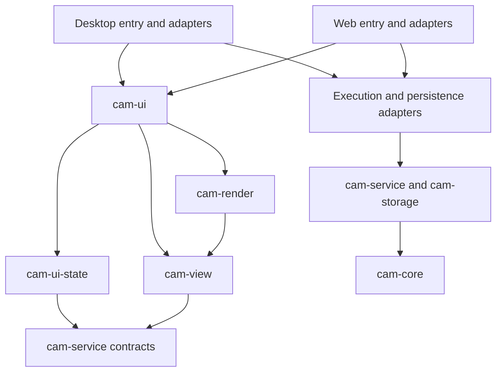

# 2.5D CAM UI: architecture and implementation handoff

Date: 2026-09-11\
Status: implementation design; all GUI milestones below are planned, not completed.\
Scope: a new shared desktop/browser workspace for the existing Rust CAM engine.

Delivery revision: user-reviewable vertical slices, beginning with the established single-SVG Flat V-carve workflow. The user identifies that operation and its existing heightfield simulation as the real-world baseline; Face, Profile and Knife have implementation/test evidence but do not inherit that operating confidence.

This document turns the [UI design proposal](2.5d-cam-ui-plan.md) into an implementation plan. It defines ownership, state transitions, integration boundaries, implementation slices and evidence required before declaring a slice complete. It is deliberately explicit: an implementing agent should not need to invent persistence semantics, machining rules or asynchronous state handling while writing a widget.

The first milestone is **GUI1: framework selection and risk reduction**. egui/eframe with a wgpu viewport is the leading candidate, not an already approved implementation stack. GUI1 produces a small working prototype, measurements and a framework decision. Subsequent architecture describes the intended boundaries if that candidate succeeds; a different selection must preserve those boundaries or document the necessary revisions before production implementation.

**GUI2a is the first usable end-to-end build:** open a known Flat V-carve job, edit it, generate both endmill/V-bit stages as applicable, inspect actual heightfield playback, prepare checked output, export, save and reopen. It does not wait for the full collection, library editor or general simulator redesign. Sections 4–13 describe the target architecture; section 14 determines how much of each boundary to implement for each usable increment.

No framework installation, prototype, application implementation or benchmark is part of writing this plan. In particular, the synthetic concept images are design references, not evidence that an egui application exists.

Reading guide: start with [GUI1's decision process](#2-gui1-framework-selection-and-risk-reduction) and the [milestone dependencies](#14-milestones-and-implementation-slices). Implementation boundaries are in [modules](#4-proposed-module-architecture), [editing state](#5-state-ownership-and-document-editing), [ports](#6-ports-contracts-and-asynchronous-results) and [workers](#7-execution-workers-and-memory). Use the [viewport](#9-viewport-architecture), [simulation](#10-visual-simulation-and-timeline), [output](#11-output-preparation-and-file-export) and [persistence](#12-portable-files-recovery-and-global-resources) contracts for feature work, then follow the [test matrix](#133-acceptance-fixture-matrix) and [handoff instructions](#16-instructions-for-implementation-handoff).

## 1. Scope, authority and principles

### 1.1 How the documents fit together

| Document | Authority |
| --- | --- |
| [CAM architecture plan, especially section 22](2.5d-cam-plan.md#22-addendum-ui-driven-backend-contracts-2026-09-10) | Machining meaning, canonical job schema, artwork/geometry identity, Rust service contracts, F3 and H1–H6 backend work. |
| [CAM implementation checklist](2.5d-cam-checklist.md) | Evidence of actual backend and incumbent UI implementation. A planned field or successful screenshot is not completion evidence. |
| [UI design proposal](2.5d-cam-ui-plan.md) | User workflow, information hierarchy, resource ownership, controls and interaction intent. |
| This document | New UI architecture, framework decision process, implementation sequence and acceptance. |
| [Concept gallery](ui-concepts/2026-09-09/README.md) | Visual direction. Written contracts govern ambiguous labels, illustrative geometry and example values. |

Use `GUI1`, `GUI2`, etc. for this plan. Do not reuse the historical web UI's U-series or the backend A–H labels. Completing the Rust-only F3 does not complete GUI8's knife interface. Completing GUI1 does not complete any H slice. This delivery revision replaces the earlier horizontal GUI2–GUI10 breakdown; those unimplemented slice names are not parallel work queues.

The initial repository review used the committed CAM/UI plans at `9627a3a`. At this delivery revision, HEAD was `30659dd` and the checklist records F3 implementation. That establishes recorded software work, not a claim of physical machining trials or user acceptance. Before implementing a dependent slice, read the current checklist, contracts and capabilities again. Preserve unrelated changes and record the actual starting commit in the slice report.

### 1.2 Product boundary

Build one persistent workspace for experienced CNC users, with compact controls and few interruptions. Prepare and Simulate share the same document, selection and view context. Setup contains Stock & work zero, Machine and the global Tool library. Artwork contains independent sources. Operations is the sole execution-order list. Job tools remains accessible at the bottom of the navigator. Export is a panel over this workspace.

First-release operations are Face, Flat V-carve, closed milling Profile and passive XYZ Drag knife. Support the planned multiple SVG sources, independent placement, explicit cross-source selection, job tool snapshots, assignment-specific cutting profiles and one applied machine configuration.

Keep general pockets, CAD sketch editing, multiple setups, rotary/tangential control, machine streaming/control, fixture/holder physics, detached-part motion and cloud synchronization outside this release. Sketch remains an extensible artwork type, with no active creation control until separately implemented. A web build does not imply a phone authoring interface.

### 1.3 Non-negotiable implementation principles

1. **One machining authority.** Core/service code resolves geometry, heights, tabs, entries, stock dependencies, knife compensation and output eligibility. UI guides and simulation pixels never become inputs to those decisions.
2. **Shared behavior, explicit platform adapters.** Desktop and browser use the same Rust application state, commands and scene meaning. Files, worker/process supervision, clipboard and storage may differ behind ports.
3. **No expensive work in the frame function.** A repaint must not import SVG, plan, serialize the job, hash every source, integrate stock or wait for a task.
4. **Stable identity over position.** Every edit, widget, selection, diagnostic and asynchronous result refers to stable document/operation/item/assignment identities. List indices and display names do not identify entities.
5. **Preserve incomplete work.** Missing values stay missing. Invalid partial text stays visible and recoverable. Never make an incomplete job apparently ready by applying undocumented defaults.
6. **Separate document, workspace, tasks and artifacts.** Camera, raw text, canonical machining intent, checked output and running computations have different lifetimes.
7. **Explicit selections.** Picking artwork is temporary. Assigning it to an operation is a document command. Importing another file does not expand existing machining selections.
8. **Explicit freshness and scope.** A complete result for an old job or different prefix is not current. A successful task is not automatically a complete, checked, executable plan.
9. **Simulation explains the plan.** It includes preceding stock removal and labels approximation, missing pages and stale results. Watching playback is not required to export.
10. **Save checked bytes.** Export preparation owns coordinate formatting and checking. File saving does not regenerate or rewrite G-code.
11. **Use measured limits.** Paging, undo, GPU buffers, source storage and stock checkpoints all have byte budgets. More sources must not multiply an unbounded cache.
12. **Deliver one usable increment at a time.** From GUI2a onward, a slice includes the UI, integration, display and persistence/output work needed for its stated workflow, with a runnable manual-review build. A mocked screen or completed infrastructure layer is not that deliverable.

### 1.4 What to reuse and what to replace

The workspace currently has `cam-core`, pure `cam-service` DTO/projection code, `cam-wasm`, the `cam-app` CLI, `cam-server`, and `cam-storage`. Preserve their domain responsibilities. `cam-app` is not an unused name for a new GUI crate.

The incumbent `web/` uses React/Three.js. Its typed contracts, worker supervision, recovery behavior, simulation fixtures and bug history are useful engineering references. Its component hierarchy and appearance are not the new design's starting point. Extract behavior or reuse a tested algorithm where appropriate; do not port each React component mechanically into an egui function.

The legacy browser worker already separates a parent ledger from disposable compute children. However, existing sequence commands do not by themselves establish the H5 retained-sequence contract. Likewise, the TypeScript sequence simulator currently has a display motion cap and a milling-tool assumption; these are limitations to address, not requirements to reproduce in the new product.

### 1.5 Vertical delivery and manual review

The first workflow is Flat V-carve because it gives the user a familiar result and a comparison application. Do not substitute a newly implemented Face or Profile just because its form has fewer fields. Start with the existing combined endmill/V-bit workflow as well as endmill-only compatibility; a roughing-only screen is not completion of the familiar V-carve loop.

Foundation work remains necessary, but is a task inside a usable slice. For GUI2a, build only the state, field binding, worker adapter, scene, heightfield presentation and one-program export needed for one known job. Later slices extend those same paths. Do not finish every renderer capability, persistence mode or H milestone before connecting the first workflow.

Every slice from GUI2a supplies a native review build and browser review build for the targets selected in GUI1, a named starting fixture, a short manual recipe, expected visible changes and known limits. Keep the last working build available. Earlier accepted workflows remain a short regression tour in every later build.

Offer a runnable target for early feedback as soon as it exists; do not withhold a native preview solely because the browser build is still being integrated. Record readiness per target, and do not call the complete slice technically qualified until its required targets pass.

Track **Technical checks**, **Ready for manual review**, and **User review** separately. An agent's smoke run can establish readiness; only recorded user feedback establishes user acceptance. Pending feedback is not implicit approval, and tests do not decide whether a layout feels right. Continue independent implementation while feedback is pending, but record assumptions and resolve feedback affecting a dependent interaction before treating that design as settled. Do not require a new permission prompt for every internal commit.

Internal tasks such as adding a reducer or port may be committed separately, but are not additional user-acceptance slices. Do not present a sequence of empty shells as completed vertical increments. Conversely, a usable limited build can be reviewed before the whole product or optional advanced settings exist, provided its limitations are visible and it never silently drops unsupported content.

## 2. GUI1: framework selection and risk reduction

This is the first implementation milestone. It precedes production UI architecture commits. It may use synthetic fixtures and a narrow real-engine example without waiting for H1–H6. Do not use missing collection support as a reason to skip the framework tests, or use a synthetic result as proof that collection integration is complete.

### 2.1 Decisions GUI1 must resolve

| Decision | Initial candidate | Required decision evidence |
| --- | --- | --- |
| Widget/application shell | egui + eframe | Dense forms, stable widget IDs, raw text, focus, IME, keyboard navigation and acceptable accessibility on the actual targets. |
| Viewport integration | Shared wgpu renderer embedded through egui's custom rendering boundary | Depth, overlays, picking, resize/DPI behavior, GPU recovery and sustained motion rendering. |
| Browser graphics baseline | WebGPU, with a WebGL2 path only if the selected stack and required features pass | Actual browser/GPU runs and selected feature flags. No assumed automatic fallback. |
| Desktop targets | Windows is the initial required candidate; evaluate Linux as the next desktop target | Exact OS/architecture, GPU/driver, display system and packaging requirements recorded in the decision. LinuxCNC output does not itself require running the GUI on Linux. |
| Browser targets | Desktop Chromium and Firefox are initial qualification candidates | Exact browser versions and GPU backend tested. Safari/macOS remain explicit evaluation items until qualified. |
| Background execution | Native supervisor; browser parent ledger and disposable compute worker | Responsive cancellation, retained results and error recovery without shared-memory WASM threads as a prerequisite. |
| Browser build/bootstrap | Small JS glue around shared Rust UI and separate CAM workers | Reproducible build, version handshake, worker loading, MIME/base-path behavior, compressed size and startup measurements. |
| Files, recovery and global resources | Existing persistence semantics through new platform ports | Portable open/save, offline reopen, quota/write failures, library revision conflicts and recoverable drafts. |
| UI testing | Pure state tests plus framework interaction harness and real platform smoke tests | Demonstrate a failing behavioral assertion, a renderer regression check and browser/native interaction tests. |

Confirm the support matrix in the GUI1 decision before using it as a release promise. A matrix row not exercised on suitable hardware is Unverified, not Passed. Do not present a Linux or Safari build as supported solely because compilation succeeded elsewhere.

### 2.2 Evidence behind the leading candidate

egui documents immediate-mode UI, stable-ID requirements and the cost of laying out large scroll regions. This supports evaluating it for a compact editor, while making virtualization and application-owned state necessary. It does not establish performance for this application. [egui project documentation](https://github.com/emilk/egui).

eframe supplies native and web entry points and documents separate graphics and accessibility features. Select and record the actual feature set; do not inherit a changing default renderer accidentally. [eframe documentation](https://docs.rs/eframe/latest/eframe/).

wgpu documents browser paths through WebGPU and WebGL2. That is a framework capability, not proof that our shaders, formats, limits or GPU configuration work on both. A WebGL2 fallback must pass the same required scene tests with any documented display-quality differences. [wgpu web platform documentation](https://wgpu.rs/doc/wgpu/documentation/platforms/web/index.html).

The proposed embedded viewport uses the custom render callback's resource preparation and painting boundary. Keep persistent buffers and pipelines there, rather than constructing a second unrelated window or rebuilding meshes during layout. [egui-wgpu callback documentation](https://docs.rs/egui-wgpu/latest/egui_wgpu/trait.CallbackTrait.html).

These primary documents were consulted during planning on 2026-09-10. They are moving references. GUI1 must record exact dependency versions, enabled features and toolchain compatibility in its decision and lockfile. This plan intentionally does not install or pin a guessed future combination.

### 2.3 Keep the comparison bounded

First prototype egui/eframe with wgpu. Use the incumbent React/Three.js implementation as a measurable compatibility/control case for browser files and rendering, not as a mandate to keep its design.

If a required capability fails, identify whether the failure belongs to the widget toolkit, graphics backend, runtime integration or application code. Test a narrow alternative only at that boundary. For example, an alternate eframe renderer can address a graphics limitation but cannot prove that our wgpu viewport works through it; a separate viewport implementation has real maintenance cost. A browser accessibility failure may require evaluating a DOM-based shell rather than exchanging the GPU backend.

Do not build multiple production UIs speculatively. If egui cannot meet a required platform/input/accessibility requirement within a bounded experiment, stop the affected production work and write a concrete alternative comparison. Selecting another shell must revise this document's crate map, testing strategy and shared-code claim. It must not quietly introduce duplicate application state or a JavaScript CAM algorithm.

### 2.4 Prototype contents

The spike is a deliberately small executable, preferably isolated under an experimental path until the decision. It must contain all of the following; a triangle renderer and a few buttons are insufficient.

1. The three-pane workspace at 1280 × 800 and 1440 × 900, with independently scrolling lists, resizable boundaries and a bottom timeline.
2. A 40-field operation inspector with optional numeric values, unit suffixes, collapsed groups, inline issues and setting search. Include text such as `-`, `1.`, a pasted invalid number, a long tool name and an IME composition.
3. Two identical named artwork sources with different IDs. Edit a field, reorder their rows, change the selected operation and return; the text and focus must remain attached to the original field.
4. A custom viewport with a stock box, placed contours, batched motion lines, translucent selected geometry, a blade glyph and top/isometric cameras. Exercise picking at several DPI values.
5. A synthetic paged motion stream, backward scrubbing and tiled stock updates. This tests transport/rendering cost; it is not a correctness claim about a machining simulator.
6. A real known Flat V-carve calculation through both the native and browser execution adapters, plus a deliberately long-running worker calculation used to prove cancellation and UI responsiveness. Do not use a new Face operation as the primary correctness/interaction baseline.
7. Portable job open/save, file drop, recovery of invalid raw text, a denied/quota-limited persistence attempt and a failed export save that can be retried.
8. Keyboard-only navigation of the critical flow, focus restoration after a dialog, clipboard, UI scaling and representative platform screen-reader behavior.
9. Worker crash/restart and GPU loss or equivalent injected renderer failure. The document must remain recoverable; failures must not look like empty successful toolpaths.
10. One behavioral UI test and one controlled image check executed in CI or a documented reproducible local harness.

Use a fixed seed for synthetic data. Store fixture generation instructions and input hashes. Include a path count, vertex count, byte count and tool/operation count in each measurement; a screenshot of a visually busy scene is not a load specification.

### 2.5 Workloads and provisional budgets

These are project targets for the spike, not measurements already achieved. GUI1 may revise them with a recorded reason and explicit support scope before production milestones begin. Do not quietly raise a threshold after a failed run to mark the same experiment Passed.

| Fixture | Purpose | Initial size |
| --- | --- | --- |
| S: daily editing | Forms, selection, file workflow | 2 sources, 10 operations, 20,000 motion segments, a 512 × 512 display field. |
| M: working job | Sustained rendering and stock playback | 20 sources, 100 operations, 200,000 segments, a 2048 × 2048 display field. |
| L: bounded stress | Paging, virtualized trees and eviction | 100 sources, 1,000 operations, 1,000,000 segments and explicit geometry/memory limits. No requirement to retain every detail on the GPU simultaneously. |

| Measurement | Initial acceptance target | Measurement rule |
| --- | --- | --- |
| S editor response | 95th-percentile input-to-visible response below 100 ms | Include keyboard input while a calculation runs; report worst pauses. |
| M camera movement | 95th-percentile frame interval at or below 33 ms | Release build, declared viewport/DPI, after controlled warm-up; report CPU and GPU where measurable. |
| Cancel response | UI acknowledges within 100 ms; disposable calculation stops within 1 second | Separate visual acknowledgement from actual stopped execution. |
| M scrub | Latest requested view appears within 250 ms when nearby pages/checkpoints are resident | For cold data, show a loading state promptly and measure time separately. |
| Large lists | Visible rows remain interactive at L size | Count laid-out rows and detect O(total rows) work per frame. |
| Idle behavior | No continuous full-scene upload or stock recomputation | Observe at least 30 seconds with no animation/task/input. |
| Browser retained display data | Initial total budget 256 MiB | Includes motion pages, CPU/GPU scene caches and stock/checkpoints; engine/source/undo budgets are additional but must also be reported in total process/tab usage. |
| Desktop retained display data | Initial total budget 512 MiB | Same accounting categories; larger RAM is not permission for unbounded growth. |
| Web cold start | Aim for shell usable within 5 seconds on a declared ordinary connection/machine | Record compressed assets, transfer, compilation and worker initialization separately. Failure requires investigation, not a claim that all users have the warm cache. |

Run at least five repetitions for interaction/startup samples and a sustained two-minute M playback/pan exercise. Report median, tail, peak retained memory and load conditions. Separate application allocations, WASM memory, JS heap and GPU estimates; browser APIs may not expose a reliable single total. A missing counter is an unknown to disclose, not zero.

### 2.6 Risk probes that must produce a decision

| Probe | Passing evidence | If it fails |
| --- | --- | --- |
| Dense input/IME | Pending text survives selection, repaint and reorder; commit/cancel/focus work on both targets | Fix state or input integration before choosing the shell. |
| Required accessibility | Named controls, navigable focus and usable critical workflows on the chosen target matrix | Identify toolkit vs custom-widget gaps; reassess the shell or explicitly revise supported scope. Do not equate an internal text-to-speech option with screen-reader parity. |
| Graphics compatibility | Required scene passes on each selected backend/GPU row | Select a tested baseline, reduce optional visual features, or evaluate an alternative; no silent blank viewport. |
| Cancellation | A CPU-bound WASM call can be stopped without freezing the UI or losing an unrelated prepared bundle | Keep computation out of the parent ledger; do not rely on a cancel message being processed inside non-yielding synchronous WASM. |
| Transfer/memory | Measured copies, page eviction and worker memory stay bounded | Change binary/page ownership before implementing million-segment playback. |
| Files/recovery | Unsupported direct-save API still has portable download; recovery failure preserves editable state | Use platform fallbacks and expose the actual persistence result. |
| Testing | Tests can find named controls and detect a broken command/focus transition | Establish an accessible/testable UI surface before adding many bespoke controls. |

### 2.7 GUI1 outputs and stop condition

Deliver an executable spike, reproducible commands, fixture manifests, measurement results, platform matrix, known limitations and a `ui-framework-decision.md` beside this plan. The decision must name the shell, renderer, feature flags, exact versions, bootstrap/build tools, platform I/O libraries, test approach and cancellation architecture. Record license/distribution requirements for shipped libraries, fonts and icons.

The decision has one of three outcomes: **Proceed**, **Proceed with explicit scope limits**, or **Reconsider the stack**. Missing evidence for a required platform is not Proceed. A successful native screenshot does not resolve browser worker, storage or accessibility risks. No production milestone begins with an unresolved required-stack decision.

## 3. Relationship to the Rust backend plan

### 3.1 Backend dependencies are real integration work

| Backend slice | What the UI needs from it | UI must not substitute |
| --- | --- | --- |
| H1 | Portable collection schema, qualified reference types, copied-resource shapes, draft validation and migration | Hidden UI-only collection fields or serializing only the first source. |
| H2 | Per-item catalogue/placement, source revisions, artwork commands, assignments and fit-stock proposals | Filename-based geometry matching or a second SVG machining importer. |
| H3 | Cross-source operation resolution and semantic identities | Planning sources separately when Flat V-carve requires their union. |
| H4 | Applied profile/machine commands and read-only inspection DTOs | UI-derived stock heights, tab feasibility or competing output settings. |
| H5 | Retained plan/output handles, cancellable tasks, paging, selected-scope preparation and ordered bundles | Replanning on every motion page, client-manufactured trust receipts or unchecked G-code formatting. |
| H6 | Qualified Rust/native/WASM contracts and stated limits | Treating a local successful run as platform parity. |
| F3 | Bounded knife evidence, emitted-program replay/process checks and supported stock contact | Re-deriving passive blade motion in the renderer or assuming air contact is material engagement. |

GUI1 may mock unavailable contracts. Later slices may use a deterministic fake adapter for tests, but the milestone cannot be marked complete until the real declared backend dependencies work. Never mark H or F3 complete inside a UI report; link their recorded evidence.

This table describes responsibility for the completed product, not a requirement to finish every H milestone before GUI2. GUI2–GUI3 use the bounded compatibility route below when those later contracts are unavailable. Deliver and test the required small backend capability as part of its vertical slice, with explicit partial credit against H work. Do not falsely declare the entire H milestone done.

### 3.2 Avoid a dependency cycle

The framework spike uses synthetic scene/task DTOs with an explicit Experimental marker alongside the known real carving example. H1–H6 can implement machining/service contracts without an egui renderer. Production UI state consumes the released canonical contracts, moving to the versioned H contracts as their capabilities enter the product. A needed missing field is a backend contract change to coordinate, not an invitation for the UI to inspect private planner internals.

Do not make H6 depend on GUI11 screenshots, and do not count H6 as evidence that the browser GUI has been tested. The two handoffs test different boundaries.

### 3.3 Early compatibility route and minimum backend contract

The [CAM addendum's early-delivery rule](2.5d-cam-plan.md#2213-early-user-review-with-the-established-flat-v-carve-workflow) permits the following narrow route so the first usable build does not wait for a complete document/resource rewrite. This changes delivery order, not machining or output correctness.

1. At GUI1d, choose the then-working released canonical job/transport as GUI2's baseline. Schema 4 with a single embedded source and one Flat V-carve operation is sufficient. Use the existing migration and legacy Flat V-carve adapter; do not implement a second carve planner or call a partially implemented schema 5 released. If a newer canonical contract already supports the actual single-source open/generate/inspect/prepare/save loop, consume it directly and omit this bridge. H1 model types or migration alone are not evidence that its downstream execution path is ready.
2. Preserve combined endmill/V-bit execution, distinct tool assignments, selected filled components and existing cutting values. A single operation may have two internal stages and two mapped tools. Compare the new adapter path against the known job and investigate differences; legacy operation confidence does not automatically qualify every newer wrapper/post change.
3. Until a portable applied machine snapshot is available, keep one explicitly loaded schema-2 sequence profile in the application session, addressed by Setup → Machine and Export. Save it as a separate supported profile file and say when it is needed on reopen. Never hide it in an unknown schema-4 field, reconstruct it from descriptive legacy metadata, or keep a second editable export copy. Missing values stay missing. GUI4a explicitly copies/applies it into the new canonical portable snapshot.
4. Provide service-owned retention of the generated plan, complete bounded motion stream, checks and checked program bytes. Reuse the core's generated-plan/prepared-execution contracts and the existing supervisor/worker pattern. A small single-job lease/cache and bounded whole-result or ordinary pages are sufficient; optimized binary streaming, many simultaneous artifacts and sequential bundles are not prerequisites.
5. Current `SequenceCommand::Motions` can replan and `Export` plans from a job again. Do not build scrubbing over those stateless calls or treat a freshly generated different execution as the inspected plan. Add a narrow typed Rust service/supervisor path that pages/prepares the retained generated execution using the existing core methods. It must bind document/instance/request identity, reject stale/cancelled results and retain exact checked bytes for save/retry. New public shapes/capabilities are versioned explicitly; no client-manufactured trust receipt.
6. Keep import/planning/preparation and stock integration off the frame/UI thread. Actual child cancellation, error reporting, unsupported-job rejection and save failure handling are required in the first usable loop, even if the cache holds only one job. Do not implement unchecked output to obtain a quicker demonstration.
7. Before H3 semantic projections arrive, the released whole-job fingerprint may conservatively stale a plan on an output-only or name edit. Record this temporary over-invalidation; camera/selection cannot cause it because they are not in the job. GUI4's H3 integration removes this limitation. It is never acceptable to retain a current result after a relevant machining change.
8. GUI4 retires the schema-4/session-profile bridge through explicit migration. Preserve old portable readers and backups, then use qualified references and the new applied-snapshot/retained-artifact contracts. Extend the same service-owned retention implementation rather than keeping a second GUI-specific execution engine. Full H5 remains incomplete until its additional scopes/bundle/lifecycle acceptance passes.

GUI2 may reject newer collection or multi-operation documents outside its advertised envelope before changing the current draft. It must not open them by dropping unsupported operations, artwork or fields. Fake adapters remain test tools; the manually reviewed workflow uses real Rust generation, stock data and checked output on both targets.

## 4. Proposed module architecture

Names below are proposed implementation locations, conditional on GUI1. They are not existing crates. Start with these boundaries and ordinary modules inside them; do not create a crate for each widget or panel.

This is a responsibility map, not a scaffold milestone. GUI2a creates only the modules/crates needed for its working loop; create or extract other units when a later usable slice needs them. Do not spend a release filling empty module trees, generic resource editors or unused ports before connecting the known carving.

| Proposed unit | Owns | Must not own |
| --- | --- | --- |
| `cam-ui-state` | Application model, raw drafts, commands/events/effects, undo, selection, freshness projections, platform-port types | egui/wgpu objects, filesystem access, CAM algorithms, worker spawning. |
| `cam-ui` | egui shell, named controls, field binding, layout, navigation, input routing, presentation | Canonical serialization rules, output authority, long-running computation. |
| `cam-view` | Renderer-neutral scene data, camera math, display picking structures, motion display store, approximate visual stock and checkpoints | Machining validation, library mutation, GPU/window handles. |
| `cam-render` | wgpu pipelines, buffers, textures, render passes, clipping, overlays, device-loss recovery | Document mutation, operation ordering, numerical knife replay. |
| `cam-ui-desktop` | Native entry point, execution/storage/file/dialog adapters, packaging integration | A second set of UI behavior rules or a renamed CLI. |
| `cam-ui-web` | Web entry point and Rust bindings to browser adapters | A second document reducer or JS implementation of stock/CAM algorithms. |
| Browser glue directory chosen by GUI1 | Worker bootstrap, typed message transport, browser files/clipboard/storage calls | Business logic duplicated from the Rust application/service layer. |

Keep `cam-service` pure. It can define typed request/result structures, projections and admission logic; async runtimes, filesystem handles and task supervision belong to adapters. If a shared supervisor state machine is extracted, separate its pure bookkeeping from platform effects.



The diagram expresses dependencies, not calls that must run synchronously. `cam-core` must never depend on a GUI crate. `cam-view` tests must run without a window or GPU. `cam-ui-state` tests must run without starting a server. Browser-only types remain behind target-specific adapters, not scattered through operation editors.

### 4.1 Suggested internal modules

```text
cam-ui-state/src/
  app.rs              # application state, action reduction and effects
  document.rs         # session identity and canonical command transactions
  drafts.rs           # field keys, raw text, parse/commit state
  undo.rs             # grouped document transactions and retained sources
  tasks.rs            # client task state and accepted result bindings
  artifacts.rs        # views/leases, freshness and output selection
  resources.rs        # library editor sessions and copied profile actions
  persistence.rs      # recovery/save state, no platform I/O
  selection.rs        # navigator, picking and explicit assignment selections
  ports.rs            # typed execution, storage, files, clipboard contracts

cam-ui/src/
  shell.rs, navigator.rs, inspector.rs, issues.rs, export.rs
  fields/             # optional numeric/text/enum binders and setting registry
  editors/            # setup, artwork, machine, tools and operation editors
  viewport_input.rs, timeline.rs, theme.rs

cam-view/src/
  scene.rs, camera.rs, picking.rs, motion_store.rs
  stock/              # display raster, tile updates and checkpoints
  knife.rs            # presentation of core evidence, no replay algorithm
```

Keep widgets small by passing a focused presenter and emitting actions. Do not pass mutable access to the entire document into every panel. A field registry can supply labels, units, keywords and diagnostic routes; it must not become a generic reflection engine that hides operation-specific meaning or inserts numeric defaults.

## 5. State ownership and document editing

### 5.1 State layers

```text
Application
  DocumentSession
    document_epoch, document_id, revision, canonical CamJob
    last_portable_save, pending_save, recovery_status
    DraftStore, UndoHistory
  Workspace
    mode, navigator_selection, viewport_selection, assignment_session
    camera, layout, expansion, inspector_scroll, active_gesture
  ResourceEditors
    library/configuration edit buffers, source revisions, conflicts
  Tasks
    request bindings, progress, cancellation, accepted completion
  Artifacts
    current/stale PlanView, inspection pages, PreparedBundleView
  DisplayCaches
    immutable scene snapshots, motion pages, stock tiles/checkpoints
```

The canonical job is portable machining intent. `DraftStore` contains uncommitted input that may not be representable in it. Workspace is session/recovery state. Artifacts are retained execution evidence, not editable job fields. GPU resources are disposable projections of display caches.

Opening another job creates a new `document_epoch` even when its filename or serialized contents match the previous job. Late messages from the prior epoch cannot update the new session. Backend instance IDs likewise change after service/worker restart. Avoid overloading one revision counter to mean both things.

### 5.2 Stable field and widget keys

Define a field key from document epoch, entity ID, assignment role where applicable and a typed field path. Examples are `(operation_id, profile, finishing.feed)` and `(artwork_item_id, placement.translation_x)`. Use that key as the egui ID seed and the `DraftStore` key. Include a persistent row ID for contour/tab rows; never use their current array index.

An operation rename must not replace the field key. Reordering must not transfer text, focus, selection or expansion to the entity occupying the old index. A deleted entity's active draft becomes detached from live editing and is retained with its undo transaction as needed; it cannot attach to a newly created entity that happens to use the same name.

### 5.3 Numeric editing contract

Use a field buffer rather than binding every keystroke directly to `f64`:

```text
NumericDraft
  field_key
  raw_text
  baseline_typed_value: Option<number>
  edit_generation
  parse_state: Empty | Partial | Invalid | Parsed(value)
  semantic_issue: optional located diagnostic
```

Empty text means an unset optional value when committed. It does not mean zero. A parseable value can still be semantically invalid, such as negative stock thickness; service readiness reports that separately. Do not clamp it silently to an apparently valid boundary.

Enter or valid focus loss commits a typed value through the document command path. Escape restores the edit's baseline. Invalid/partial text remains associated with its field when focus moves; navigating to another operation cannot discard it. IME composition must finish before parsing/committing. Format a committed number when editing ends, not on every repaint or keystroke.

For the initial parser, use an explicit locale-independent numeric grammar and visible units. Decide decimal-comma handling in GUI1; either normalize it deliberately with tests or reject it visibly. Never interpret an ambiguous thousands separator by stripping punctuation. Formatting must not reduce the precision of a stored value simply because the unfocused control shows fewer digits.

### 5.4 Pending text and high-level actions

Before Generate or Prepare output, finalize valid pending fields relevant to the requested scope in a defined transaction, then run readiness. A partial/invalid relevant field blocks the action and routes to the field. Never generate from a hidden previous value while displaying a different uncommitted value as if it were effective.

Uncommitted machining edits mark the displayed result as pending/out of date immediately for presentation. They do not fabricate a new backend machining identity. If the user cancels the edit and the committed identity still matches, the existing result may become current again. Non-machining drafts, such as a name, do not require replanning; they may still affect prepared filenames/comments.

Save must remain useful for incomplete jobs. It commits valid drafts, saves the structurally valid canonical job and separately attempts recovery of remaining raw text. A portable file cannot contain an invalid numeric token in a numeric field. If raw text remains only in recovery, show that distinction beside Save; do not clear the entire unsaved-draft indication or claim that the portable file contains it. A failed recovery write leaves that text in memory and reports the failure.

Only pending fields affecting the selected generation/output scope need block that action. Do not make an unrelated disabled operation's incomplete settings block a valid prefix. Global structural corruption remains a document error. The backend supplies the scope/readiness rules; the UI does not invent a more permissive subset.

### 5.5 Transactions and undo

Represent user intent with typed commands: Set field, Apply profile, Replace source, Reorder operation, Assign geometry, Commit placement and similar actions. Reuse H1/H2/H4 command validation. The UI may perform bounded local application using the same shared pure command code; it must not maintain a second validator.

One drag gesture is one undo transaction. Numeric typing coalesces within a field edit. Batch imports form one transaction for the accepted additions, with per-file failures reported. Applying a profile changes its copied fields and baseline together. Reordering across a dependency can produce a saveable unresolved draft; it must not silently reorder other operations or disable the affected one.

Store enough before/after state to restore exact intent, IDs and source bytes. Use shared immutable source blobs or commands referencing retained snapshots; copying every embedded SVG for every keystroke is unacceptable. Account for undo-retained bytes. Prune whole transactions under a declared budget, retaining the saved checkpoint where practical and never leaving half an undo group.

Global library/configuration saves are separate revisioned actions. Job Undo can undo copying a preset into an assignment, but cannot silently roll back a separately committed library edit. Reapplying a preset reads a selected revision once; Undo/Redo uses the captured values rather than fetching whatever the library contains later.

Undo does not restore live task handles or an expired trust receipt. After undo, reuse retained output only if the current backend instance and relevant identities still match. Otherwise retain it as stale inspection data and regenerate normally.

### 5.6 Frame and effect discipline

The frame reads an immutable or narrowly borrowed presentation snapshot, displays controls and queues actions. Apply each action once outside layout, then issue effects. Backend completions become events reduced through the same state owner. A widget returning `changed()` must not trigger a second application when egui lays it out again.

Bound events consumed per frame and coalesce replaceable progress/camera/preview updates. Never drop a terminal task result, command acknowledgement or save failure to keep animation smooth. Wake the UI on input, task progress, a completed upload or active playback; no permanent busy repaint loop for an idle scene.

## 6. Ports, contracts and asynchronous results

### 6.1 Port responsibilities

| Port | Inputs/outputs | Ownership rule |
| --- | --- | --- |
| Execution | Capabilities, document commands/inspection, Generate, task status/cancel, plan pages, Prepare output, exact bytes | Uses H contracts and service-owned artifacts. |
| Files | Open bytes, choose destination, write/download immutable bytes, actual result | Never parses machining meaning or reformats programs. |
| Recovery | Save/load a versioned recovery envelope and report quota/write failure | Does not claim a portable user file was saved. |
| Library/configuration storage | Read revision, propose changes, conditional save, import/export | Conflicts preserve the edit buffer and do not overwrite a newer record silently. |
| Clipboard/platform input | Text and platform result | Invoked from appropriate user gestures; denied access remains visible. |
| Renderer/display work | Immutable scene inputs, tile/page requests and completed display updates | Cannot change document or export eligibility. |

Use shared Rust request/result types where possible. Version bulk display buffers as well as JSON control messages. Native in-process calls are an adapter to the same semantics, not permission to bypass service admission or access a private planner pointer. Preserve a usable CLI/HTTP path.

### 6.2 Capability and version handshake

At startup, obtain engine version, API/document versions, supported operation/inspection kinds, resource limits and instance ID. Compare them before opening an editable job. An incompatible service or cached worker must cause an explicit reload/update or unsupported-version state. Do not retry against an old route by dropping collection fields.

The application bundle, worker glue and WASM module have a common build manifest from the first review build. Cache keys include their build identity. If deployment leaves a mixed set, stop before editing/output; preserve recovery access and provide a useful recovery path. A service worker/offline installer is optional later work, not a prerequisite for local WASM computation after assets are loaded.

### 6.3 Request binding and acceptance

Each request captures at least document epoch, revision, backend instance, request ID, scope, relevant semantic identity and a cancellation/generation token. Candidate geometry and stock scrubbing have their own replaceable request generations; a late preview must not overwrite a newer gesture.

```text
on_completion(binding, result):
  reject if backend instance or document epoch is no longer active
  reject if the request was cancelled or superseded
  verify expected response kind, version, scope and artifact ownership
  compare result's relevant semantic identity with the current committed inputs
  attach as current only if all required conditions match
  otherwise retain only as explicitly stale inspection, when useful and bounded
```

This is the target behavioral contract, not an implementation to copy without considering H5. A changed document revision is not alone enough to discard a semantically unchanged plan after a rename once the semantic projections are available; section 3.3 explicitly allows temporary conservative invalidation with the older whole-job receipt. Conversely, a matching revision number from another session cannot authorize a result. Service identity checks remain authoritative; the UI's projection is not a trust grant.

### 6.4 State is not one green light

Keep separate states for edit readiness, task progress, generation outcome, plan freshness, basic checks, display completeness, machine readiness, prepared-output freshness and optional quality analysis. The design proposal's status table governs labels.

An Empty plan is visible but cannot supply an all-empty executable bundle. Inconclusive checks remain inconclusive. A failed display tile upload does not invalidate core machining, but must not claim complete simulation. A missing mapping can block preparation while leaving a valid plan inspectable. A proven invalid motion returned by optional analysis becomes a blocking issue through the service contract; cosmetic quality findings stay in that report.

When showing stale paths, retain their original setup/tool/source snapshot or render them as an explicitly separate comparison. Do not put an old toolpath through the new tool geometry, new stock datum or new artwork placement and label that mixture a simulation of either job.

## 7. Execution, workers and memory

### 7.1 Native and browser arrangements

On desktop, the UI thread owns input and GPU presentation. A supervisor manages bounded computation outside that thread, using the existing process boundary where appropriate. File operations and large serialization also run asynchronously. A synchronous service helper is acceptable for a demonstrably cheap typed field edit; that does not justify synchronously importing a large SVG.

In the browser, use a UI WASM instance for shared application/presentation code, a long-lived service/ledger worker, and disposable compute workers for non-yielding calculations. A separate display worker can run stock integration if it would otherwise delay service responses. Prefer one active CAM calculation and one active display calculation initially; queue work with explicit priorities rather than spawning a worker for every operation or scrub event.

The repository's `web/src/service/wasm/{worker,child,ledger,transport}.ts` is an engineering reference for this arrangement. Reuse the established supervision behavior where compatible. H5 must extend the sequence artifact contract; merely wrapping the existing synchronous sequence route in a Promise is insufficient.

Keep the parent responsive enough to answer Cancel and serve retained artifacts while its child computes. A posted cancel message cannot be relied on to interrupt a synchronous WASM call that never returns to its worker event loop. The browser provides immediate worker termination, which also means cleanup inside that worker is not guaranteed. Terminate the disposable calculation, not the owner of unrelated prepared bundles. [MDN Worker termination](https://developer.mozilla.org/en-US/docs/Web/API/Worker/terminate).

If the parent itself crashes, invalidate its instance and all associated handles. Preserve the editable document/recovery state, restart the service and regenerate/reprepare as required. Do not revive a cached handle because the UI still has its string. Never report parent-crash recovery as equivalent to an ordinary child cancellation.

### 7.2 Message and buffer ownership

Use compact control messages for commands/status and bounded binary pages for large motion/display arrays once profiling justifies them. Each bulk page includes format version, artifact/scene identity, range, element count, precision/units, ownership tables and validation bounds. Check lengths and indices before allocating or uploading.

Do not send the entire job with every motion page, serialize one JS object per segment for every scrub, or copy the complete heightfield on each changed tile. Use immutable pages, dirty-tile updates and bounded outstanding requests. Deduplicate identical page requests; newest scrub/preview requests can replace obsolete requests, while required ordered data is retained or requested again.

Transferred browser buffers change ownership and detach the sender's copy. This does not make arbitrary WASM memory transferable without copying. Measure the necessary copy from WASM memory into an owned transferable buffer; account for both live representations until the transfer completes. Avoid retaining views into memory that may grow or become invalid. [MDN transferable objects](https://developer.mozilla.org/en-US/docs/Web/API/Web_Workers_API/Transferable_objects).

GPU buffers remain owned by the render context. No port exposes a GPU handle to a compute worker or writes to one from an arbitrary thread. The display pipeline receives CPU-owned immutable data and schedules uploads on the render side.

### 7.3 Budget ownership

Track at least source bytes, canonical/recovery serialization, undo-retained sources, active worker inputs/results, retained plans, prepared programs, CPU motion pages, stock/checkpoints and GPU resources. The total includes concurrent workers and transient copies, not only the steady-state scene.

Use capabilities for hard engine/import/output limits. GUI1 sets display budgets independently. At a limit, evict reconstructable display data first, reduce explicitly labeled display resolution if permitted, or reject the requested display detail with a located message. Do not drop machining motion or loosen a core tolerance to satisfy a renderer limit.

Define a bounded lease policy for plans and prepared bundles. An in-progress save keeps the bundle it is reading alive. A failed save retains it for retry within the documented lifetime. If eviction becomes necessary, the UI loses Current prepared output and offers preparation again; it cannot display a working export action over missing bytes.

## 8. Editing workflows and presenters

### 8.1 Shell and navigation

Implement fixed resizable panes before considering docking. Navigator, inspector and timeline use persistent workspace settings; the document's machining schema does not contain pane widths. At narrower supported sizes, switch drawers/panels without losing field buffers or selection. Keep Generate, Cancel, Save and Export in stable locations.

Define navigator selection as a tagged value: Setup section, Artwork item/geometry, Operation, Job tool/assignment or Global library editor. It is distinct from viewport multi-selection, active machining assignment and timeline playhead. A navigation action changes the presenter, not the machining selection.

Each inspector presenter exposes its title/context, stable field keys, committed values, draft values, relevant diagnostics and available actions. A located issue selects the owner, opens collapsed ancestors, scrolls to the field and optionally frames a supplied geometry location. Do not parse a human-readable error string to discover its owner.

### 8.2 Setup and work zero

Stock controls edit physical XY extents, thickness and travel settings through typed commands. Fit to artwork requests a bounded proposal for explicitly selected artwork IDs and margins; applying it is a document transaction. Importing/moving artwork does not silently resize physical stock.

Use the existing setup-coordinate convention consistently: original stock top is Z=0, stock extends downward, and work zero changes output coordinates rather than physically moving stock or artwork. Work-zero presets and custom values resolve through the core/setup contract. Face-derived operation tops do not redefine stock thickness or move the job datum.

Show setup-space values for geometry editing and clearly labeled work-coordinate readouts for output review. With H3/H5 identities, changing work zero invalidates preparation while unchanged setup-space machining remains reusable; the older-receipt bridge may replan conservatively as documented in section 3.3. The Machine panel must not expose a competing Z datum or spindle-direction field.

### 8.3 Artwork collection and assignment

An artwork presenter operates on `ArtworkItemId`, its embedded content, interpretation, placement and catalogue revision. Import supports several files; parsing/inspection happens off the frame thread, failures identify each file, and accepted additions commit together. Opening a job and importing artwork are separate actions.

Replacement is transactional: malformed content leaves the source unchanged; valid changed content preserves the item ID and produces unresolved assignments/anchors according to the backend's source-revision rules. Show the affected operations and an explicit reattachment route. Never guess a replacement from filename, nearest geometry or matching display text.

The assignment editor holds a temporary set/order of qualified geometry references. Use/Add/Remove commits it to the target operation. Picking a contour elsewhere or importing another SVG leaves the operation unchanged. Assignments can cross artwork owners. Profile and knife preserve their selected contour identities; Flat V-carve's union belongs to H3.

Hide and Lock are workspace properties. Hidden assigned geometry still contributes to machining; its operation shows the owner/reference. Lock prevents accidental viewport picking/manipulation, not explicit typed settings edits. Duplicate source creates a new item and does not clone or retarget operations. Organizing artwork rows changes display order only.

### 8.4 Tool library and job assignments

The Global library editor owns a revisioned edit buffer, explicit Save and conflict state. A job editor owns copied geometry, assignment values and optional provenance. Do not share a mutable tool/preset object between them.

Implement distinct actions: Add geometry to job; Use in operation; Apply cutting profile; Reset overrides; Reapply a selected library revision; Save assignment values as a library profile. Reusing unchanged library geometry may reuse a matching job snapshot by explicit origin/identity. Equal diameters alone do not identify the same physical tool.

The profile application target is `(operation_id, assignment_role)`, not just a tool ID. Flat V-carve's endmill and V-bit roles remain separate. Changing one assignment must not change another using the same job tool. Choosing a different tool without a preset clears applicable assignment cutting fields/baseline; editing the existing shared job geometry preserves values for revalidation and names affected assignments.

Applied/Modified is calculated against the stored copied baseline, including unset values. Reset works without the library. Reapply uses a reviewed current revision. Unavailable provenance does not make valid copied values unusable. Job tools' assignment table is a projection of actual assignments, not another table of editable presets.

Controller T/H mappings use stable job tool IDs in the one applied machine snapshot. Mapping changes do not rename entity IDs, change tool geometry or reset cutting values. Unused tools remain visible and do not require mappings outside the selected executable scope.

### 8.5 Operation editors

Use explicit editors for the four operation kinds over shared field primitives. The table below is a completeness checklist, not permission to expose unsupported backend options.

| Editor | Required groups | Integration details |
| --- | --- | --- |
| Face | Area, tool/cutting, heights, passes, extensions/entry | Entire-stock and explicit rectangle modes; distinguish requested coverage margins from travel overrun and allowed overhang; source-free operation. |
| Flat V-carve | Filled selection, heights, execution mode, endmill assignment, optional V-bit assignment, detail/allowance controls | Remains one operation with ordered internal stages. Endmill-only is explicit. Do not invent separate rest-machining operations. |
| Profile | Qualified contour rows with side/order, assignment, heights, depth passes, finish allowance/feed, tabs, starts/entries/leads | Side is per contour; helper actions write visible values. Preserve tabs in rough and finish paths. Candidate overlays are not proof of feasible entry. |
| Drag knife | Qualified chains/contours, knife assignment, heights, feeds, stepdown, swivel/corner settings, initial heading, start/closure | No RPM/stepover/rotary-axis controls. Show fixed process intent and supported alignment/contact limitations. |

Show only supported enum choices. Existing unsupported saved values need a visible unsupported/read-only state, not replacement with the first selectable option. A newly required value absent from a preset stays missing.

Common operation actions include add, duplicate, rename, enable/disable, reorder and remove. Duplicate creates new operation/row identities and retains the explicit source/tool references. Reordering uses the backend to report dependency issues; the UI does not resolve them by silently changing a referenced face or disabling an operation.

### 8.6 Direct manipulation

Represent a gesture as Idle → Armed → Dragging candidate → Commit/Cancel. Pointer-down captures entity/reference and baseline transform/anchor; subsequent events target that same identity. Pointer capture loss, Escape and document replacement have explicit cancellation behavior.

Convert the pointer to setup coordinates using the current camera, then ask the relevant shared/core helper for an anchor or candidate. A displayed decimated polyline cannot redefine a source fraction or tab boundary. Each preview request has a gesture generation and source revision. Ignore older completions and label accepted previews Candidate until generated evidence exists.

Commit sends one typed document command with the candidate's required reference information. If the source changed during dragging, reject/restart the gesture rather than applying a stale candidate. Provide numeric/list equivalents for every draggable placement, area, start and tab. Snapping must be visible and explicitly enabled; it must not change machining geometry merely because the cursor passed near it.

## 9. Viewport architecture

### 9.1 Scene contract

Build an immutable `SceneSnapshot` from typed document/inspection/artifact views. It contains a scene identity and coordinate frame, physical stock extents, artwork display primitives with owner-qualified IDs, operation overlays with evidence labels, ordered motion references, selection/style roles and current tool/knife display samples.

Separate document guides, candidate geometry, generated setup-plan motions and prepared-program motions into named layers. A layer has its source identity, completeness and freshness. The renderer must not silently replace planned entry motion with a prettier candidate or treat an emitted bridge as a planned cutting segment.

Updates are incremental by item/layer/page. Moving one artwork source updates its transform and affected overlays; it does not reimport other sources. A camera change updates matrices and screen-space pick projections, not the core catalogue. A theme change updates style bindings, not geometry buffers.

### 9.2 Coordinates and precision

Keep authoritative positions in setup millimeters using the service's precision. The UI camera has a documented right-handed world convention consistent with setup +X/+Y/+Z. Screen coordinates use logical UI points, while GPU viewports and picking attachments use physical pixels; multiply by the actual scale factor exactly once.

For GPU positions, use camera-relative or local-origin float coordinates where necessary and retain the original higher-precision data for readouts and commands. Never round the canonical job because a float32 buffer is convenient. Test large coordinate offsets with small geometry, negative XY, nonzero artwork origin, rotation/scale, stock-bottom work zero and high DPI.

Use the core's placement conversion. The current import formula is `scale * rotate(page_XY - origin_mm)`; a new UI translation field must round-trip through that formula, not reinterpret `origin_mm` as a post-rotation translation. Changing rotation/scale must have a documented pivot convention and identical numeric/drag behavior.

### 9.3 Picking

Maintain a scene-local pick registry mapping compact render IDs to qualified document references and primitive kinds. Compact IDs are cache entries, never portable geometry IDs. Rebuild or version the registry when its source scene changes so a delayed pick cannot select the object that later reused its slot.

Begin with CPU spatial indexing and precise screen-distance/ray tests if GUI1 proves it sufficient; use a GPU ID pass only when measured need justifies readback complexity. Either path must support stable ownership, overlapped candidates, transparent overlays and DPI-aware hit tolerance. Coarse render geometry may find candidates, but a machining anchor is resolved through the source catalogue.

Specify interaction priority: active edit handles first; then the currently selectable geometry kind; then stock/view navigation. Provide a way to cycle or list coincident candidates instead of choosing by arbitrary draw order. Locked/hidden guides do not pick accidentally. A generated path selection routes to its operation/stage and does not become an artwork assignment automatically.

### 9.4 Render passes and resource lifecycle

Use persistent batched buffers for artwork, toolpaths, stock and overlays. Draw motion segments through an instanced/batched line representation with predictable screen-space widths; do not submit a widget or generic painter shape for every segment. Visibility/filter changes should normally affect ranges/style data rather than rebuild all vertices.

A useful initial pass order is opaque stock/surfaces, visible path/guide layers, selected translucent geometry, then edit handles/labels. Explicitly choose depth testing/bias for each layer to avoid z-fighting or invisible selected tabs. Apply the viewport clip/scissor so custom rendering cannot cover the inspector.

Keep pipelines, textures and upload queues outside UI layout. Reallocate on capacity growth, not every frame. Budget upload work per frame and display loading status if necessary. The device owner handles surface resize/minimize, DPI change and device loss. Reconstruct GPU resources from retained CPU descriptors or request bounded pages again.

If graphics initialization fails, keep a readable startup/recovery path. If failure occurs while editing, preserve the document and file access. A fallback may reduce optional shading or display detail only if GUI1 qualifies it; it cannot claim complete stock visualization while showing nothing.

### 9.5 What not to build here

Do not implement a second milling offsetter, tab placer, curve-to-source matcher, knife ODE solver, G-code interpreter or stock-contact validator in `cam-render`. Display triangulation, camera transforms and hit testing are legitimate display work. Machining meaning must come from `cam-service`/`cam-core` contracts.

## 10. Visual simulation and timeline

### 10.1 Source and accuracy contract

The simulator consumes the ordered current plan and its actual stock prefix. Its display heightfield is approximate. Core stock history and F3 replay remain authoritative for planning/checks. Do not feed raster output back into the CAM engine or make a screenshot comparison an export gate.

Use `web/src/sim/{engine,sequenceSim,store}.ts`, `web/tests/sim/` and `web/integration/simulator-crosscheck.test.ts` as the established implementation/test reference. GUI1 decides direct reuse versus a narrow renderer-independent Rust port for the selected targets; GUI2a includes the actual combined-carving simulation. A required port preserves the existing endmill/V-bit update, quantization, sampling and checkpoint meaning first, with side-by-side fixture comparisons. It does not start as a generic simulator redesign. A port needs its own evidence; confidence in the original implementation is not proof that the port is correct.

Keep the existing operation/simulator available as a comparison until the new workflow is manually reviewed. Compare matched grids, motion positions and stock samples, not just similar screenshots. Add independent small numerical fixtures so identical mistakes are not accepted solely through parity. Generalize narrow tool/stage assumptions when the first new workflow needs it, with checked indices throughout; a knife-only job later must not require a milling tool.

Define one `SimulationKey` containing execution identity, source view (setup plan or prepared program), scope, initial/prefix stock identity, tool geometry, display algorithm version and resolution. A checkpoint or tile for another key cannot be reused just because the stock rectangle matches.

### 10.2 Heightfield representation

Start GUI2 with the existing bounded tiled heightfield representation and quantization behavior wherever the chosen runtime permits it. Do not switch to a float model, new sampling policy and new renderer simultaneously just to modernize the implementation. State the inherited quantization/display error and qualify the chosen resource envelope against the real carving fixture. GUI9 may revise representation, tile/resolution policy or removed-through presentation for a concrete user-visible benefit, backed by comparisons and independent fixtures.

Resolution is a display setting derived from physical dimensions and a cell budget. Show the cell size. Include CPU field storage, changed-tile copies, GPU textures/meshes and checkpoints in the budget. An initial 2048 × 2048 float field alone is about 16 MiB before any duplicates; four checkpoints plus a GPU copy cost much more than that headline figure.

Represent original stock top, bottom and side walls. Through removal creates visible openings; detached islands remain in place. Features smaller than a cell can be missed, so render generated profile/tab boundaries as separate overlays and expose the resolution limit. An overlay of a tab is not proof that the raster resolved the material beneath it.

### 10.3 Milling update rule

Only motions with the explicit milling-removal effect alter stock. Rapids and knife traces do not. Preserve the entire stage order, including revisits by the same tool. A visual path filter does not remove the hidden stage's material contribution.

For a cell sample at XY, the display update approximates the minimum supported cutter surface along the actual XYZ segment: tool-tip Z at a segment parameter plus the cutter's radial height at that sample. A flat endmill contributes a flat disc at the tip; a V-bit contributes the bounded conical profile including any flat tip. Respect declared tool dimensions and cutting envelope.

Use the existing tested continuous/sampled segment treatment as the starting point. A ramp cannot be rendered by sweeping only its final depth along the whole XY segment. A plunge must not be skipped because its XY length is zero. Add analytical small fixtures for constant-Z cuts, a varying-Z ramp, a plunge, a truncated V-bit and through removal. Quantify display approximation separately from core tolerances.

Apply updates in a display worker/task, emit changed tiles and keep the frame responsive. If integration reaches a display budget, stop with Partial/limited detail and a useful location/range. Do not silently omit later moves and label the final stock Complete.

### 10.4 Ordered pages and backward scrubbing

Maintain a compact ordered motion store with checked operation/stage/tool ownership. Request bounded contiguous pages; detect gaps, duplicate conflicting pages and wrong artifact identities. Never integrate a later page over fresh stock while an earlier page is missing.

Represent the playhead as a global motion position plus a within-motion fraction, with stage/pass metadata for navigation. A time display may use a declared timing model, but missing rapid/macro durations stay unknown. Do not derive a precise machine-cycle estimate solely from cutting feed.

Forward playback applies motions from the current field position. Backward scrubbing restores the nearest checkpoint at or before the target and replays forward. It does not attempt to reverse a subtractive update by adding material. A checkpoint records key, exact motion/fraction boundary and retained tiles. Use bounded LRU/copy-on-write storage or another measured strategy with explicit ownership.

Checkpoint creation is governed by useful replay intervals and memory, not automatically one full field per motion or operation. Prioritize the latest scrub request, cancel obsolete display work and reject late tiles by simulation/request identity. Show requested versus displayed playhead while waiting so the displayed stock is not misattributed to a later position.

### 10.5 Timeline semantics

Group by operation, then internal stage, then local pass/depth where available. T1 → T2 → T1 remains that sequence. Clicking a late operation frames its segment of the already generated prefix; it does not restart stock at that operation.

Support play/pause, speed, scrub, previous/next stage, local pass selection and Stock after operation. Switching Prepare/Simulate preserves the relevant camera and selection context. Editing an operation returns to its presenter without clearing unrelated raw drafts.

Stop or mark the setup-plan playback at tool-change boundaries where macro-internal motion is unknown. A prepared-program view may include known post-generated positioning bridges from decoded output; clearly identify that source. Do not animate invented machine travel between stages to create a continuous-looking movie.

### 10.6 Knife display

Consume bounded F3 intended-tip, independently replayed-tip, pivot and heading evidence. The UI may derive a simple blade glyph from the documented pivot-to-tip heading convention, but must not integrate another tracking model or turn an intended path into a claimed replayed result.

Maintain distinct labels for planned-model evidence and replay of prepared program bytes. Output replay is bound to that program hash/precision/work transform; changing output settings stales it even when the setup plan remains current. Never interpolate headings across a tool change or missing evidence interval as if the blade orientation were known.

A knife-only job displays the original stock with no invented milling tool. Knife passes show cutting depth, alignment and swivels without reducing the milling field. Preserve the explicit initial-heading assumption and displayed unsupported-contact/reversal cases. If sampled evidence is incomplete, show its available range; do not color the unsampled region as checked.

## 11. Output preparation and file export

### 11.1 One source of machine settings

The Export presenter reads the applied machine snapshot in the job, setup/work-zero settings, used tool assignments and selected scope/layout. Machine editing routes to Setup → Machine and returns to the same export context. There is no separate editable profile hidden in the panel.

Readiness is supplied by the service. Show scope, ordered operations/stages, work frame, active mappings, process assumptions and missing values. An unused tool outside the scope needs no mapping. Conflicts among used mappings block preparation with a route to the actual setting.

### 11.2 State machine

```text
NotPrepared -> Preparing(binding) -> Current(bundle handle, checked manifest)
Preparing -> Failed | Cancelled | OutOfDate
Current -> OutOfDate on a relevant input edit or handle expiry
Current -> Saving(bundle lease, destination) -> SaveResult
SaveResult -> Current remains available for retry while its lease is valid
```

Output preparation transforms/formats the current plan, checks decoded output and retains the exact bytes through the service-owned contract: section 3.3's bounded subset initially, then the full H5 lifecycle. The UI cannot set Current from a local hash comparison alone. Missing, failed or inconclusive required evidence keeps preparation/output ineligible.

A datum, mapping or formatting edit while preparation runs rejects the old completion. A pure camera edit does not. A name edit can affect comments/filenames and therefore may require a new prepared manifest even when machining is unchanged. Resolve this through the relevant output identity, not a hard-coded list in an export button.

### 11.3 Scope and sequential files

Default to one ordered program. Sequential files use the backend's ordered manifest, including stock prerequisites. An option to combine adjacent compatible same-tool stages is applied during preparation, never by sorting all stages by tool number.

For a T1 → T1 → T2 → T1 sequence, the final T1 operation remains last. A through-operation plan prepares only that prefix. Arbitrary late-operation export on fresh stock is outside v1. Display both scope and file order so a later stage cannot be mistaken for an independently executable part.

The native adapter may save a program or packaged bundle; folder extraction is an optional separately tested destination. The browser baseline is one program download or one archive containing the manifest and sequential files. Avoid relying on several automatic downloads that the browser may block. Packaging must preserve each checked program's bytes and manifest association.

### 11.4 Honest persistence results

Write exactly the prepared bytes. No newline normalization, decimal changes, extra comments or G-code regeneration occurs during save. If packaging creates an archive, retain the packaged result or deterministic packaging inputs under the bundle contract so a retry cannot silently select different program versions.

A native write reports success only after the intended write/replace contract completes. A browser download request generally cannot prove that the user retained a file on disk; use a Download started/result appropriate to the adapter, not a fabricated filesystem success. A direct file handle may provide a stronger write result where supported.

Keep a failed/cancelled save distinct from failed preparation. Retain the valid bundle for retry within its lease. If the service restarts or evicts it, return to preparation rather than reading stale cached text as trusted output. A imported plan/report is inspection data until the backend's regeneration/preparation workflow establishes current evidence.

## 12. Portable files, recovery and global resources

### 12.1 Portable job versus recovery

Portable job files contain canonical schema-versioned intent, embedded artwork, copied tools/assignments and the applied machine snapshot. Use H1 serialization/migration. The new UI must not add an unversioned `ui` object to a strict job schema to smuggle raw text or camera state into it.

Recovery is a separate versioned envelope containing the canonical document snapshot, raw field buffers, workspace context, document/session identity, recovery timestamp, last portable-save identity and any necessary source blobs. It excludes live tasks, GPU objects, trusted artifact handles and global library edit commits. Large artifact caches have separate disposable storage and cannot authorize output after restart.

Validate and migrate recovery explicitly. If a newer envelope cannot be interpreted, preserve its bytes and offer access to the embedded portable job where supported; do not overwrite it with an empty default. A recovered draft has its own identity until the user saves it as a portable file.

### 12.2 Save sequencing and failures

Save captures a specific document revision. If editing continues during I/O, mark only that captured revision saved; newer changes remain dirty. A late save completion must not clear the unsaved state of a different document epoch. Save As changes the destination association only after the adapter succeeds under its actual contract.

Use transactional writes appropriate to the platform. Native replace should preserve the prior file if preparation/write fails; handle locks and failed rename explicitly. Browser recovery should commit a consistent envelope/source set through its storage transaction and retain the previous recoverable revision when a new write fails.

Debounce recovery during rapid edits while also persisting completed semantic transactions and invalid raw drafts within a documented interval. Do not depend on an unload callback as the sole persistence mechanism. Quota/eviction behavior varies by browser; recovery is best-effort local storage, not a promise of permanent backup. [MDN storage quotas and eviction](https://developer.mozilla.org/en-US/docs/Web/API/Storage_API/Storage_quotas_and_eviction_criteria).

Browser direct file saving is optional because the relevant picker has availability/security/gesture constraints. Keep ordinary file input/drop and download as the baseline, and test enhanced handle access independently. [MDN save file picker](https://developer.mozilla.org/en-US/docs/Web/API/Window/showSaveFilePicker).

### 12.3 Global library/configuration edits

Resource editors load a revision and keep local changes separate from the job. Conditional saves detect conflicting revisions and preserve the user's buffer. Provide reload/compare or explicit overwrite resolution; do not automatically choose the later timestamp as correct.

A global save never reapplies the record to jobs. Applying a tool/profile/configuration copies a reviewed snapshot into a job command. Reopening a portable job must work without those external resources. Library export/import is the first-release transfer mechanism; no synchronization or implicit cloud account is assumed.

### 12.4 Loading and artifact hygiene

Apply byte/count limits before allocating large structures. Parse source SVG through the existing importer; do not inject untrusted SVG as live browser markup or load its external scripts/resources for a thumbnail. Render an inert display projection. Preserve source filename as display metadata, not a writable path authority.

Sanitize generated export filenames and archive entries through the output/files contract. A job name cannot escape a chosen output directory. Diagnostic logs can include IDs, versions and bounded summaries; avoid dumping entire source/job data or local credentials in routine reports. These are implementation boundaries for handling user files, not extra approval screens in the product.

## 13. Testing, instrumentation and evidence

### 13.1 Test the boundary that can fail

| Layer | Tests to write | What they establish |
| --- | --- | --- |
| Application state | Deterministic events/actions with fake ports and adversarial completion order | Correct draft identity, undo grouping, scope/freshness, save races and navigation without a GPU. |
| Command integration | Real H/F3 service fixtures through the UI's typed ports | The actual document contract is preserved; a fake adapter did not hide a missing field or API. |
| Framework interaction | Named-control keyboard/pointer tests, focus/IME cases where supported | Field binding, navigation, disabled-action reasons and accessible names work in the shell. |
| Display algorithms | Small independent geometric/raster fixtures and checkpoint replay equivalence | Camera/picking transforms, stock integration and backward scrubbing obey display semantics. |
| GPU rendering | Controlled scenes and targeted image/ID-buffer checks | Depth, clipping, selection, holes, thin overlays and DPI projection appear correctly. |
| Browser/native runtime | Actual built app with workers, files, failure injection and selected GPUs | Platform behavior exists beyond pure Rust tests or host-only WASM entry tests. |
| Performance | GUI1 S/M/L workloads and bounded memory counters | The released build remains usable within its declared hardware/resource envelope. |

egui's test harness offers interaction through accessible information and optional rendering snapshots. Evaluate it in GUI1 rather than inventing a pixel-coordinate-only test suite. Pure state assertions remain preferable for most behavior; screenshots cover visual properties that those assertions cannot observe. [egui_kittest documentation](https://docs.rs/egui_kittest/latest/egui_kittest/).

Keep golden images small and focused, with fixed viewport, fonts, DPI, renderer/backend and fixture identity. Review image changes deliberately. Do not regenerate every golden simply to make a failing build pass, or use the AI concept images as pixel-perfect expected output.

### 13.2 Runtime instrumentation

Provide a development-only diagnostics view/export with build/backend identity, task IDs/states, scene/simulation keys, loaded page ranges, memory categories, queue depth, frame/upload timings and cache hits/evictions. It should make a stale-result or missing-page bug explainable without reading a giant serialized job.

Any browser/native test bridge must be confined to test/development builds. It may expose deterministic fixture setup and read-only state probes; it cannot bypass service readiness or inject a trusted prepared artifact. Production output follows the same preparation checks used in tests.

Track an application event trace with bounded entries and stable IDs. A useful regression report includes the seed/input fixture, action sequence, response ordering, platform/build, expected state and observed state. Avoid tests that merely call a helper and compare its output with another call to the same helper.

### 13.3 Acceptance fixture matrix

| ID | Scenario | Required observation |
| --- | --- | --- |
| UI-F01 | Create source-free Face, configure stock/tool, Generate and prepare one program | No SVG or dummy milling stage needed; saved program matches retained checked bytes. |
| UI-F02 | Open migrated job with nonzero source origin/rotation/scale | Placed geometry and anchors match the migration fixture; work zero remains independent. |
| UI-F03 | Import same filename/bytes twice; move one; assign contours from both | Stable independent owners; only explicit assignment changes machining selection. |
| UI-F04 | Replace a used source with reused local IDs and a sub-grid edit | References become unresolved according to source revision; failed parsing preserves the old source. |
| UI-F05 | Type `-` into a field, reorder operations, switch inspector, return | Text remains attached to that exact field; Generate cannot silently use its hidden old value. |
| UI-F06 | Delete used artwork/tool/face, save/reopen, Undo or reattach | Broken references are visible and recoverable; no automatic substitution. |
| UI-F07 | Apply two cutting profiles to assignments sharing one job tool | Local edit/reset/reapply affects only its target; offline baseline reset works. |
| UI-F08 | Change work zero during output preparation | Existing setup plan remains reusable where appropriate; old prepared completion cannot become Current. |
| UI-F09 | Start task A, edit, start B, receive B then A | A never replaces B; cancellation and document epoch are honored. |
| UI-F10 | Save revision A while editing B; then open another job before completion | Only the captured save/document association changes; B/new job is not marked saved. |
| UI-F11 | Cancel a CPU-bound calculation while a checked bundle exists | UI stays responsive, child stops, bundle remains retryable and parent identity remains valid. |
| UI-F12 | Crash parent worker and attempt to reuse old handles | Document is recoverable; old handles lose eligibility and require regeneration/preparation. |
| UI-F13 | Scrub backward across Face → V-carve → Profile; hide Face paths | Restored stock matches forward replay at the target; hidden removal still contributes. |
| UI-F14 | Delay/drop/reorder motion pages | Missing range is visibly partial; later stock is not shown as complete on fresh material. |
| UI-F15 | Profile tabs thinner than display cells; through cuts and V-bit ramp | Resolution and generated boundaries remain visible; display does not claim exact sub-cell stock. |
| UI-F16 | Knife-only job, disconnected paths, corner swivel and lifted traverse | Original stock remains; intended/replayed/pivot traces have distinct evidence and heading follows F3. |
| UI-F17 | Reprepare knife output at changed precision/work zero | Output replay binds to new bytes; old report is stale even if planned paths did not change. |
| UI-F18 | Export T1 → T1 → T2 → T1, full and through-operation scopes | Manifest preserves order/prerequisites; prefix cannot export later stages. |
| UI-F19 | Denied save, cancelled picker, storage quota failure and retry | Current prepared bytes/draft survive; success labels reflect the actual adapter outcome. |
| UI-F20 | Keyboard-only workflow, dialog return, IME and DPI change | Critical controls remain usable/named and focus/picking are correct on qualified targets. |
| UI-F21 | Device loss, unsupported GPU, mixed cached app/worker versions | Explicit failure/recovery; no silent empty scene or editable incompatible document. |
| UI-F22 | L workload plus undo/import/recovery activity | Resource ceilings include transient copies and caches; limits do not truncate machining intent. |
| UI-F23 | Known single-source combined Flat V-carve: open, edit, generate, simulate rough/finish, export, save/reopen | First usable loop preserves actual machining intent and ordered stock history; saved bytes come from checked retained output; user can compare with the working application. |
| UI-F24 | Review a new increment and repeat the prior known-carve tour | Runnable artifact, concrete manual recipe, visible new capability and prior workflow preserved; technical readiness and recorded user acceptance remain separate. |
| UI-F25 | Reuse or port the existing heightfield on matched carving inputs/grid/playhead | Endmill/V-bit samples and stage results are compared with the existing implementation and independent small fixtures; changed code is not labeled field-tested without its own evidence. |

### 13.4 Validation commands

Keep existing core/service checks appropriate to affected code. Once the proposed crates exist, the initial command set is:

```powershell
Set-Location D:\proj1\flat-v-carve
cargo fmt --all -- --check
cargo clippy --workspace --all-targets --locked -- -D warnings
cargo test -p cam-ui-state -p cam-view --locked
cargo test -p cam-ui --locked
cargo build -p cam-ui-web --target wasm32-unknown-unknown --release --locked
```

These are **future commands**, not commands executed for this document. Crate names/features and GUI-specific platform dependencies must be finalized in GUI1/GUI2. Host tests of a `cam-wasm` function do not substitute for running the actual browser build. A WASM compile does not test worker cancellation or clipboard.

GUI1 must publish exact native launch, web build/serve, UI test and platform smoke commands for its chosen toolchain. GUI2 promotes those into repository scripts; GUI11 runs them from a clean checkout and tests packaged artifacts. Keep the pinned toolchain/lockfile policy. Do not make every small layout change run every expensive GPU benchmark; run the focused checks for that change, and broaden when failures or changed contracts justify it.

## 14. Milestones and implementation slices

### 14.1 Delivery overview

All GUI implementation statuses remain Not started. The user-visible release unit is a vertical slice such as GUI2a or GUI7b. Each includes the necessary work across the architecture and leaves a runnable application. Module creation, pure tests and refactoring are internal tasks, not separate acceptance milestones. GUI1's experiments are the initial exception: they inform framework selection and provide an early interaction review, without pretending to be a usable CAM release.

The new sequence deliberately starts with the existing, user-tested Flat V-carve operation and its established heightfield behavior. Adding new operations later lets the user distinguish unfamiliar machining behavior from a regression in the new shell.

| Milestone | Depends on | Delivered user capability | Backend requirement |
| --- | --- | --- | --- |
| GUI1 framework and reference-workflow decision | — | Try the proposed shell with familiar carving data; assess density, input, cameras and platform fit | Existing Flat V-carve and simulation references; bounded experimental adapters allowed. |
| GUI2 familiar Flat V-carve loop | GUI1 | Open/edit/generate/simulate/export/save a known job, then start another single-source job | Existing released model and planner/post; the narrow retained execution contract in section 3.3. Full H1–H5 are not prerequisites. |
| GUI3 efficient single-source carving | GUI2 | Pick filled regions, place artwork, tune each cutting assignment and inspect results comfortably | Existing single-source import and Flat V-carve semantics; targeted typed command/inspection additions only. |
| GUI4 portable multi-artwork carving | GUI3 | Reopen one portable project and independently place/select/replace multiple sources | H1–H3 and the applicable applied-machine/retained-artifact parts of H4/H5. |
| GUI5 reusable tools and machine settings | GUI4 | Apply/reset named cutting profiles, manage job tools and reuse machine configuration | H4 resource commands and storage; prior working workflows remain available. |
| GUI6 facing and ordered preparation | GUI5 | Face stock, adjust coverage and use that result before a known Flat V-carve | Implemented Face, resolved heights/stock history and H5 scoped sequence preparation. |
| GUI7 profiling and workholding | GUI6 | Cut selected profiles, then add tabs, finishing and entries in separate usable increments | Implemented Profile/tabs/finish/entries and their inspection contracts. |
| GUI8 passive knife cutting | GUI6 | Create a knife-only job and inspect/use supported mixed sequences | F3, qualified chain references and its current transport; GUI7 is not required. |
| GUI9 larger jobs and deeper inspection | GUI4 | Scrub large jobs responsively and inspect finer stock/features | Retained pages and bounded display work; no prerequisite for basic simulation in GUI2. |
| GUI10 advanced output delivery | GUI6 | Save ordered sequential bundles and inspect prepared-program positioning | H5 complete ordered-bundle contract; F3 for knife-specific cases. |
| GUI11 usability and release qualification | GUI7, GUI8, GUI9, GUI10 | Use the complete workflow in reviewed, qualified native/browser packages | H6 plus the software and manual-review evidence accumulated throughout delivery. |

The table is a default order, not a reason to postpone an independent user priority. For example, GUI8 can follow GUI6 without completing Profile, and GUI9 can improve a large Flat V-carve job while new operations are still being evaluated. GUI2 and GUI3 must not wait for the general collection/resource roadmap to finish. Public backend subcontracts must still be defined and tested before a slice relies on them.

### 14.2 Manual acceptance contract for every usable slice

Deliver all of these together:

1. A launchable native artifact and browser build/URL or a single documented launch command for each qualified review target. The user should not need to assemble the build from several development branches.
2. A short release note saying what the user can now do, what remains limited and which earlier workflows still work.
3. A known starting job and required machine profile/resources, with their versions/identities. Include the user's known real job for regression, plus small reproducible fixtures for new cases. Example settings are explicit fixture data, not defaults in New job.
4. A five-to-ten-minute manual recipe with actions and visible expectations. Include changing a value and regenerating, not just opening a pre-rendered result.
5. Relevant automated evidence for geometry/identity/output correctness, and the implementing agent's actual end-to-end smoke run. Record native/browser outcomes separately.
6. A feedback record: layout/density, terminology, navigation, input feel, camera/scrub behavior, errors and missing conveniences. Distinguish bugs from optional enhancements and record the next action.

Manual acceptance is software/workflow review. It does not require running the machine or imply a successful physical machining trial. New operations retain their own untested-in-use status until real usage supplies that evidence. The known operation is a comparison baseline, not permission to skip checking new adapters, simulation ports or output preparation.

Each later slice starts from the previous runnable build and repeats the short known-carve regression tour. A backend refactor is complete technically when its checks pass; its enclosing vertical slice is only Ready for manual review when the real UI workflow is connected. Do not mark User accepted from silence, an agent's screenshot or a green test suite.

### 14.3 GUI1: select frameworks using the known workflow

**GUI1a — reference and risk inventory.** Capture the current working Flat V-carve job, canonical/migrated representation, actual motion stages, simulator settings and exported-program checks. Include `real_data/flower_box-svg.job-real.json`, the accompanying SVG and explicitly selected machine-profile configuration, along with a small combined fixture. Record file hashes and software versions; do not modify the original job to make the new UI look successful. Define the required platform matrix and risk probes from section 2.

**GUI1b — interaction prototype.** Put that familiar source/stock/result in the candidate shell with representative carving fields, cameras and the roughing/V-bit stage selector. Synthetic large buffers can test performance, but use actual carving data for the user's visual/input comparison. Provide an early clickable review of layout, numeric editing, navigation and camera behavior; generated screenshots alone are insufficient.

**GUI1c — runtime and simulation feasibility.** Exercise one real calculation, actual worker cancellation, bounded stock display, file handling and the required platform/input tests. Decide how the existing TypeScript heightfield behavior reaches each new target. Reuse the implementation directly where the chosen runtime supports it; if native shared Rust requires a port, establish a narrow tested port and compare it to the existing implementation. Do not add a new embedded JS runtime solely to disguise a rewrite as reuse, or declare the new Rust code field-tested because its reference is.

**GUI1d — framework decision and first-slice contract.** Publish the decision from section 2.7, the visible prototype and a concrete GUI2a checklist, including its support envelope and the minimal service contract. Resolve hard framework/input/runtime risks before production work. Large-job tuning, every library dialog and all future-operation controls are not GUI1 prerequisites; record feature-specific risks with the slice that first needs them.

GUI1 remains a bounded experiment. Build only enough of each risk probe to make the framework decision; do not turn it into the complete application under an Experimental label. Promote reviewed pieces into GUI2a rather than restarting an unrelated scaffold.

### 14.4 GUI2: first usable Flat V-carve application

#### GUI2a — reopen, change and produce a known carving

**User outcome:** use the new UI for an existing complete single-SVG, single-Flat-V-carve job, including combined endmill/V-bit execution. This is the first real vertical acceptance slice. It contains editing, actual calculation, stock simulation, checked output and persistence together.

Minimum supported workflow:

1. Open the existing job through the supported migration/parser and explicitly load/apply its machine profile. All stored geometry, selected components, tools, feeds and cutting values are preserved. Missing output values remain visible and must be supplied before export.
2. Inspect the artwork and physical stock in top/isometric views. Read both cutting assignments and change at least a feed and a geometry-affecting setting through real controls. Preserve partial input and basic Undo for those controls.
3. Generate with visible progress/Cancel through the actual Rust engine. Retain the generated execution, complete ordered motion stream and checks for the stated bounded job envelope.
4. Enter Simulate, play through roughing and V-bit stages, inspect stock after roughing and after finishing, and scrub back to an earlier state. Stock after roughing must remain the input to the V-bit stage. Show cell size and loading/stale states.
5. Prepare the one ordered program through the real checked post, inspect mappings/process summary, and save the exact checked bytes. A failed destination attempt permits retry without regenerating G-code.
6. Save the edited job and reopen it. For the temporary schema-4 route, machine configuration is an explicitly separate saved profile; the UI makes this visible. Do not pretend a portable file contains values that were only in session memory.

**Work inside this slice:** the minimum application state/field binders, existing-model command adapter, asynchronous supervisor, bounded plan/program retention, persistent viewport buffers, existing heightfield implementation or its checked minimal port, single-job files/recovery and one-program Export presenter. These are internal tasks of GUI2a, not six prerequisite GUI releases.

**Manual review:** open the known job in both applications; compare source placement, useful controls, roughing result and final V-bit detail at comparable simulation resolution. Change the documented fixture values, regenerate, scrub between the same stage positions, export and reopen. Assess density, focus, camera, stage navigation and the clarity of stale/output state. Record any numerical or visual difference rather than approving it as merely a new style.

**Technical evidence:** real native/browser round trips; adapter/legacy planner equivalence for the unchanged fixture, including selections/tool geometry and execution meaning; heightfield comparisons at matched samples/settings plus independent small fixtures; pending-text and late-result rejection; cancelled compute; exact-byte save/retry. Raw G-code need not be byte-identical across deliberately different post profiles or formatting, but any difference in machining/process meaning needs an explanation and test.

**Allowed limits:** one source, one Flat V-carve operation, existing supported tool shapes, a documented bounded motion/stock-display envelope, no full library editor, no multi-source collection and no new operations. The complete known fixture must fit that envelope; truncating later motion is not an acceptable way to pass. Unsupported multi-operation/collection jobs are refused explicitly without replacing the current document. Do not silently select the first operation/source.

A screenshot viewer, controls connected to fake generation, roughing-only playback or an Export button calling a different unchecked path does not complete GUI2a.

#### GUI2b — start the next carving from a new SVG

**User outcome:** create a new single-source carving without hand-editing JSON. Import one SVG, set stock/work zero/placement, explicitly select filled components, configure endmill and optional V-bit assignments, and finish the same Generate → Simulate → Export → Save loop.

**Manual review:** import a different known SVG, position it numerically, choose components explicitly, configure/apply the required copied values, switch endmill-only/combined intentionally and reopen the saved job. New job contains unset machining values until explicitly entered/applied. An example fixture must not act as a hidden source of feeds, stock or machine assumptions.

**Implementation:** extend the GUI2a presenters and typed commands only where this workflow needs them. Use an explicit existing machine-profile import and minimal mapping controls; reusable profile authoring is later. Test unit/placement round trips, incomplete saved jobs, unused settings after mode changes and one datum authority.

#### GUI2c — comfortably revise and resume a carving

**User outcome:** keep working through edits, cancelled jobs, application restart and failed saves without losing the document or confusing old results with current ones.

**Manual review:** type partial input, change selection and return; undo several related edits; cancel generation; recover a draft after restarting; retry a denied save. Existing basic integrity/error behavior is required already in GUI2a; this slice extends recovery/navigation coverage and the user's ability to resume the whole working context.

**Implementation:** bounded transaction/recovery history, fuller field routing and workspace restoration. Preserve the job's last saved revision and recovery-only text distinction. Do not treat parent-worker restart as preservation of live artifact trust. Deliver the same known-carve loop with these failures exercised through its real controls.

### 14.5 GUI3: improve the familiar single-source workflow

| Slice | New usable capability | Manual acceptance tour | Required work/evidence |
| --- | --- | --- | --- |
| GUI3a direct source placement and selection | Choose filled regions from the viewport, move/scale/rotate artwork and see assignments clearly | Move a known lettering source, pick a subset, Generate/Simulate/Export, Undo and repeat from numeric fields | Stable picking/source IDs, one placement conversion, explicit Use/Add/Remove assignment, no machining change from ordinary viewport selection. |
| GUI3b complete local cutting controls | Tune all supported Flat V-carve settings and each job assignment in context | Change roughing and V-bit values independently; inspect their stages; switch execution mode and reopen | Shared optional-field binders, typed command validation, no silent preset values or sibling-assignment edits. Reusable global profile management is GUI5. |
| GUI3c inspect and compare the carving | Inspect depth/detail and navigate issues without leaving the workflow | Scrub rough/finish, change a detail setting, identify stale paths, regenerate and compare the corresponding result | Existing heightfield behavior, stage-bound views/readouts, currentness labels and error-to-field navigation; no generic CAD measurement engine. |

All three build on GUI2's real simulation and export. A renderer/picking refactor is internal to the capability it enables. The user can keep producing existing carvings between these changes.

### 14.6 GUI4: portable projects and an artwork collection

| Slice | New usable capability | Manual acceptance tour | Required work/evidence |
| --- | --- | --- | --- |
| GUI4a one portable project | Reopen the known carving with its applied machine snapshot and copied values from one canonical file | Open a GUI2/GUI3 job and separate applied profile, explicitly migrate/apply, save the new format, remove external resources and reopen | H1 full published schema and relevant H4 snapshot behavior; exact source/placement/selection migration; profile authority and existing draft/widget references preserved. |
| GUI4b independently placed sources | Add a second SVG, place it independently and carve explicitly selected regions from both | Import outline/lettering or overlapping regions, move one, assign both, Generate/Simulate/Export and reopen | H2/H3 catalogue and selected-region union; retained-artifact support for the new transport; no synthetic SVG merge or separate-source planner shortcut. |
| GUI4c repair source changes | Replace/delete used artwork and repair or undo references visibly | Replace a used file with reused IDs, observe unresolved references, save/reopen, reattach or Undo and regenerate | Source revisions and located references, transactional replacement, ID mapping and undo; no filename/nearest-shape repair. |

Each slice preserves the previous single-source loop. H1's incompatible fields ship together; progressive UI controls are not permission to publish changing meanings under one schema number. End the schema-4/session-profile bridge here, with explicit old-file migration and newer-document rejection in the incumbent client. Do not remove the old reader or backups through a silent conversion.

### 14.7 GUI5: reusable tools and machine configuration

| Slice | New usable capability | Manual acceptance tour | Required work/evidence |
| --- | --- | --- | --- |
| GUI5a apply and reset cutting profiles | Reuse named settings for the existing carving assignments and restore overrides | Apply profiles to rough/finish assignments, change one, reset without the library and export | H4 copied baselines including unset values, operation/role targeting and Applied/Modified/Custom display. |
| GUI5b maintain the library | Add/edit/duplicate a library tool or profile and use it in a carving | Save a library edit, handle a revision conflict, apply it explicitly, then Undo the job application | Separate global dirty/revision state, import/export and exact copy semantics; job Undo does not undo a committed library save. |
| GUI5c manage job tools and output configuration | See usages, edit a copied tool, apply/edit machine configuration and map only used tools | Edit a shared job tool with affected assignments visible; change mappings/work zero, prepare and reopen | One applied machine object, active-scope mappings, effective-value identities and revalidation; no automatic deduplication of equal-diameter physical tools. |

These are conveniences on top of a working manual/copied-value workflow. No GUI2–GUI3 acceptance waits for the complete Global library view. Every resource slice ends by generating, simulating and exporting a real existing carving with the selected values.

### 14.8 GUI6: introduce facing and ordered preparation

**GUI6a — face a stock by itself.** Add a source-free Face job with stock/tool/cutting settings, generated paths, actual heightfield playback and checked export. Manual review: configure a small fixture, change its facing depth, inspect original/final stock and reopen. Automated coverage is a prerequisite; record this as a new operation under user evaluation, not as already battle-tested because it has core tests.

**GUI6b — control facing coverage.** Add rectangle/whole-stock modes, margins, travel overrun and supported pass controls in the same loop. Manual review: change the area and extension, inspect what is actually removed and where the tool travels, and check a rejected setting routes correctly. Distinguish requested coverage from overhang; source geometry remains optional.

**GUI6c — face before the familiar carving.** Expose adding/reordering/enabling operations, height dependencies, prefix generation and one-program prefix export. Manual review: Face → Flat V-carve, inspect stock after each operation, hide earlier paths without losing their removal, change face height, then deliberately reorder across the dependency and repair it. H5 must bind the selected scope through preparation; the current whole-job export route is not a valid prefix shortcut.

Extend the existing timeline and simulator to operation prefixes; do not build a separate facing viewer. Reuse the established carving as the second operation so new stock-height/sequence integration has an understandable reference.

### 14.9 GUI7: introduce profiles, then workholding and finish controls

| Slice | New usable capability | Manual acceptance tour | Required work/evidence |
| --- | --- | --- | --- |
| GUI7a basic closed profile | Create a profile alone or after the known carving | Select outer/hole contours, set explicit sides/depths, simulate the cut and export/reopen | Qualified contour table, offset/direction/height inspection, appropriate stock display; current backend algorithms and rejection cases. |
| GUI7b tabs | Retain visible material bridges in that actual cutting workflow | Add/move/remove tabs numerically and by dragging; scrub rough and final passes; export and reopen | Source anchors, candidate versus generated geometry, single-gesture Undo and visible sub-cell display limits. |
| GUI7c finishing | Leave radial allowance and run the configured finish pass | Compare rough/finish stock and feeds, change allowance, regenerate with tabs still present | Backend finish semantics, per-pass inspection and assignment preservation; no UI-side path construction. |
| GUI7d starts and entries | Control where/how the real profile enters and leaves | Move a start, choose supported leads/ramp, inspect motion, then provoke and repair an invalid entry | Typed candidate commands, source revision binding, lead/tab constraints and located errors; every drag has numeric/list equivalents. |

Each letter is a complete usable addition, with generated/simulated/exported results. Do not batch all tab, finish and entry infrastructure before presenting GUI7a. Record actual user/physical experience separately from software fixture results.

### 14.10 GUI8: passive knife cutting

**GUI8a — knife-only workflow.** Import a supported chain/contour, configure a knife and explicit initial heading, Generate, inspect intended/replayed/pivot traces with unchanged stock, prepare/export and reopen. No dummy milling tool is needed. Consume F3 evidence; do not write a UI replay algorithm. Manual review uses a small known synthetic contour and a chosen real cutting source, with settings supplied explicitly.

**GUI8b — corner and entry inspection.** Add detailed swivel/alignment/depth/closure readouts and navigation in that workflow. Manual review: inspect a corner and disconnected-chain entry, change supported settings, then change output precision/work zero and verify the old emitted replay becomes stale. Distinguish planned evidence from actual-byte replay and missing samples from checked ranges.

**GUI8c — supported mixed sequences.** Use a milling/knife sequence, inspect each operation's stock context, and exercise unsupported-contact/reversal feedback. A rejected planted turn in cleared material must be explainable from the UI. Manual acceptance does not assert physical blade tracking or new alignment capabilities beyond F3.

GUI8 may be prioritized after GUI6 without waiting for Profile or large-job display optimization. The first knife release still includes save/output and real evidence; a knife form without playback is an internal task, not GUI8a acceptance.

### 14.11 GUI9: larger jobs and deeper inspection

| Slice | New usable capability | Manual acceptance tour | Required work/evidence |
| --- | --- | --- | --- |
| GUI9a responsive large-job playback | Open and scrub a larger real carving without freezing or truncation | Compare an agreed larger fixture before/after; scrub backward/forward while pages load; keep the small-job workflow responsive | Bounded paging/checkpoints, transfer accounting, virtualization and latest-request scheduling. Exceeding a limit remains explicit. |
| GUI9b finer stock inspection | Choose display resolution and inspect thin features/sections clearly | Change resolution, inspect a narrow V-carve detail and available profile/tab fixture, compare the same playhead | Simulation-key changes, rebuild/checkpoint invalidation, labeled approximation, section views and generated overlays; no raster-to-CAM feedback. |
| GUI9c robust display under load | Continue editing/reviewing while uploads/tasks or GPU recovery occur | Pan/edit during a heavy scrub, cancel, inject a renderer failure, recover and re-open the prior view | Resource lifecycle, bounded events/uploads, preserved document and identity; actual platform/performance evidence. |

Basic stock removal, play/pause, stage navigation and backward scrubbing already ship in GUI2a. This milestone scales and enriches them; it is not the first time the application shows simulation. Retain the established simulator reference while optimizing, and explain intentional display-model differences.

### 14.12 GUI10: advanced output and delivery

**GUI10a — ordered sequential bundles.** Add one-program versus sequential-file layout, supported adjacent-stage combination, an ordered manifest and packaged saving. Manual review uses recurring tools and both full/prefix scopes; compare the manifest, file order and unchanged per-file hashes. No regrouping across an intervening tool or treating a later file as independent of preceding stock.

**GUI10b — prepared-program inspection.** Add a clearly named view of decoded positioning/process state where supported, including known post-generated bridges. Manual review compares a prepared program with the setup-plan view and verifies that unknown M6 internals are not invented. Knife-specific evidence requires F3; the view cannot grant output eligibility.

**GUI10c — additional delivery destinations and recovery.** Extend the existing single-file/archive save path to the supported native destination options and richer bundle retry reporting. Manual review exercises cancellation, denied/partial destination writes, retry and lease expiry. Ordinary exact-byte saving, failed-save retention and honest browser download labels remain requirements from GUI2a, not deferred fixes.

### 14.13 GUI11: polish, qualification and cutover

**GUI11a — full-workflow usability pass.** Deliver concrete corrections from accumulated user review: compact layout, focus/search/issue navigation, keyboard alternatives, small-window/DPI behavior and terminology across all implemented editors. Each review build states its visible changes and repeats representative carving/new-operation tasks. Basic keyboard/focus usability was required when each feature first shipped; this is a whole-product consistency pass.

**GUI11b — qualified installable builds.** Run the complete applicable UI-F01–UI-F25 suite and ratified S/M/L/platform tests on release artifacts from a clean checkout. Review build/launch artifacts have existed since GUI2a; this slice qualifies installation, upgrade, manifests, recovery, paths with spaces and documented offline behavior. Record skipped targets honestly and preserve CLI/local-service compatibility.

**GUI11c — controlled cutover.** Switch the preferred entry point after required technical and user-review issues are resolved. Preserve recovery/files and a clear compatibility route. Older clients cannot silently down-convert collection jobs. Removing the incumbent route is a separately reviewable change with migration/rollback evidence.

Publish the supported-platform matrix, measured limits, actual operation-use experience, unresolved issues and user-review record. H6 or successful compilation alone does not establish product acceptance. User software acceptance alone does not establish a physical trial of every new operation.

### 14.14 Coverage and regression ownership

The architecture has been redistributed, not dropped:

| Technical responsibility | Minimum arrives with | Later expansion |
| --- | --- | --- |
| State, raw fields, Undo, freshness | GUI2a for its live controls | GUI2c and every new editor. |
| Async execution, cancellation, retained checked bytes | GUI2a single-job contract | New-format integration in GUI4, scopes in GUI6, bundles in GUI10. |
| Open/save and recovery | GUI2a for the accepted loop | GUI2c full working-context recovery; GUI4 portable snapshots; GUI11 upgrade qualification. |
| Viewport, cameras and actual heightfield | GUI2a combined carving | Direct picking in GUI3, new operation effects in GUI6–GUI8, large/fine display in GUI9. |
| Applied resource authority | GUI2a explicit session profile/current schema | GUI4 portable snapshot and GUI5 reusable resource editing. |
| Manual review artifacts | GUI1 prototype; GUI2a usable build | Every later vertical slice. |

Keep UI-F23's known carving loop as the mandatory short regression tour. UI-F24 verifies incremental delivery/user-review evidence; UI-F25 verifies the established simulator comparison and any port. Existing UI-F01–UI-F22 still apply when their features are introduced. A feature's essential correctness/failure checks travel with that feature instead of being postponed to GUI11.

## 15. Risk register and escalation boundaries

| Risk | Mitigation and proof | Owning milestone |
| --- | --- | --- |
| Toolkit fails required input/accessibility behavior | Prototype real critical flows early; evaluate the precise failing boundary before writing many controls | GUI1 |
| Browser/GPU fallback works only in a demo | Run our shaders, formats, carving data and large buffers on the target matrix; record actual renderer features | GUI1, GUI2, GUI9, GUI11 |
| Non-yielding WASM makes Cancel ineffective | Responsive parent ledger plus disposable compute; actual stopped-work measurement in the first carving loop | GUI1, GUI2 |
| Partial text changes the wrong row | Stable entity/field keys and reorder/delete/navigation tests | GUI2 |
| Old result appears current after edit/open/restart | Separate document epoch, instance, request generation, scope and semantic identities | GUI2; expand with GUI4 and GUI6 |
| Saving an old revision clears newer dirty state | Snapshot-bound save completion and independent raw-draft/recovery status | GUI2 |
| Multiple SVGs collide or selections expand | Qualified references, explicit assignment, source-revision and replacement fixtures | H1–H3, GUI4 |
| Cutting profile or machine values have two authorities | Explicit single session profile during the bridge, then one applied snapshot and assignment baselines | GUI2, H4, GUI4–GUI5 |
| Large scenes freeze while scrolling or uploading | Persistent buffers and bounds from the first loop; measured virtualization/paging as size grows | GUI1, GUI2, GUI9 |
| Copies/checkpoints exhaust browser memory | Whole-process category accounting, transfer ownership and bounded eviction | GUI2, GUI9 |
| Backward scrub or path hiding loses earlier removal | Roughing/V-bit history first, then operation-prefix checkpoints and replay equivalence tests | GUI2, GUI6, GUI9 |
| Coarse simulation misrepresents tabs or holes | Visible cell size and required overlays when profiles ship; finer inspection later | GUI7, GUI9 |
| Knife display looks plausible while evidence is stale | Separate source/hash identity and consume F3 samples rather than recomputing tracking | F3, GUI8 |
| Sequential export changes operation order or scope | Backend manifest, recurring-tool fixtures and exact-byte packaged output | H5, GUI10 |
| Storage failure silently loses draft/source data | Transactional recovery and explicit quota/write outcomes; retain prior recoverable revision | GUI2, GUI4 |
| New cached UI and old worker use different contracts | Build manifest, startup handshake and preserved recovery route from the first review build | GUI2, GUI11 |
| First usable app is postponed by general infrastructure | GUI2a has a fixed known-carve outcome; implement only needed modules and the narrow service contract inside that slice | GUI1, GUI2 |
| New-operation behavior is confused with a UI regression | Establish the user-tested Flat V-carve loop first; introduce Face/Profile/Knife separately and preserve the comparison | GUI2, GUI6–GUI8 |
| Simulation rewrite loses established behavior | Direct reuse or a narrow checked port before redesign; matched-input comparisons and its own qualification | GUI1, GUI2, GUI9 |
| Technical checks are mistaken for user acceptance | Per-target review builds, manual recipes and separate feedback status for each vertical increment | All usable slices |
| UI completion depends on unfinished backend without saying so | Explicit H/F3 prerequisites and real-adapter acceptance per slice | All |
| New UI grows into a general CAD/machine-control rewrite | Keep the first-release boundary; record requested scope changes separately | All |

Escalate a concrete missing contract, unqualified required platform or failed hard risk with evidence and an actionable choice. Do not ask for approval for routine reversible widget work already authorized by an implementation task. Conversely, do not resolve a product/framework failure by quietly deleting a required workflow or weakening output checks.

## 16. Instructions for implementation handoff

### 16.1 Before starting a slice

Read the current backend checklist, this slice and its referenced contracts. Inspect current code before creating a helper that may already exist. Record starting commit, changed/untracked files owned by other work, the exact slice and its prerequisites. Use existing fixtures and test commands where they fit.

Write the user outcome and manual recipe first, then a short internal implementation checklist: files/modules expected to change, state/contract boundary, one happy-path fixture, at least one relevant failure/race fixture and the acceptance evidence to collect. Include all layers needed to complete that vertical outcome. Do not turn those internal tasks into new horizontal acceptance milestones or start unrelated features merely because they share a file.

If required backend functionality is missing, identify its H/F3 owner and exact missing behavior. For GUI2–GUI3, use the explicit section 3.3 contract rather than waiting for every H milestone or silently inventing a shortcut. A deterministic fake is appropriate for isolated state tests, but must stay behind an explicit development/test boundary. Do not make production capabilities claim an operation or inspection report that the actual adapter cannot supply.

### 16.2 During implementation

Keep domain choices in the existing core/service command and inspection paths. Keep presentation helpers out of `cam-core`. Prefer explicit small operation presenters over a monolithic frame function or an over-generalized form framework. Do not add defaults, lossy casts, filename-based identity or silent error-to-empty fallbacks to make a screen render.

Preserve exact source bytes, stable references and unset values during serialization. Treat all asynchronous results as potentially late. Keep allocations/hash/import/replay work off the frame path. Use measured limits and existing platform contracts rather than assuming native pointers, filesystem access or shared-memory threads exist in a browser.

Test the user-visible failure that motivated a change. A reversible label/layout edit needs focused visual/interaction review, not a new broad test framework. A task-identity, persistence, output or simulation change needs a meaningful regression at that boundary. Do not rerun expensive qualification without a changed risk, failure or release requirement.

### 16.3 Slice report template

```text
Slice and starting/ending commit:
User-visible capability and previous workflow preserved:
Prerequisites actually verified:
Behavior implemented, with a concrete before/after or workflow:
Changed modules and contract/version impact:
Fixtures and exact commands executed, with outcomes:
Actual native/browser/GPU configurations exercised:
Review build locations, launch instructions and manual recipe:
Implementing agent's actual end-to-end smoke result:
Performance/resource observations where relevant:
Remaining unsupported cases, skipped checks and their impact:
Technical status and readiness per review target:
User review: pending / feedback recorded / accepted, with evidence:
Feedback affecting the next slice and its disposition:
Next dependent slice and any contract action it needs:
```

Use a dedicated new-UI progress tracker when implementation begins, or append reports in a clearly identified implementation section. Do not overwrite this plan's proposed thresholds with results without retaining the distinction. Never mark a milestone user-accepted because its DTOs compile, its controls appear, its screenshots resemble the concepts or the user has not replied. Keep technical completion, a runnable review build and actual user review separately visible.

The first implementation task is GUI1a–GUI1d using the familiar carving as its reference. GUI2a immediately connects the real Flat V-carve editing/simulation/export loop; it is not preceded by separate complete-state, complete-storage or complete-renderer milestones. Each subsequent slice adds a capability the user can exercise in that same working application.
