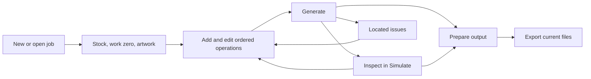
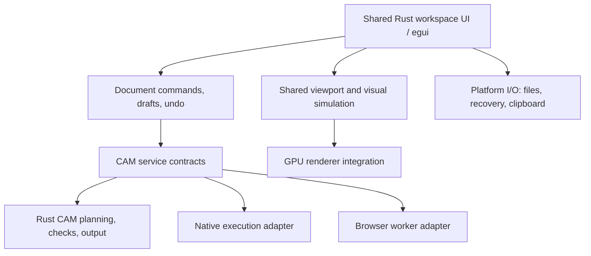
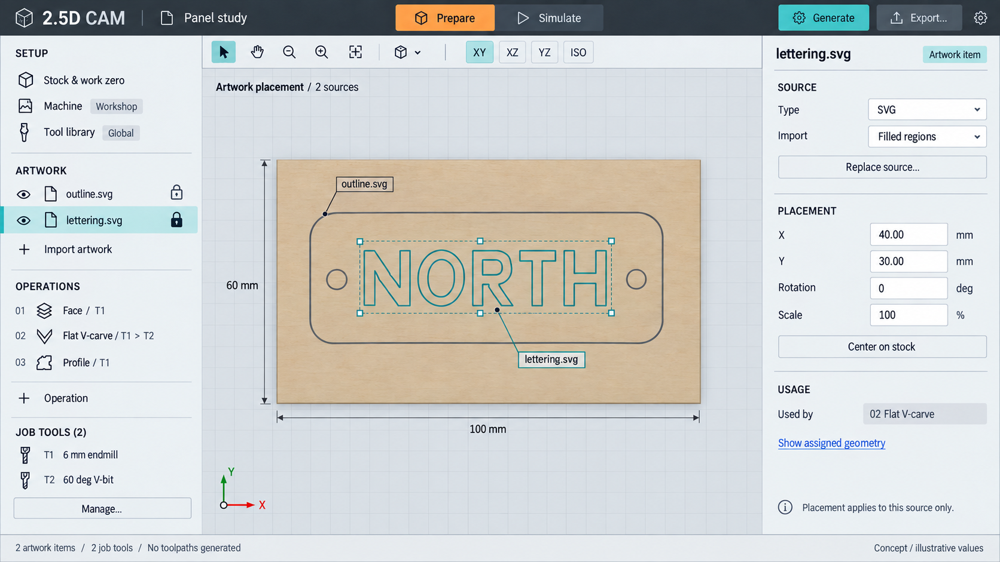
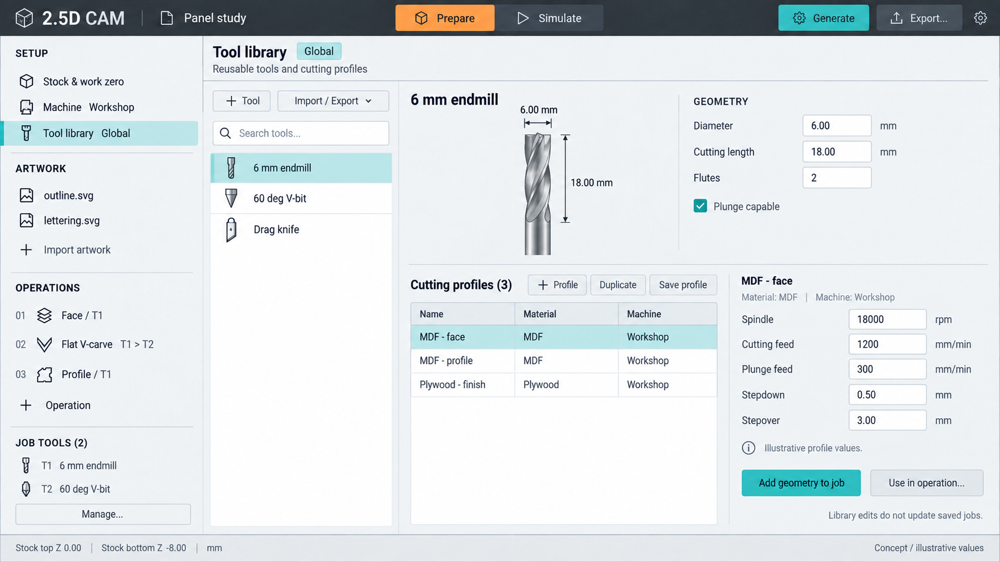
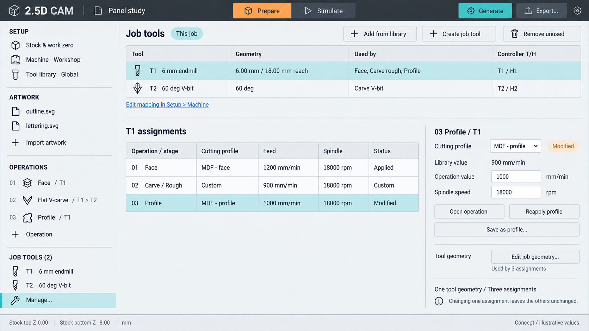
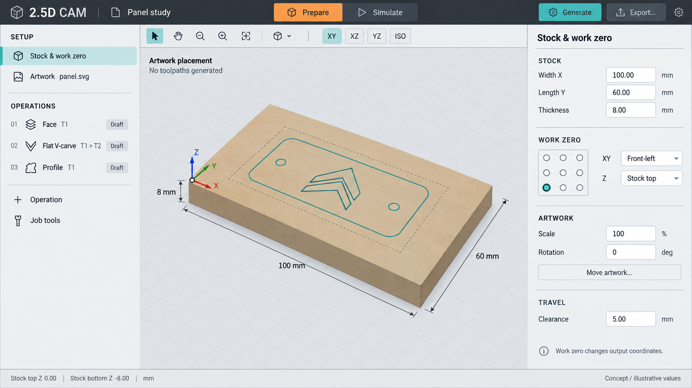
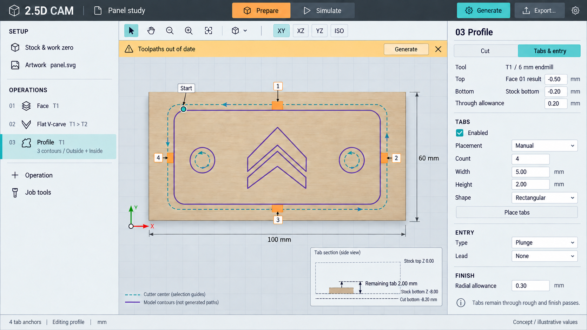
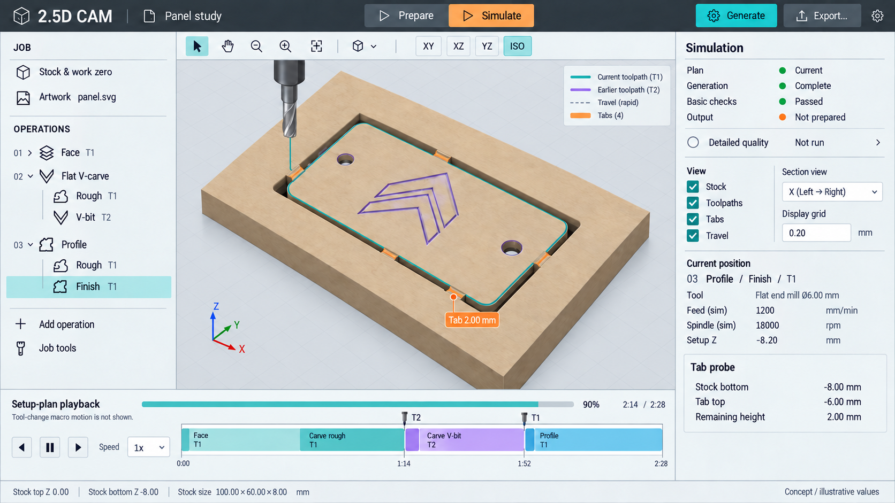
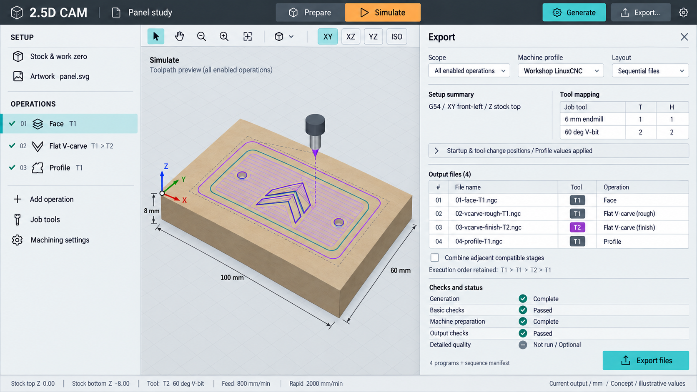
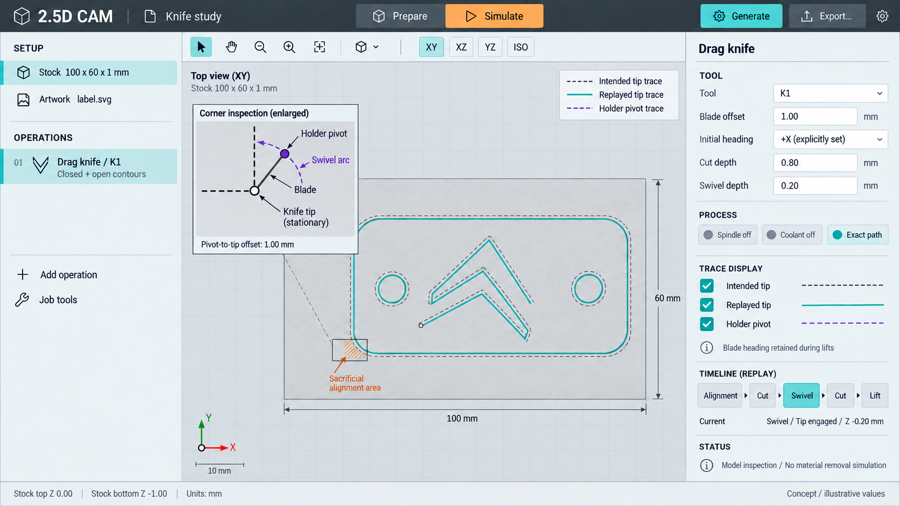

# 2.5D CAM UI: an egui workspace for web and desktop

Date: 2026-09-09\
Status: design proposal and synthetic screenshot references; no application implementation.\
Audience confirmed by the user: **experienced CNC users, compact controls, fewer prompts**.

Revision 2 incorporates the user's follow-up: Machine and the global Tool library live under Setup; Job tools remains at the bottom of the navigator; each library tool has multiple named cutting profiles; Artwork becomes a collection of independently placed sources. Simple sketches are a future artwork type.

This proposal starts from the machining contracts in [the 2.5D CAM plan](2.5d-cam-plan.md), independently of the project's existing interface. No existing web UI code, screenshots, or UI design document was used as a visual or interaction reference. The existing [tool-library data model](tool-library.md) was consulted to preserve its geometry/preset ownership and explicit copy semantics, as requested by the user. Section 14 records the required document changes; the [2026-09-10 CAM addendum](2.5d-cam-plan.md#22-addendum-ui-driven-backend-contracts-2026-09-10) now specifies their backend contracts, migration and implementation slices. F3 is Rust-only; knife controls and rendering remain part of this UI plan.

The recommendation is one persistent, viewport-centered workspace with **Prepare** and **Simulate** modes, an ordered operation navigator, a contextual inspector, and an **Export** panel. Use Rust **egui + eframe** as the candidate shared application shell. The viewport needs its own rendering and interaction work; selecting egui does not supply a CAM simulator.

The separate [UI architecture and implementation handoff](2.5d-cam-ui-implementation-plan.md) expands this proposal into module/state contracts, platform integration, simulation architecture and GUI1–GUI11 milestones. Its first milestone, GUI1, evaluated frameworks using the familiar Flat V-carve workflow and is complete: the framework is accepted with explicit scope limits (Windows x86_64 native and desktop Chromium/WebGPU). GUI2a is next and delivers a real open/edit/generate/heightfield-simulate/export/save loop for a known carving; later user-reviewable increments add authoring conveniences, artwork collections, resources and new operations. The existing carving and simulator remain the comparison baseline. Target architecture below does not require finishing every general subsystem before that first usable build.

Open the [concept gallery](ui-concepts/2026-09-09/README.md) for the three revised organization/tooling views and the five original workflow references, or continue below for workflow and behavior.

## 1. What we are deciding

The workflow should make six questions easy to answer at any moment:

1. What stock and work zero does this job describe?
2. Which geometry does this operation actually machine?
3. Where does it run in the sequence, and which preceding result does it use?
4. What tool, heights, and cutting settings apply here?
5. Are these displayed paths current, complete, and checked?
6. What ordered files and machine assumptions will export use?

For experienced users, keep high-use settings directly available. Omit a compulsory wizard and global Simple/Advanced/Expert switch. Use named sections, short summaries, setting search, and remembered expansion instead. Optional help belongs at the relevant field or diagnostic.

| Decision | Proposed direction |
| --- | --- |
| Primary navigation | Prepare and Simulate; switch without losing selection, camera, or drafts. |
| Job structure | One setup, zero or more artwork items, job tool snapshots, an ordered operation list. Each initial artwork item is an independently placed SVG. |
| Setup resources | Machine configuration and the global Tool library are discoverable under Setup; scope labels distinguish job configuration from reusable library records. |
| Tool model | One library tool geometry with multiple named cutting profiles; a job tool may serve several operation assignments with different applied profiles and overrides. |
| Output | Export reviews the configured machine and tool mappings, selects scope/layout, prepares output, and saves exact bytes. Machine editing opens Setup → Machine. |
| Editing | Immediate document edits with grouped undo; explicit commits for geometry assignment and placement gestures. |
| Planning | Explicit Generate; cheap editing diagnostics can update in the background. |
| Inspection | Simulation is the ordinary path; watching playback is not an export prerequisite. |
| Quality analysis | Optional scoped analysis in the diagnostics drawer. |
| Layout | Resizable fixed panes initially; avoid a docking system and floating-window arrangement in v1. |
| Shared implementation | Rust owns the new UI state and rendering behavior as well as CAM; platform adapters own I/O and execution mechanics. |

The audience, egui evaluation, setup/resource organization, multiple cutting profiles per tool, and multiple artwork sources reflect the user's direction. The detailed interactions below are proposals concrete enough to prototype; they do not claim measured usability or platform support.

## 2. Slicer references, translated to CAM

The useful reference is the relationship between the scene, editable settings, generated paths, and output. PrusaSlicer's documented interface places object/settings controls alongside a central scene and provides model/toolpath inspection. Its documented mode system also illustrates the tradeoff between compactness and discoverability. Here we keep expert access and use local disclosure. These links describe the documented PrusaSlicer 2.9 interface, not a claim about the latest redesign. [Prusa UI overview](https://help.prusa3d.com/article/ui-overview_1766), [Prusa modes](https://help.prusa3d.com/article/simple-advanced-expert-modes_1765).

Orca's official documentation organizes preparation tools, process settings, and project/preset workflows. It is a useful reference for editing beside the work area and saving a complete project. Our translation of those patterns is a proposal, not an assertion that a slicer already models CAM dependencies. [Orca documentation](https://github.com/OrcaSlicer/OrcaSlicer/wiki), [Orca import and export](https://www.orcaslicer.com/wiki/general_settings/import_export).

| Slicer pattern | CAM adaptation |
| --- | --- |
| Build plate and model | Physical stock and placed SVG geometry. Work zero is independently visible. |
| Object navigator | Setup/artwork plus ordered machining operations. Operations are the main editing units. |
| Process settings | The active operation's geometry, tool assignments, heights, passes, and entry. |
| Slice action | Generate the enabled sequence, or its explicitly selected prefix. |
| Preview and layer inspection | Simulate ordered operations/stages; depth passes are local to each stage. |
| Reusable profiles | Setup exposes machine configurations and the global tool library. Tool geometry is copied into job tools; a chosen cutting profile is copied into an operation assignment. |
| Export | Prepare and review one program or sequential files, preserving recurring tools and operation order. |

CAM cannot inherit an additive slicer's global layer slider literally. Two operations can visit the same Z with different stock histories; a knife trace does not remove a milling volume. Reordering is a machining edit, and choosing a different work zero changes output coordinates without moving the artwork. These distinctions determine the design.

## 3. The workspace

At a wide desktop size, use a roughly 250-point navigator and 355-point inspector, with the remaining width assigned to the viewport. A 52-point top bar carries the document, modes, and main actions. The viewport has a slim local toolbar. Simulate adds a roughly 150-point timeline at the bottom of the viewport. These are starting proportions for validation, not pixel-perfect acceptance criteria.

```text
Document / Save / Undo     Prepare | Simulate       Generate ▾   Export…
┌────────────────────┬────────────────────────────────┬─────────────────────┐
│ SETUP              │ View / selection / editing tools│ Context inspector   │
│ Stock & work zero  │                                │                     │
│ Machine            │                                │ Active operation,   │
│ Tool library Global│                                │ setup, artwork item,│
│ ARTWORK            │                                │ or inspection       │
│ outline.svg        │                                │                     │
│ lettering.svg      │                                │                     │
│ + Import artwork   │                                │                     │
│ OPERATIONS         │          2D / 3D view           │                     │
│ 01 Face            │                                │                     │
│ 02 Flat V-carve     │                                │                     │
│ 03 Profile         │                                │                     │
│ + Operation        │ Timeline in Simulate            │                     │
│ Job tools          │                                │                     │
└────────────────────┴────────────────────────────────┴─────────────────────┘
Document state       Plan state / task progress       Issues       mm
```

**Top bar.** Keep Prepare, Simulate, Generate, and Export in stable positions. Generate's dropdown contains “All enabled operations” and “Through selected operation.” The current scope appears beside any generated result. A prefix always includes the necessary preceding operations.

**Navigator.** Use four groups in order: **Setup**, **Artwork**, **Operations**, and **Job tools** anchored at the bottom. Setup contains Stock & work zero (including Travel), Machine, and Tool library with a visible **Global** scope badge. Machine shows the applied configuration name and readiness. Artwork lists each source by name, with visibility, a lock against accidental picking/moving, an expandable geometry tree, and an import action. Operations remain the execution list. Job tools shows the tools already selected for this job, including unused tools, their operation usage, and a Manage action. The groups scroll independently when necessary so a large source tree cannot push Job tools away.

Selecting Machine opens the job's machine configuration in the workspace; selecting Tool library opens a library management view in the main area. These resource editors temporarily use the viewport/inspector area while retaining the navigator and document. Returning to artwork or an operation restores the camera and editing context. A compact scope label distinguishes **Global library** from **This job**. No permanently open library pane is required.

**Inspector.** Selecting a navigator item or operation changes its contents. In Simulate, selecting a stage shows its current readouts and view controls; “Edit operation” returns to Prepare and the same operation. A field diagnostic can make that transition directly. Width, scroll, and open sections persist by context and operation ID.

**Bottom drawer.** Issues, Tasks, and Detailed quality share a collapsible drawer. Clicking an issue selects its operation, reveals its field, and frames its location if available. Technical codes remain available in details/copy, while the first line names the actual problem and a useful correction.

**Export panel.** Expands over the right portion of the workspace, replacing the ordinary inspector and reducing the viewport. Preserve the operation navigator. Closing it leaves edits and preparation status intact. It does not become a third mandatory workflow step.

## 4. A typical milling job



### Start and save

New job opens an empty workspace with compact “Import SVG” and “Add facing operation” actions in the viewport. A face-only job never encounters an SVG requirement. Stock, feeds, RPM, machine positions, and knife offsets start unset unless the user explicitly applies a saved preset or template. The screenshots show deliberately populated example jobs, not automatic defaults.

Open restores a complete portable job, including all embedded artwork, job tool geometry, operation cutting values, and the applied machine-configuration snapshot. Save is available for incomplete drafts. Browser recovery and desktop recovery have a separate “Recovered draft” identity until saved; an autosaved recovery record does not imply that the user's portable file was overwritten. Importing another artwork file adds an item. “Replace source…” is a separate action on a particular item. Opening, importing, or replacing is transactional, with the existing draft preserved if parsing or migration fails.

### Set stock, place artwork, choose work zero

Stock fields show X width, Y length, thickness, and the stock rectangle's XY position. A “Fit stock to artwork…” action explicitly chooses all or selected artwork items, previews dimensions and margins, and commits them explicitly; inferred dimensions never become measured stock without that action. Viewport visibility is not the implicit fit scope.

Each artwork item has its own numeric XY translation, rotation, and scale, plus direct manipulation and center/fit helpers. Importing or moving lettering leaves the outline item fixed. Geometry inside a given SVG initially shares that item's transform; a contour selection does not create independently transformable CAD entities. Keep one round-tripped placement conversion, applied independently per item. All artwork is placed in the same setup XY plane; cutting Z belongs to operation height settings.

Work zero uses a nine-point stock anchor selector, a custom XY option, and a Z choice of Stock top or Stock bottom. Preserve a Setup origin choice for compatibility. Moving the datum marker leaves the stock and artwork stationary. Show the active coordinate frame beside every probe/readout; default geometry editing to setup coordinates and offer work-coordinate readouts in output review.

Clearance is above original stock top. A face operation publishes a new surface reference; it does not alter physical thickness or silently reset Z zero. Work zero describes intended output coordinates and does not set a controller offset.

### Add operations directly

“+ Operation” opens a compact menu of Face, Flat V-carve, Profile, and Drag knife, limited to advertised capabilities. Creating an operation selects it and focuses its first unset required field. Allow it to remain incomplete and saveable.

The revised running example is an illustrative 100 × 60 × 8 mm stock with `outline.svg` and `lettering.svg`. Face uses stock coverage, Flat V-carve uses lettering on the faced surface, and Profile uses the outline and hole contours while retaining tabs. T1 is reused after the V-bit T2; the navigator and output preserve that sequence.

### Generate, inspect, export

Generate resolves and plans the current scope, reports progress per operation, and runs required basic checks. A completed task can still yield an incomplete or inconclusive plan. Publish that distinction explicitly. Do not automatically open Simulate or steal focus while the user is editing; offer “View toolpaths” when the result is available.

Simulate shows the selected sequence with stage navigation and stock after each operation. Configure the machine under Setup at any time. Export can be opened at any point to review missing requirements and link directly to their Setup fields; it prepares output as soon as the plan and machine inputs permit. There is no requirement to play every motion or run detailed quality analysis.

### Artwork as a collection

An artwork row represents an imported source with a stable item ID, display name, embedded source data, import interpretation, and independent placement. It expands into filled components, closed contours, and open chains as supported. For duplicate filenames, use distinct display labels and stable identities; file names and list positions are never geometry IDs.

Support multi-file import, rename, duplicate, reorder for organization, replace source, and remove. A duplicate initially copies source data and placement into a new artwork item with new namespaced geometry identities; it does not duplicate operations or retarget them automatically. Imported sources retain their own units interpretation; the resolved catalogue is in setup millimeters. A batch import reports each rejected file without replacing unrelated artwork or losing the draft, and accepted additions form one undo group.

“Used by” links connect an item or contour to its operations. An operation may use geometry from several artwork items, and several operations may use different geometry from one item. Geometry assignment stores explicit references; adding a new SVG or another contour does not silently expand a previous operation's selection. Reordering artwork changes only navigator/picking order, never machining order.

The eye hides artwork guides; the lock prevents accidental viewport picking or movement. Neither disables operations using that artwork. Hidden assigned geometry still has a visible source badge in the operation inspector. Editing placement invalidates affected machining results. Removing or replacing referenced source geometry leaves located missing references/anchors until reattached or undone; do not match by filename or nearest shape.

Future **Sketch** items should enter this same list and produce the same kinds of selectable geometry. The first sketch scope can be lines/polylines, rectangles, and circles; dimensions, constraints, text editing, and general CAD need separate scoping. Keep sketch creation out of the initial controls until implemented. A Face operation's coverage rectangle remains operation geometry, not an automatically created artwork item.

## 5. Operations, selection, and editing

### Operation rows

Each row has a sequence number, enable checkbox, operation icon/name, tool badge(s), compact height/depth summary, and status icon/text. A distinct eye control changes visibility. Enabled and visible are independent. Use two compact lines per row when needed rather than compressing all information into unreadable badges.

Support rename, duplicate, disable, drag reorder, move up/down, and delete through both buttons/menus and keyboard commands. Duplicate copies editable settings into a new ID and starts without generated results. Expanded Flat V-carve stages are read-only execution children; they cannot be dragged out as independent operations.

While dragging, show the proposed sequence position and any broken preceding-face reference. A reorder can leave an editable invalid draft, with the offending references visibly unresolved and generation blocked for that scope. Do not silently sort it back or retarget references. Deleting a referenced face likewise leaves an explicit missing reference with Undo immediately available.

### Geometry assignment

Viewport selection is temporary inspection state. The operation stores its own machining selection. A selection toolbar says, for example, “3 contours selected” and offers “Use for Profile 03” or “Add to selection.” Clicking unrelated geometry does not rewrite the operation.

The picker exposes the relevant primitive: filled components for Flat V-carve, closed contours for Profile, contours/centerlines for Knife, and stock or a rectangle for Face. Group rows by artwork item and show source lineage and outer/hole/open roles in a compact table. Labels such as `outline.svg / outer` and `lettering.svg / glyph 4` make cross-file selection clear. Additive selection, clearing, isolate, and “Select assigned geometry” have visible controls and keyboard alternatives. Resolve all assigned geometry in setup coordinates before applying the operation's own region-union or contour rules; do not flatten/union the artwork collection globally.

For Profile, every contour has its own Inside/Outside/On value. “Outside outer edges / Inside holes” is an explicit helper that writes visible row values. Show the retained side, compensated guide, and traversal arrows. Label provisional guides separately from generated motion; a guide cannot promise a feasible lead, protected tab, or completed plan.

### Numeric input and undo

Keep editable text separate from validated values. An empty field is “Required”; a supplied invalid value gets its own error. Preserve intermediate text such as `-` or `1.` while typing. Never convert missing input to zero or fill cutting values merely to make a form green.

Enter or focus loss commits a valid field edit; Escape restores its previous value. An invalid draft remains visible and prevents planning from silently using an older value for that field. A pointer drag is one undo transaction; preview it during motion, commit on release, cancel with Escape. Geometry assignment, preset application, and operation reorder are also individual transactions.

Use operation IDs and field identifiers for input focus/drafts. Reordering cannot move unfinished text to a different operation. Keep mm, mm/min, degrees, and RPM explicit. Initial UI units are millimeters; inch entry and expression parsing are separately scoped conveniences, not assumed parser features.

### Inspector contents

Use the same section names where semantics match. Expose the common cutting controls in the initial view, retain open sections per operation, and let “Find setting” reveal and focus any supported setting. Required missing fields must remain discoverable even in collapsed sections.

| Operation | Main sections and distinctions |
| --- | --- |
| Face | Area: entire stock or numeric/drawn rectangle. Tool & cutting: flat-bottom tool, feeds, RPM/direction, stepdown/stepover. Heights. Passes: supported angles, zigzag/one-way. Extensions: four area margins and separate travel overrun. Show requested coverage and allowed cutter overhang distinctly. |
| Flat V-carve | Filled selection, Heights, Execution: Endmill only or Endmill + V-bit. Roughing and V-bit sections contain their own tool assignments and cutting settings. Detail/allowance settings remain specific to this operation. General pocketing is absent. |
| Profile | Contour table with explicit sides and order. Tool & cutting, Heights, Passes & finish, Tabs, Entry & leads. Climb/conventional uses explicit spindle direction; On-contour uses traversal direction. Finishing is a radial allowance and depth-stepped finish. |
| Drag knife | Centerlines/contours, knife geometry, Heights, cut/descent/swivel feeds, stepdown, corner/swivel controls, start/closure and alignment. Fixed process summary: spindle off, coolant off, exact path. No RPM, stepover, or commanded rotary-axis control. |

Two inspector tabs can be useful for the dense Profile editor: **Cut** and **Tabs & entry**. They only organize one operation. Keep tool/height summaries visible in both, and surface hidden-field errors on the tab label. Other operations need not inherit empty tabs.

## 6. Height, tab, and knife interactions that need deliberate design

### Heights are references with offsets

Use a reference dropdown, signed offset, and read-only resolved setup Z for each height. Name references after the actual operation, such as “Face 01 result,” with stable identity behind the label. Bottom may use “Operation top”; top may not. The face-reference picker offers only enabled preceding faces, but an already broken reference remains visible for correction.

| Illustrative setting | Resolved setup Z |
| --- | --- |
| Original stock top | 0.00 mm |
| Original stock bottom, thickness 8 | −8.00 mm |
| Face bottom: Stock top − 0.50 | −0.50 mm |
| Carve top: Face 01 result | −0.50 mm |
| Carve bottom: Operation top − 2.00 | −2.50 mm |
| Profile bottom: Stock bottom − 0.20 | −8.20 mm; requires explicit 0.20 through allowance |
| Tab top: 2.00 remaining above stock bottom | −6.00 mm |

If a selected contour crosses a partial face's established coverage, show that uncovered portion and link the error to its height reference. Do not let the UI suggest that a partial face establishes a new global stock top.

### Tabs and starts

“Place tabs” enters an explicit viewport tool. Click eligible spans, drag existing anchors, Delete the active tab, or edit anchors through a list of contour/fraction values. Show width, remaining height, shape, and count in the inspector. Automatic count/spacing produces a visible placement preview and reports any deficit; it does not quietly accept fewer tabs.

Manual handles belong to source contours. Artwork placement carries them along, while physical widths/heights remain in mm. Source geometry changes can leave them unresolved; highlight and reattach them deliberately. A start handle is visually distinct from a tab handle.

Before generation, use candidate markers with “Unvalidated” status. After generation, display the resolved protected footprint, including cutter effects, and an X/Y section or depth probe. Tab height is remaining material above physical stock bottom. A finishing pass must visibly retain it. Start/lead edits show any located collision or lack of space; they never silently disable the configured lead or replace a ramp with a plunge.

### Passive knife

The knife needs three distinguishable traces: intended tip, replayed/modelled tip, and programmed holder pivot. Use line pattern plus color and a legend. During inspection, display modeled blade heading and an enlarged corner view with pivot-to-tip offset and swivel depth.

Initial heading is an explicit user input; “+X” in the screenshot is a value deliberately supplied in that sample. Show the contact alignment trace and any sacrificial area it marks. Carry heading through lifts according to the plan's stated retention assumption. Do not rotate a blade in the air to match the next contour, draw an A/C command, or remove a cylindrical groove from the stock.

Open-chain import includes an explicit “Stroke as centerline” interpretation; endpoints stay visibly open and stroke width is not quietly treated as a second contour. If a supported alignment or corner construction cannot be established, show its location and keep that sequence unexportable. Model replay is not a claim about real blade flex or tearing.

## 7. Tool and machine settings

### One tool, several cutting profiles

Preserve the existing library's useful model: **one cutter geometry owns several named cutting profiles**. “Cutting profile” is the UI name for the existing `CuttingPreset` concept; renaming the UI label does not itself require renaming its serialized field. A machine configuration is a separate object and should always be labeled **Machine configuration**, avoiding an ambiguous unqualified “Profile.”

| Object | Owns | Does not own |
| --- | --- | --- |
| Global library tool | Cutter geometry, entry capabilities, name, and its collection of named cutting profiles. | Job-specific T/H mapping, stock, operation depth/selection, or one universally active cutting profile. |
| Cutting profile, owned by that tool | Reusable feed, plunge feed, RPM, stepdown, stepover where applicable, and optional descriptive material/machine labels. Knife profiles use their applicable typed values. New fields such as spindle direction must be explicitly versioned if added to presets. | Another copy of cutter geometry, a controller tool number, or implicit machine-configuration selection. |
| Job tool | An embedded geometry/capability snapshot with a stable job ID and a name; optional explicit library provenance. | One shared set of mutable cutting values for all its operations. |
| Operation/stage assignment | Job tool ID, copied cutting values, local overrides, and optional profile provenance/baseline. | A live link that automatically follows global library changes. |
| Applied machine configuration | Job-specific output settings, T/H mapping by job tool ID, startup/M6 contract, and configuration provenance. | A competing work-zero value or operation spindle direction. |

For example, library tool “6 mm endmill” can own “MDF — face,” “MDF — profile,” and “Plywood — finish.” Job tool T1 is one geometry snapshot. Face can apply the first profile, Profile can apply the second, and V-carve roughing can use custom values. Switching Profile's cutting profile does not create another cutter, change Face's values, or imply a tool change in the ordered program.

Material/machine labels help search and filtering. They do not certify conditions, choose a profile automatically, or apply a different machine configuration. Keep missing values missing and do not infer a spindle direction from a context label.

### Setup → Tool library: reusable records

The library editor has a searchable tool list and a selected-tool view containing **Geometry** and **Cutting profiles**. Geometry is edited once. A profile table shows names/context, and selecting a row reveals that profile's values. Support add/duplicate/rename/remove tools and profiles, portable import/export, and explicit saves with the existing revision/conflict behavior. No stale editor silently overwrites a newer library record.

Global editors have their own dirty/save state. The job's Undo history covers copying a tool/profile/configuration into the job and editing that job; it does not silently roll back a separately committed global-library save. Show failures and conflicts in the resource editor that owns them.

“Global” means shared across jobs in this installation or browser storage. It does not promise cloud synchronization between desktop and browser. Portable library import/export remains the explicit transfer mechanism until synchronization is separately designed. Opening a portable job does not populate or overwrite this library automatically.

Two distinct actions leave the editor: **Add geometry to job** adds an unused job tool snapshot without applying feeds; **Use in operation…** chooses a compatible operation/stage and optionally a cutting profile, previews the copied fields, and commits one undoable assignment change. If the same library geometry is already present unchanged in the job, reuse that job tool. Never deduplicate different cutters merely because their diameters match. If a local geometry snapshot differs, offer an explicit choice to keep it, add a separate job tool, or update it with affected assignments listed; do not silently overwrite it.

The operation inspector likewise has two controls: **Tool** chooses the job geometry (with a library-picker route), and **Cutting profile** chooses values for this assignment. Choosing a different tool without a profile clears the applicable cutting values; choosing a profile copies all its applicable values, including unset values, rather than inheriting unrelated values from the former cutter. Applying a profile to the same tool changes cutting values only. Unknown/new required process fields stay unset. These rules preserve the current library's explicit application semantics.

Editing a copied value makes the assignment **Modified** relative to the stored applied baseline; assignments without a baseline are **Custom**. **Reapply profile** explicitly reads/reviews a selected current library revision and replaces those fields. **Reset overrides** restores the originally applied baseline, even if the global library has since changed. **Save as profile…** explicitly captures current values into a named library record; it does not happen on ordinary operation edits. An explicit update of an existing profile follows the library's revision checks and never updates other assignments automatically.

### Job tools: selected geometry and its usage

Keep the bottom navigator group as a compact inventory with a tool count, tool badges/names, use count, and **Manage…**. The expanded management view contains a tool table and, for the selected tool, an assignment table. Tool columns show geometry, used-by operations/stages, and a read-only controller mapping. Assignment columns show operation/stage, applied cutting profile or Custom, key cutting values, and Applied/Modified/Custom state.

T1/T2 in the examples are mapped display badges, not the stable job tool IDs. An unmapped tool still has its name and an Unmapped badge. Changing a controller number must not change assignment identity, reset cutting values, or reorder operations.

Job tools does not introduce a second independent catalog of editable cutting profiles. Its profile rows are views of the actual operation assignments. A profile change opened here targets the selected assignment through the same command as the operation inspector. There is no “T1's current cutting profile” field. Profile provenance remains display/reference metadata; actual stored assignment values drive machining.

**Edit job geometry…** changes the shared job snapshot and names all affected assignments before the user commits the editor. Revalidate their profiles/overrides and invalidate affected machining results; do not propagate this edit into the library. **Add from library**, **Create job tool**, **Duplicate job tool**, and **Remove unused** are available. Unused selected tools remain visible and do not require a controller mapping until used in the chosen output scope. A user can explicitly create distinct job tools for physically distinct cutters with identical geometry. Removing a used tool leaves located unresolved assignments with Undo, or the user can explicitly reassign its usages; no automatic substitution.

### Setup → Machine: configure once, review during export

Setup is the canonical editing location for the applied machine configuration: controller/work offset, tool-length-compensation mode, job tool T/H mapping, startup/M6 return contract, supported path control, dwell, and output formatting. The view shows the applied configuration name, **This job** scope, and Missing/Complete state. A configuration picker can save/load reusable named configurations, while the job retains the explicitly applied snapshot and local edits. Changes to a saved configuration do not silently rewrite open or saved jobs.

Controller T/H assignments belong to this applied job configuration. A reusable machine record may provide a physical tool-table reference, but it cannot assume another job's opaque tool IDs or map all cutters by geometry similarity. Resolve each active job tool explicitly; applying another configuration clears or marks uncertain mappings for review rather than inventing numbers. The job-tool table and Export show the same mapping read-only with **Edit in Setup → Machine** links.

Work zero remains authoritative under Stock & work zero. Milling spindle direction remains authoritative in its operation assignment. Setup → Machine may display both with links, but does not maintain duplicate editable copies. Choosing a machine need not block early artwork editing or compatible plan generation; unresolved machine preparation blocks output, not draft saving. Configuration changes that affect only output stale prepared bytes, while any explicit application that changes machining inputs follows the normal replan rules.

Export summarizes the applied configuration and its outstanding requirements, then handles scope, program layout, preparation/readback, and writing files. Any “Change machine…” or mapping correction routes to this same Setup editor and returns to Export without losing output options. There is one editing authority, accessible from both flows.

Do not invent a machine envelope, stock material recommendation, tool length, or M6 macro trajectory. Optional descriptive tool details must not acquire machining authority without an explicit schema/planner contract.

## 8. State and primary actions

The UI needs separate facts, not one green “valid” state. Document save state is independent of all machining states.

| Fact | Display examples | Consequence |
| --- | --- | --- |
| Editing readiness | Missing feeds; Invalid reference; Ready to generate | Incomplete drafts save. Required issues block generation for the affected scope. |
| Generation | Not generated; Working; Complete; Empty; Incomplete; Inconclusive | A successful task response is not necessarily a complete plan. Empty results remain visible and cannot constitute an executable all-empty output. |
| Plan freshness | Current; Toolpaths out of date | Keep old paths available with an obvious stale label, never as the current executable plan. |
| Basic checks | Pending; Passed; Failed; Inconclusive | Required unresolved checks block output preparation. |
| Simulation data | Loading; Partial; Complete for scope | Partial playback is labeled. Loading is independent of valid core plan/output state. |
| Machine preparation | Missing fields; Complete | A complete motion plan can still need tool mappings or process preparation. |
| Output | Not prepared; Preparing; Current; Out of date; Failed | “Export files” is available only for current prepared bytes after output readback checks pass. |
| Detailed quality | Not run; Unsupported; Passed; Failed; Inconclusive | Optional. A proven invalid motion found here still becomes a blocking issue; cosmetic quality findings stay in this report. |

Generate is always in the same location. While a job runs it shows progress and Cancel. Editing may continue: cancel obsolete work when possible and reject late results by revision/identity. Keep the last current completed result separately. Never attach an old result to a newer draft because its task completed later.

The Export entry point remains accessible for reviewing missing settings. Inside it, show “Prepare output” until preparation succeeds, then “Export files.” An ineligible action has an adjacent reason and a direct route to its fields; do not rely only on a disabled-button tooltip.

| Edit | What becomes stale |
| --- | --- |
| Stock size, referenced artwork geometry/placement, machining selection, job tool geometry, assignment cutting values, heights, spindle direction, operation order/enabled state | Machining plan and output; conservative full-sequence regeneration is acceptable initially. |
| Work zero, machine profile, T/H mapping, output precision/layout | Prepared output; setup-coordinate motions can remain reusable where machining inputs are unchanged. Recheck setup-dependent machine assumptions. |
| Camera, path/artwork visibility, artwork lock, navigator-only artwork order, selected inspector, playhead | Neither plan nor output. |
| Global library tool/profile or saved machine-configuration edit | No job machining/output changes until explicitly applied. |
| Unused artwork or unused job tool added/edited | Document changes; enabled machining need not change. Assigning it or fitting stock to it is a separate machining edit. |
| Disabled operation settings | Its own readiness; enabled plan may remain reusable. Enabling it invalidates the affected sequence. |

Use useful messages such as “Profile 03: lead intersects the retained edge. Move the start or shorten the lead.” Offer “Show location,” “Open setting,” and Undo where appropriate. Do not repair machining intent automatically. “Toolpaths generated” and “Output checks passed” are suitable labels; “Verified safe” is not.

## 9. Simulation and output review

### Timeline

The horizontal timeline follows execution order. It groups operations, expands internal stages, and marks tool changes and process boundaries. The selected stage has a local pass/depth selector. Support play/pause, scrub, previous/next stage, speed, and “Stock after this operation.” A temporal scale can use modeled motion time, but unknown tool-change macro duration must remain explicitly unknown; do not advertise a precise total machine-cycle time without a timing model.

A Generate-through prefix is labeled “Through Profile 03,” including its actual prefix boundary. Selecting a late operation is not permission to simulate it on fresh stock or export it alone. Hiding earlier paths leaves their stock removal in place. Simulation consumes the entire ordered motion stream for its chosen scope, with bounded page/checkpoint loading and visible partial-data states.

### Viewport

Prepare defaults to top orthographic for contour/tab work and offers isometric stock inspection. Simulate defaults to isometric but retains top, side, and simple X/Y section views. Provide visible Select, Pan, Orbit, Zoom/Fit, and view buttons so mouse gestures are shortcuts rather than the only route.

Render physical stock sides and actual holes for removed-through cells. Detached parts remain in place. Overlay resolved tab geometry when display resolution is too coarse and show the simulation grid size. Stock shading is a display approximation; no raster or screenshot becomes evidence for planning or export.

Setup-plan playback stops at a tool-change boundary without inventing macro-internal movement. An optional emitted-program view may show known post-generated bridges, distinctly labeled. Knife playback uses its separate tip/pivot/heading model and does not lower the milling heightfield.

### Export panel

Show scope, the applied machine-configuration summary, setup/work-frame summary, job-tool T/H mapping, ordered stages/files, missing requirements, and preparation/check status. Configuration and mapping summaries link to Setup → Machine; they are not independent editable copies. Initially default to **One ordered program**. The alternative is **Sequential files**, with a separate option to combine adjacent compatible same-tool stages.

For the screenshot's deliberately uncombined sample:

```text
01-face-T1.ngc
02-vcarve-rough-T1.ngc
03-vcarve-finish-T2.ngc
04-profile-T1.ngc
```

This is T1 → T1 → T2 → T1. Never group the last profile with the first T1 operations across T2. List a sequence manifest and any stock prerequisites; splitting files does not make them independently executable. Prefix output names the included boundary and regenerates/prepares the matching scope as necessary. Arbitrary late-operation export is outside v1.

Preparing output binds the exact current plan and machine settings, transforms/formats coordinates, runs required numeric readback, and retains the checked bytes. Saving exports those same bytes. Changing a datum or mapping while preparation runs invalidates its result. A failed save/download preserves the prepared bundle so the user can retry without pretending it was saved.

Imported motion plans open as inspection data with an explicit “Regenerate from embedded job” action. They do not gain export eligibility from their filenames, hashes, or a green visual preview. Migrated jobs preserve unset values; migrated legacy plans require regeneration before new output.

## 10. egui as the shared basis

### Fit and boundaries

egui supplies immediate-mode controls, resizable panels, custom painting, and styling. eframe hosts a shared Rust application on native and web targets. egui is a 2D UI library; embedded 3D requires integration with a renderer. Its documentation also identifies accessibility/platform differences and the need to keep work off the UI thread. This makes it a plausible fit for a dense viewport application, subject to a prototype. [egui project documentation](https://github.com/emilk/egui).

eframe documents separate native and WebRunner entry points, web compilation/glue, renderer options, and distinct accessibility features. Therefore “shared UI” must still budget for browser bootstrapping, I/O, worker scheduling, and deployment configuration. Renderer/backend availability must be established for the selected build, not assumed from the word WebGPU. [eframe documentation](https://docs.rs/eframe/latest/eframe/).

**Proposed ownership change:** the CAM plan assigns TypeScript editing and visual simulation in §1.1.9, §4, and §15. Adopting this proposal revises that ownership for the new UI: Rust would own editing state, interaction, and visual simulation. Thin browser JavaScript/WASM glue would remain where needed for web APIs. This is a design delta to record before implementation; it is not a silent reinterpretation of the existing plan or a direction to port the current interface.

### Proposed code responsibilities

Names below describe boundaries, not instructions to add crates immediately.



Keep four state layers explicit: editable document/draft text; ephemeral workspace/selection/layout; immutable generated/prepared artifacts; and running task identity/progress. The frame function displays these states and emits commands. It does not plan, hash the whole SVG, regenerate stock, or serialize the job every repaint.

Use stable IDs for widgets, operations, contours, and staged motions. A job-tool rename cannot reset a widget or transfer text to another row. Grouped undo belongs in application state, not solely in a widget's built-in text undo. Persist document recovery explicitly; generic UI persistence is not a substitute for portable-job saving.

### Rendering candidate

Start the spike with egui/eframe and a wgpu-based viewport, using a paint callback or render-to-texture integration. Keep GPU resources and geometry buffers outside immediate-mode layout. Use a shared camera, picking model, stock renderer, line renderer, and overlays on both targets. Batch toolpaths by stage/range and budget checkpoints; do not create one egui widget or painter primitive per motion.

Evaluate WebGPU plus a tested WebGL fallback if the renderer and chosen build support the required operations. If fallback fails, report the supported browser/GPU requirement before starting a job; an unsupported backend must not crash after editing. Decide the graphics baseline from measured prototype results, rather than implementing two rendering stacks speculatively.

### Platform contract

| Concern | Native | Browser |
| --- | --- | --- |
| UI/layout/commands | Shared Rust code | Same shared Rust code in WASM |
| Heavy planning | Existing native execution boundary or cancellable worker execution | Dedicated worker hosting CAM WASM; preserve a responsive UI thread |
| Scheduling | Native task messages | Worker messages; do not assume shared-memory WASM threads or required cross-origin isolation |
| Open/save | Native file APIs/dialogs | File picker/drop and downloads as baseline; do not require browser filesystem handles |
| Sequential bundle | Files/folder or packaged bundle through adapter | Packaged download including manifest; single-program download for simple output |
| Recovery/library | Versioned local storage adapter | Versioned browser storage, with quota/eviction failures reported; not a promise of permanent storage |
| Clipboard/shortcuts | Platform conventions | Focus and browser-reserved shortcut constraints tested explicitly |
| Output authority | Current service-owned plan/prepared bytes | Equivalent worker/ledger-owned plan/prepared bytes, without trusting UI-provided receipts |
| Limits | Advertised native resource limits | Advertised browser limits with identical machining meaning |

Keep HTTP and CLI contracts viable even if the desktop shell can use native execution directly. The execution adapter can differ without creating a second GUI product. A browser tab does not have to require a server for machining; the proposed baseline is local WASM processing with explicit worker ownership.

## 11. Density, keyboard use, and smaller windows

Use a restrained light workspace with a dark top bar for the first concept. Teal identifies active selection, violet helps distinguish V-bit/pivot paths, orange marks tabs/attention, and text/icons distinguish status independently of color. These are UI roles, not new machining meanings. Support theme and UI-scale settings after the first layout is validated.

Start with 14–16-point body text and 26–30-point compact control rows. Use aligned label/value grids, tabular numbers, unit suffixes, thin separators, and short labels. Avoid large dashboard cards and ornamental whitespace. Resizing must preserve legible controls, not scale the entire app into tiny text.

Target pointer/keyboard desktop and laptop use in both native and web builds. Validate at 1440 × 900, 1280 × 800, and 1920 × 1080. Below the comfortable three-pane width, collapse the navigator to a drawer and allow switching it with the inspector while retaining the viewport. A sub-900-point phone layout is not an initial authoring target; universal web/desktop code does not imply a touch-first mobile CAM product.

Keyboard baseline: Tab/Shift-Tab focus; Enter commit; Escape cancel active tool; standard Undo/Redo and Save; Space play/pause only when text editing is not focused. Contextual Delete and move-up/down commands have menu equivalents. Setting search works from a visible field so it need not conflict with browser Find. Shortcuts are remappable proposals until validated on target OS/browser combinations.

Every draggable tab/start/rectangle also has numeric or list controls. Every icon has a name/tooltip, every custom selectable element has appropriate accessible information for the framework harness, and every warning can be read as text. Test keyboard navigation, focus restoration, IME and high DPI separately on native and web. User scope revision (2026-09-11): screen-reader support is not required on native or browser targets; screen-reader behavior is therefore not a framework-selection gate. Named controls for testing remain required.

## 12. Screenshot storyboard

The images are AI-generated visual references. Their layout, hierarchy, and editing context are the intended design signal; tiny text, geometry, and example settings are not an executable specification. This document governs behavior where an illustration is ambiguous. Values are synthetic and are not cutting recommendations.

### Revision 2 — Artwork collection and resource locations



Two source files are visible together; the selected lettering source has its own placement and “Used by” operation. Setup exposes Machine and the global library, while Job tools stays at the bottom.

### Revision 2 — Tool geometry and multiple cutting profiles



The library editor makes the ownership visible: one tool geometry, several named profiles, and explicit actions to copy into the job or use in an operation.

### Revision 2 — Job tools and assignment usage



T1 is one job tool with several assignments. A modified Profile assignment can coexist with Face's applied profile and custom carve roughing. Controller mappings are shared readouts linked to Setup → Machine.

The five original screens below remain workflow references. Their older navigator and editable export-configuration layout are superseded by revision 2; they do not override the new resource locations or multiple-artwork model.

### 01 — Physical setup in one view



Assess whether stock dimensions, SVG placement, and the datum feel related but independently editable. Operations remain visible while Setup is selected. The example is populated; a new job would show unset fields.

### 02 — Profile editing with tabs



Assess expert density, explicit contour sides, and the relationship between the tab editor and viewport. Dashed guides are provisional, the plan is stale, and the remaining tab height is referenced to physical stock bottom.

### 03 — Simulation across operations



Assess whether stage navigation, recurring tools, visible tab material, and current-plan/check states are understandable. Output has not yet been prepared. The exact simulation grid and appearance are design examples.

### 04 — Output in execution order



Assess whether file order and tool mappings are easy to review without losing the operation list. This screenshot deliberately shows Sequential files after preparation; the proposed default is One ordered program. The ready state presumes output checks have already completed.

### 05 — Knife-specific inspection



Assess whether the shared workspace can explain a passive knife without presenting it as a rotating mill. This is a separate sheet-stock job with explicit initial heading, contact alignment, and three distinct path traces.

The [original generation prompts](ui-concepts/2026-09-09/prompts.md) and [revision 2 prompts](ui-concepts/2026-09-09/revision-2/prompts.md) are saved beside the images for future visual iterations. Built-in image generation was used; these are not egui renders.

## 13. How to validate the proposal before implementation

First review the concepts against concrete tasks: create a source-free face job; import outline and lettering separately; move just the lettering; assign geometry from two sources to one operation; add a carve referencing the face; apply two different cutting profiles to the same job tool's assignments; edit one assignment without changing another; assign outer/hole profile sides; place and inspect tabs; reorder across a dependency and repair it; change only work zero; inspect an operation prefix; export T1/T2/T1 order; and inspect a knife corner. Watch for mistaken scope, hidden state, or unexpected geometry assignment.

Then build a small egui feasibility prototype under a separately authorized implementation task:

1. One shared shell on desktop and web with a populated synthetic document, incomplete text inputs, undo, keyboard navigation, and persisted layout.
2. One shared viewport with stock, picking, a large paged synthetic motion stream, section/tab overlays, and stage scrubbing. Measure input responsiveness, memory, GPU compatibility, load size, and DPI behavior.
3. One long-running cancellable task through each execution adapter. Edit mid-task and prove late results cannot become current.
4. Portable open/save, recovery failure handling, multi-file download, clipboard and keyboard/focus/IME checks on both targets, with named controls for framework tests. Native and browser screen-reader support is excluded by the 2026-09-11 user scope revision.

Proposed acceptance scenarios include retaining a typed partial number during operation or artwork reorder; preserving two same-named SVG imports without ID collisions; reopening a job after its source files and global library have been removed; leaving other assignments unchanged after a local feed edit; marking references unresolved after a used source is replaced; scrubbing without losing earlier removal; exposing all required settings at 1280 × 800; showing a tab thinner than the display grid; and refusing to reuse prepared output after a work-zero change. Use reference geometry and independent CAM checks for machining correctness; screenshot comparison alone cannot establish it.

Do not lock a new egui or graphics dependency version, promise browser coverage, or replace an adapter until the spike identifies the necessary changes. The CAM addendum now defines backend slices independently of that spike; renderer and platform implementation decisions still require its findings. The functional feature boundary stays Face, Flat V-carve, closed Profile, and passive Drag knife. Multiple setups, general pockets, arbitrary 3D stock, machine control, fixture physics, and CAD drawing remain outside this proposal's first release.

The next design review should focus on the artwork replacement/selection flow and the distinction between applying, overriding, and saving a cutting profile. The remaining engineering decisions include the GPU/browser baseline, worker data transfer and memory budgets, and minimum accessibility/platform guarantees. None requires using the existing web UI as the new design's starting point.

## 14. Revision 2 changes to the CAM document contract

This revision deliberately changes the baseline plan's §5.1 decision to keep a single embedded SVG and a top-level import transform. It also makes copied profile provenance and the applied machine snapshot explicit. These are planning changes, not capabilities already implemented by the current core. The CAM plan's section 22 now reconciles these additions with the implemented backend and governs detailed contracts and migration; the [checklist](2.5d-cam-checklist.md) records implementation progress. Do not ship only a UI list over a backend that still plans one source.

### Artwork records and geometry identity

The proposed shapes below describe ownership. Choose actual schema/transport versions against the then-current implementation; do not reuse a published single-source schema number for an incompatible shape.

```text
CamJob
  setup
  artwork: Vec<ArtworkItem>             # empty is valid for face-only jobs
  tools: Vec<JobTool>
  operations: Vec<Operation>            # only this list defines execution order
  machine_configuration: Option<AppliedMachineConfiguration>

ArtworkItem
  id: ArtworkItemId
  name
  content: SvgSourceSnapshot            # embedded; Sketch is a future variant
  import_options                       # interpretation belongs to this source
  placement                            # independent XY translation/rotation/scale

GeometryRef
  artwork_item_id
  local_geometry_id                    # component, contour, or open chain as appropriate

ContourAnchor
  geometry: GeometryRef
  source_geometry_fingerprint
  fraction_along_source_contour
```

A globally unique generated geometry ID with an explicit artwork-item owner is also a valid wire representation. The invariant is that two imports containing `path1`, or two imports of identical bytes, cannot collide. Source replacement keeps the artwork item's identity but only retains geometry/anchor references when their source identity is demonstrably unchanged. Otherwise leave them unresolved. Deletion diagnostics retain enough source/selection context to explain what is missing.

The catalogue keeps item ownership, source-local parameterization, and resolved setup coordinates. Operation references can cross item boundaries. Transform and validate each source before the operation resolves its own selection; only Flat V-carve's selected filled regions are unioned as required. Keep Profile/Knife contour identity distinct. Resource budgets apply both per item and to the whole job; multiple imports must not multiply maximum memory without a total cap.

Migrate a single-source job to one artwork item, preserving its embedded bytes, import interpretation, placement formula, geometry selections, and tab/start anchors through an explicit ID mapping. Source-free jobs migrate to an empty collection. Preserve physical placement exactly, including nonzero origins and rotation. Old inferred stock bounds do not become physical stock as a side effect. Store visibility, lock, expansion, and selection in workspace/recovery state rather than machining selection fields; source geometry and placement remain portable job intent.

Machining identity includes referenced source content, interpretation, placement, and selection, plus stock/dependencies. Display names and navigator-only ordering are not machining semantics. An initial implementation may conservatively replan more broadly, but must not silently ignore a second file, source replacement, or a transform change. Prefix stock and output use the same resolved multi-source document on native and WASM.

### Tool and profile application metadata

Keep the library's existing `LibraryTool → cutting_presets[]` ownership. Keep actual operation cutting values independent of library availability. If portable “Applied/Modified” labels, Reset overrides, or explicit update-from-library are implemented, add declared, optional metadata rather than injecting hidden fields into an existing strict schema:

```text
JobTool
  geometry, capabilities
  library_origin?                      # library identity/tool ID + copied revision/name

OperationToolAssignment
  tool_id                              # stable job tool identity
  cutting_values                       # authoritative values used for this assignment
  applied_profile?                     # explicit provenance, not a live dependency
    library_identity, library_tool_id, profile_id
    name_at_application, revision_at_application
    applied_values                     # baseline including unset fields
```

Absent or unresolvable provenance displays Custom or an unavailable source label; it does not make valid copied cutting values unusable. A library record edited after application is not the stored baseline. Compare overrides with `applied_values`; compare to the current library only after explicitly loading/reviewing it. The same job tool can have different provenance on each operation/stage assignment. Library/profile IDs and display hashes cannot grant plan or export trust.

### Applied machine configuration and output ownership

The applied job snapshot contains explicit preparation settings and job tool mappings, while an optional origin identifies the reusable configuration it came from. No library/configuration file needs to remain present to reopen the portable job. Missing values remain missing. Profile application/migration continues to transfer any legacy work-zero or spindle-direction values to their single authoritative Setup/assignment fields; the machine snapshot must not retain competing editable copies.

Setup → Machine, Job tools mapping readouts, and Export all address this same applied object. Output scope/layout remain export options. A change to the applied configuration invalidates prepared bytes according to its actual effects; editing a reusable configuration elsewhere changes nothing until explicitly applied.

Before implementation, update strict document validation/migration, source/catalogue inspection, operation references, anchors, retained-plan identity, recovery envelopes, and native/WASM transport projections together. Add fixtures for cross-file selections, same-name/identical-source imports, source replacement, independent transforms, multiple cutting profiles on one job tool, missing library provenance, and machine mapping ownership. These changes fit around the existing operation algorithms; they do not authorize general pocketing, multi-setup work, or sketch editing in the first release.
