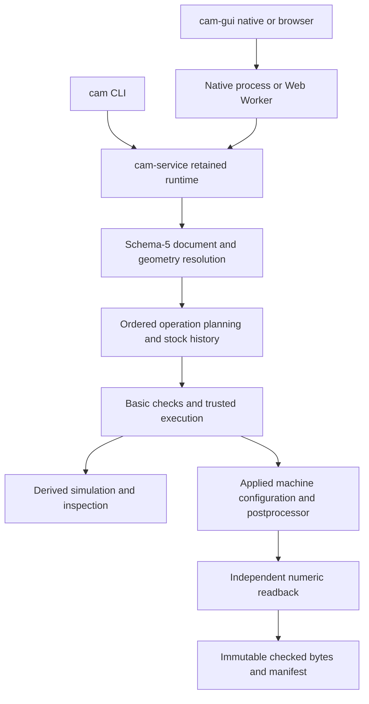

# CAM architecture

The application plans ordered 2.5D machining jobs from SVG artwork. The shared
Rust GUI runs natively and in a browser; the CLI uses the same core and service
contracts. Supported operations are Face, Flat V-carve, Profile, Drag knife and
Drill. See the [documentation index](README.md) for the other maintained guides.

## Components

The workspace has five crates:

| Crate | Responsibility and boundary |
| --- | --- |
| `cam-core` | Document model, SVG normalization, geometry, operation planners, stock history, checks and LinuxCNC postprocessing. In-memory inputs; no filesystem, HTTP or UI access. |
| `cam-service` | Collection commands, readiness, retained tasks/plans, immutable output bundles and bounded inspection. Shared by CLI and GUI. |
| `cam-gui` | egui/eframe editing and wgpu display, worker isolation, platform file access, local resources and recovery. One native/browser implementation. |
| `cam-app` | CLI file loading/saving, collection commands and geometry experiments; the portable `cam` executable. |
| `cam-server` | Loopback static hosting of a prebuilt browser UI. No planning, export, tool-library or mutable server API. |

`flat-v-carve/Cargo.toml` defines the workspace and pinned dependencies.
`experiments/gui1` is the historical framework experiment, outside the production
workspace. New GUI work belongs in `crates/cam-gui`.

## Ownership and data flow

The only portable job document is `CamJobV5`, schema 5. It embeds artwork, setup,
job tools, ordered operations and the applied machine configuration. Older and
future schemas are refused by name, without conversion. The project is
pre-release; historical schema migration proposals are not compatibility
requirements. See [job and operation contracts](job-model.md).

Structural validation permits incomplete settings and well-formed dangling
references so work can be saved and repaired. Planning readiness applies to the
requested enabled scope. Each operation owns its geometry selection, bound to
artwork identity and source revision. Artwork placement is independent of stock
resizing and machining parameters.

Planning resolves geometry once, runs operations in order and records actual
motions, stages and stock dependencies. `CamJob` remains an internal planning
substrate; `VcarveInput` is the resolved region/settings input to the combined
endmill/V-bit engine. Neither is another user document format.

The service retains generated execution and prepared output. Machining edits
invalidate a retained plan; output-only edits require fresh output preparation.
Presentation state and resource provenance do not authorize or alter machining.
Requests and replies carry identities so late worker results cannot replace
newer edits. Cancellation discards incomplete work.

The collection export path requires basic plan checks, resolved process/machine
state and independent numeric readback of the actual emitted bytes. Detailed M5
stock-quality analysis is a separate engine capability, not an automatic gate
on every collection export. Display rasters and screenshots never grant export
authority. See [LinuxCNC output](linuxcnc.md) and the
[technical design](technical-design.md) for their distinct guarantees.

## Geometry and coordinates

Millimeters, mm/min and RPM are the internal units. Planning uses stock-top Z=0
with negative cutting Z; the output transform applies the job's work zero.
SVG page coordinates are converted once to a Y-up artwork frame, then placed
in setup coordinates. The [technical design](technical-design.md) defines the
coordinate spaces, tolerance budgets, finite-tip cutter geometry and independent
verification bounds.

Application-owned adapters isolate `clipper2-rust` and `boostvoronoi`.
SVG parsing uses `roxmltree` and `svgtypes`, while the application owns supported
SVG semantics. Pin versions, preserve small reproducers for numerical failures
and revalidate geometry changes. Stable ordering and identity are required;
bitwise-identical floating point across architectures is not assumed.

Flat V-carve combines one endmill and one V-bit per operation toward a shared
target: sloped walls, flat floors in broad regions and shallower narrow detail.
Jobs may contain multiple operations and job tools. Other planners reuse setup,
stock history, motion and output contracts rather than the V-carve target model.

## Product boundary

The product supports flat uniform stock, XYZ motion, local portable jobs and
explicit tool/cutting settings. It does not choose feeds and speeds, control a
machine, execute LinuxCNC programs, or provide cloud collaboration.

General CAD, bitmap tracing, DXF import, arbitrary 3D stock/undercuts, adaptive
clearing and multiple roughing cutters within one V-carve operation remain
outside the current implementation. Simulation estimates material removal and
tool/holder clearance at a stated display resolution; it cannot establish
fixture clearance, hidden M6/probing motion, deflection or material behavior.

Windows native and desktop Chromium/WebGPU are the established GUI review
targets. Broader release/platform qualification and physical controller/coupon
validation remain in the [backlog](backlog.md). Build, test and installation
commands live in the [workspace README](../../flat-v-carve/README.md).
