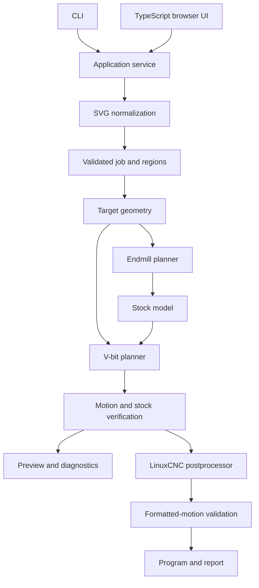

# Flat V-carve CAM: architecture

Date: 2026-09-05\
Status: M0 geometry foundation and M1 target/cutter models implemented and tested; M2–M8 remain the planning baseline.

This document records the product boundaries, components, and language choices. See [technical design](technical-design.md) for geometry and data contracts, and [implementation plan](implementation-plan.md) for milestones and acceptance criteria.

## 1. Purpose

Build a dedicated CNC-router job planner for a combined endmill and V-bit operation. Both tools work toward one finished shape:

- The SVG boundary defines the opening at the original material surface.
- Broad regions have a flat floor at a selected maximum depth.
- Walls slope all the way from the original surface to the floor.
- Narrow channels and pointed details become shallower where the V-bit cannot fit at full depth.
- The endmill removes bulk material while preserving the intended walls and a finishing allowance.
- The V-bit removes remaining material and finishes the complete boundary.

The user should not have to coordinate independent pocket and engraving operations manually. The planner owns their geometry, ordering, and remaining-stock calculation.

## 2. Decisions and assumptions

| Topic | Status | Decision |
| --- | --- | --- |
| Application language | Agreed | Rust owns all machining logic. |
| User interface | Planning baseline | Thin TypeScript browser interface using a local Rust process; CLI available first. |
| Input | Agreed | SVG; bitmap tracing remains an Inkscape task initially. |
| Machine | Agreed | LinuxCNC with existing M6 macros. |
| Finished shape | Agreed | Full sloped walls, depth cap, and shallower narrow details. |
| Tools | MVP boundary | One flat endmill and one conical V-bit per job. |
| Geometry libraries | Tested in M0 | `clipper2-rust` 1.1.0 and `boostvoronoi` 0.12.1 behind application-owned adapters; see [capability evidence](m0-capability-report.md). |
| Units and datum | Proposed default | Millimeters internally; stock top is Z = 0; cutting Z is negative. |
| Distribution | Proposed default | Native local executable; browser assets bundled for everyday use. |
| WebAssembly | Deferred | Evaluate after the native geometry pipeline works. |

These documents live in `docs/flat-v-carve/`; the standalone CAM workspace now lives in `flat-v-carve/`. The planning baseline referenced an unrelated Astro website, but the M0 checkout contained only these docs. CAM development remains isolated from any website project.

## 3. MVP boundaries

### Included

- Flat, uniform stock and three-axis XYZ router moves.
- Closed SVG regions, disconnected components, holes, and islands.
- One maximum carve depth per job, applied to all selected regions.
- Endmill clearing in multiple depth layers, followed by V-bit roughing and finishing.
- Real V-bit tip diameter, included angle, usable cutting diameter, and cutting height.
- Explicit tolerances for geometry, floor ridges, unreachable-detail residual, and verification.
- Region selection, scale, origin, tool setup, saved jobs, and diagnostic previews.
- A combined LinuxCNC program with tool changes and an optional program per tool.

### Deferred

- CAD drawing tools, bitmap tracing, text layout, and DXF import.
- Inlays, bevels above vertical walls, multiple carve depths, and general 3D machining.
- Multiple endmill sizes, adaptive clearing, automatic feeds-and-speeds selection, and tool libraries shared over a network.
- Direct machine control, sending programs to LinuxCNC, cloud accounts, and collaboration services.
- General fixture/holder collision simulation and arbitrary stock surfaces.

Stock preview predicts geometric removal. It does not predict chip load, deflection, runout, tear-out, or surface quality caused by material and machine behavior.

## 4. Component structure



Start with two Rust crates rather than a large collection of services:

| Component | Responsibility | Boundary |
| --- | --- | --- |
| `cam-core` | Job model, normalization, geometry adapters, target model, both planners, stock analysis, diagnostics, postprocessing | Accepts data in memory; no filesystem, HTTP, UI, or machine access. |
| `cam-app` | CLI, file loading/saving, local browser service, task cancellation and progress | Calls the same core pipeline for CLI and browser jobs. |
| `web` | Import workflow, region selection, settings, visual inspection | Displays core results; never reimplements toolpath rules. |

Within `cam-core`, keep modules for `model`, `svg`, `geometry`, `target`, `pocket`, `vcarve`, `stock`, `motion`, `verify`, and `post`. Split modules into crates only when a real dependency or compilation problem warrants it.

M1 implements `model`, `target`, and `preview` alongside M0's `geometry` and `spike`. Independent boundary queries support point/segment clearance and bounded finite-tip reachability. The CLI can validate edited model JSON and render plan/profile SVGs without a browser. These are target/cutter capability views; stock removal from planned moves remains future work. See the [M1 capability report](m1-capability-report.md).

Layout inside `flat-v-carve/` (the `web` directory and later core modules remain future work):

```text
Cargo.toml
Cargo.lock
rust-toolchain.toml
crates/
  cam-core/src/
  cam-app/src/
fixtures/m0.json
fixtures/m1/        # eight editable procedural target/cutter models
README.md
artifacts/          # generated locally
web/                # planned for M7
```

## 5. Geometry dependencies

Use narrow adapters that expose application-owned region, path, and skeleton types. Do not expose library-specific graph handles or polygon containers through the public job schema or UI API.

- `clipper2-rust` supplies polygon Boolean operations, offsets, and polygon hierarchy. Its documentation describes a pure Rust port with integer and floating-point interfaces. Prefer explicitly scaled integer coordinates at the adapter boundary. [Library documentation](https://docs.rs/clipper2-rust/latest/clipper2_rust/)
- `boostvoronoi` supplies a Rust port of the segment Voronoi algorithm. It accepts integer input coordinates; segments must not intersect or overlap except at shared endpoints. Normalization must satisfy that precondition before construction. [Library documentation](https://docs.rs/boostvoronoi/latest/boostvoronoi/)

M0 checked holes, curved Voronoi edges, degenerate inputs, numerical error, and native builds. The project pins Rust 1.95.0 and the tested crate versions; both geometry dependencies have default features disabled. [The capability report](m0-capability-report.md) records measurements and limitations. A port's documented API alone does not establish its correctness for this CAM workload. Future dependency failures should produce small reproducers and adapter-level decisions, without spreading workarounds throughout the planner.

SVG/XML parsing and HTTP/framework dependencies remain implementation choices. Select them against the supported SVG subset and deployment requirements, not their ability to render arbitrary web content.

## 6. Data flow and reproducibility

The source of truth is a versioned job containing an embedded SVG snapshot, selected regions, transforms, machining settings, tool definitions, tolerances, and a machine-profile snapshot when available.

Planning produces a separate artifact containing normalized regions, semantic operations, explicit motion segments, dependency versions, input fingerprints, and diagnostics. Preview meshes and thumbnails are derived data. Editing a job invalidates results derived from changed inputs.

The postprocessor consumes validated motions and a machine profile. It does not regenerate pocketing or infer tool geometry. Rounding during output formatting is followed by validation of the emitted numeric motion representation.

Given the same job, engine version, dependencies, and configuration, planning should use stable region and path ordering. Record versions because numerical-library changes can change paths. Do not promise bitwise identical floating-point results across every architecture.

## 7. Browser and CLI behavior

The browser workflow is: import, confirm dimensions/origin, select regions, set depth/tools, plan, inspect, and export. Show the target, endmill result, combined result, and residual/error overlays. Distinguish an approximate visual preview from a completed verification result.

The local service binds to loopback. Long computations run outside the request handler and report stage progress. Cancellation discards an incomplete result. Results carry a job fingerprint so an old calculation cannot replace a newer edit. Background computation must not freeze the interface.

The CLI calls the same service functions in process. Proposed commands are specified in the technical design. Start with native execution; browser-only WebAssembly is a later deployment option, not an initial requirement.

## 8. Correctness and machine boundary

The core checks geometric feasibility, full cutting segments, final depth, selected boundaries, preserved islands, and travel within its modeled stock environment. It keeps numerical error separate from permitted physical finishing residue.

LinuxCNC output uses a documented machine profile. The profile establishes the work coordinate system, clearance plane, tool numbers, spindle/feed settings, tool-change behavior, and who applies tool-length compensation. Existing M6 macros remain machine-owned configuration. Their motion and probing behavior must be understood before a program is considered ready for that machine.

The program generator does not connect to or execute code on the machine. Fixture placement and the real machine setup remain outside the geometric verifier's claims.

## 9. Outstanding decisions

| Decision | Resolve by | Evidence needed |
| --- | --- | --- |
| Exact geometry crate versions and precision scale | Resolved for M0 | [Build results and fixture measurements](m0-capability-report.md); future changes require revalidation. |
| SVG parser and practical Inkscape subset | SVG milestone | Real exported files and unsupported-feature diagnostics. |
| Rest-clearing strategy and verification bounds | Combined-planner milestone | Residual convergence and overcut bounds on difficult fixtures. |
| M6 macro and length-offset contract | LinuxCNC milestone | Actual macro/configuration behavior. |
| Initial tool dimensions, material, feeds, and workholding clearances | Machine trial | User's real setup. |
| Primary planning host and initial binary targets | Packaging milestone | Intended everyday computer/OS. |

These questions do not block documentation or the geometry prototype. Resolve each when its dependent work begins.
