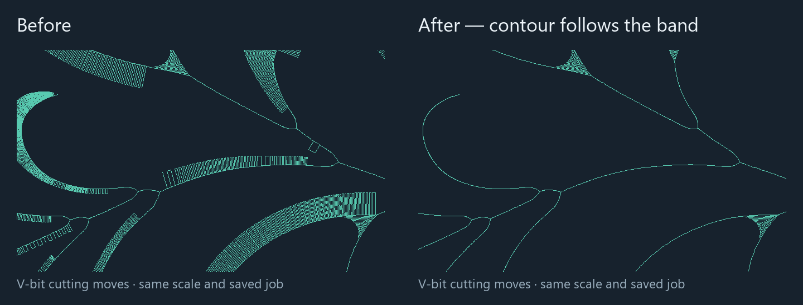

# Flower contour optimization, engine 0.7.5

The unchanged `real_data/flower_box-svg.job (2).json` now completes combined generation in **28.739, 29.061 and 29.214 seconds** in three consecutive final portable-build runs. Total V-bit XYZ movement is **16,728.60 mm**, down from **54,265.85 mm: a 69.2% reduction** against a fresh build of the current 0.7.4 source. Timings include endmill planning, V-bit planning, stock analysis, serialization and file output. The saved settings, source geometry, feeds, clearance plane and tolerances are unchanged.



The image shows the same flower region as the reported ladder pattern. It renders actual recorded V-bit cutting moves; rapid travel and vertical entries are omitted from the picture but included in the movement totals below.

| Measurement | 0.7.4 baseline | 0.7.5 |
| --- | ---: | ---: |
| Combined CLI generation | 38.486 s | 28.739 / 29.061 / 29.214 s |
| Total V-bit XYZ movement, all motion kinds | 54,265.85 mm | 16,728.60 mm |
| Total V-bit XY movement | 29,802.21 mm | 4,826.35 mm |
| V-bit cutting XYZ distance, including links | 38,145.10 mm | 3,266.62 mm |
| V-bit motion records | 96,129 | 28,501 |
| V-bit approaches / retracts | 233 each | 188 each |
| V-bit feed-only time | 33.30 min | 11.71 min |
| Endmill motion records | 17,063 | 17,063 |
| Required final finish paths | 29,992 | 15,025 |
| Serialized combined plan | 33,216,127 bytes | 14,054,720 bytes |
| Sampled peak working set | 355,819,520 bytes | 206,422,016–207,450,112 bytes |

Feed-only time excludes acceleration, rapid speeds and tool changes. Total XYZ movement sums Euclidean distance over **every** recorded V-bit motion, including approaches, plunges, retracts and XY rapids; it is not just a cutting-length or motion-count comparison. The baseline is the unbundled native Windows MSVC release CLI; the final three timings use the portable build with its embedded UI and static C runtime. Both use Rust 1.95.0 on this host.

## Why the ladders disappear

The SVG's densely tessellated curved boundaries generate many straight medial branches extending almost normally from the boundary toward the useful contour. The cone at a branch's deep endpoint already removes nearly all the material removed along that branch. Executing the entire spoke mainly repeats that removal.

For tool half-angle slope `s = tan(angle/2)`, cutter depth `d`, and XY center `p`, the cutter's height function is `1/s` Lipschitz in XY, including a finite flat tip. At any stock point, the additional depth removed at `p` compared with a retained position `q` is bounded by:

`d(p) - d(q) + distance_xy(p, q) / s`.

Along a linear XYZ spoke this bound is convex, so testing its endpoints bounds the **whole continuous cutter sweep**. A spoke is removed only when a retained final contour supplies a witness within `min(motion_tolerance, verification_tolerance) / 8`, including an arithmetic reserve. For flower this budget is **0.00125 mm**. A witness may lie inside a retained chord. Unsupported witnesses remain explicit point executions, and approximate witnesses never depend on other removed spokes, preventing accumulated error or cycles. Curved medial paths keep their existing linearization contract. Sharp corners and necessary floor-clearing paths remain.

Floor and boundary contours also lose excess vertices within the same accuracy budget. Every replaced vertex is bounded against the new chord; interpolation extends the bound to the original segments. Every proposed chord independently passes continuous variable-radius cutter clearance with the existing geometry reserve. Closed loops stay closed, and a bounded work allowance retains original vertices if simplification becomes expensive. Spoke witnesses are checked against the final simplified contours, so their error does not accumulate with contour simplification.

The planner and saved-plan verifier reconstruct the same new required finish families. Removing any of those families still fails finish authentication. Engine 0.7.5 invalidates older plan identities; saved jobs remain compatible and should be replanned.

## Timing and validation

The main generation-time saving is stock reconstruction: final analysis falls from **17.960 to 5.348 seconds**, and cleanup from **4.601 to 1.233 seconds**. There are fewer cutting footprints to construct and union. Endmill stock reconstruction now also processes spatial batches on up to four workers and merges their original conservative bounds. Batch boundaries and merge/error order are independent of CPU count; every contributing motion ID remains recorded. Endmill planning takes **3.870 seconds** in the measured run.

Floor contours share one clipping-region preparation per offset level, preserving independent paths and hole splits. Medial and access calculations share the immutable Voronoi diagram. Bounded caches reuse exact clearance/area queries at repeated diagram vertices while retaining every witness occurrence and diagnostic. Candidate preparation takes **3.590 seconds**.

V-bit air pruning previously scanned every endmill move for each candidate. It now uses a spatial index bound to the immutable endmill motion slice, followed by the same independent whole-footprint predicate against a single recorded sweep. This reduces depth-pass generation from **2.411 to 0.045 seconds**; it does not infer clearance from several disconnected sweeps or trust saved stock caches. No stock slices, configured quality/resource limits or witness requirements were removed.

Intermediate implementations measured **19.042–43.091 seconds** across ordinary and portable CLI runs, with identical output bytes. Slower repeats prompted the additional stock, clipping, query and air-index optimizations; all those measurements remain in the local artifacts. After adding the air index, the development release measured **15.045 seconds** with the same bytes. These are observed host timings, not a hard latency guarantee under arbitrary system load.

The final portable executable SHA-256 is `ed6a10f261e4382373a9886be6f5c6ff1631cd1cdc19ed83ba08d08eecf031b2`. Builds, tests and other benchmark runs were not run alongside these three consecutive measurements:

| Final portable run | Elapsed | Process CPU time | Sampled peak working set | Result |
| --- | ---: | ---: | ---: | --- |
| 1 | 28.738741 s | 88.1875 s | 206,524,416 bytes | Complete |
| 2 | 29.061244 s | 89.0313 s | 207,450,112 bytes | Complete |
| 3 | 29.214209 s | 89.5313 s | 206,422,016 bytes | Complete |

All three plans are byte-identical. Raw final measurements are in `flat-v-carve/artifacts/flower-contour-accepted-1/` through `-3/`; `-1/` also contains the final independent replay and coverage comparison.

All **233 Rust workspace tests** pass in release mode, including stock, continuous clearance, stepdown, missing finishing, resource limits, rounded motion and G-code readback tests. New regressions cover finite-tip envelope domination, original curved-band spokes, isolated witnesses, closed-contour flank coverage, serial/parallel endmill stock geometry and error handling, batched clipping at holes and intersecting subjects, and indexed air proofs against exhaustive scans for islands, ramps and multiple depths. Strict workspace/all-target Clippy, formatting and diff checks pass. The portable build also passes frontend type checking and asset-manifest generation.

Independent saved-plan reconstruction reports `Complete`, no diagnostics or generation issues, **15,025 of 15,025** final finish paths, zero missing floor beyond tolerance, and zero possible-overcut area in all nine checked slices. The maximum sampled missed reachable depth is **0.0462125 mm**, below the unchanged 0.05 mm verification tolerance.

A separate comparison queries the new recorded motions at **554,485 positions on the previous plan's cutting profiles**, including removed spokes. It uses a separate coarse spatial grid and public analytic sweep queries. Maximum missed depth at those old profile positions is **0.001248905 mm**, within the 0.00125 mm optimization budget. This supplements the new plan's 60,961 quality samples and the continuous envelope bounds; it does not rely on making old sample positions disappear. Flower's full-volume M5 certification and controller validation are separate from this M4 evidence; the existing small-fixture M5/readback regressions remain passing.

The final plan SHA-256 is `bc166699c4c57f29100ff81bfdb66b62ec1de90375b4f0374dac2ac7f80b015f`. The saved job SHA-256 remains `59e4c9deb37cc3f0a335eab1f4c53fd86257263b476b96260da560223c6ea693`. Local plans, timing logs, motion statistics, independent replay, coverage comparison and validation logs are in ignored `flat-v-carve/artifacts/flower-contour-*` paths.

## Reproduce

From `flat-v-carve`, an isolated output directory avoids the executable lock held by an already running app:

```powershell
cargo build --release --locked -p cam-app -p cam-core --examples --bin cam --target-dir target/contour-validation
./scripts/benchmark-flower.ps1 -Cam target/contour-validation/release/cam.exe -OutputDirectory artifacts/flower-contour-new -Stages combined
node scripts/analyze-motions.mjs artifacts/flower-contour-new/combined.plan.json
./target/contour-validation/release/examples/benchmark_pipeline.exe --replay artifacts/flower-contour-new/combined.plan.json
./target/contour-validation/release/examples/compare_plan_coverage.exe artifacts/flower-contour-source-baseline/combined.plan.json artifacts/flower-contour-new/combined.plan.json
./scripts/build-portable.ps1 -Offline -OutputDirectory artifacts/portable-contour
```

The comparison command requires a previously captured 0.7.4 baseline. It authenticates the new plan and treats the old artifact solely as comparison data. The updated portable application is `artifacts/portable-contour/cam.exe`; restart using that executable and regenerate the saved job to use the new planner.
