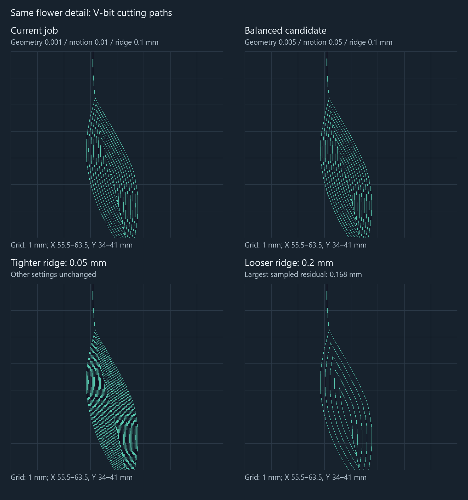

# Flower job settings: calculation cost and finish

Measured on 2026-09-06 with the optimized engine **0.7.5**, using the unchanged `real_data/flower_box-svg.job (2).json`. This is a settings study after the contour optimization, so the baseline already includes that optimization.

**The useful changes are geometry tolerance 0.001 → 0.005 mm and motion tolerance 0.01 → 0.05 mm.** They reduce computation substantially without needing to relax verification. For this flower, the balanced preset stayed below 0.1 mm residual at every comparison sample. A second preset tightens the floor ridge to 0.05 mm for more finish margin while retaining the faster geometry settings.

## Presets

| Setting, mm | Current job | [Wood balanced](../../real_data/flower_box-wood-balanced.job.json) | [Wood finish](../../real_data/flower_box-wood-finish.job.json) |
|---|---:|---:|---:|
| Import geometry tolerance | 0.001 | **0.005** | **0.005** |
| Motion tolerance | 0.01 | **0.05** | **0.05** |
| Verification tolerance | 0.05 | 0.05 | 0.05 |
| Maximum floor ridge | 0.1 | 0.1 | **0.05** |
| Endmill wall allowance | 0 | 0 | 0 |
| Detail residual allowance | 0.1 | 0.1 | 0.1 |
| V-bit stepover | 1 | 1 | 1 |
| Endmill stepover | 1.5 | 1.5 | 1.5 |
| Clearance Z | 30 | 30 | 30 |
| Combined generation, seconds | 20.39–29.51, four runs | **8.25–8.47**, two runs | **10.38–10.47**, two runs |
| V-bit total XYZ movement, metres | 16.729 | **15.400** | 17.070 |
| Largest residual at common samples, mm | 0.0633 | **0.0831** | **0.0376** |
| Largest wall residual at common samples, mm | 0.0032 | 0.0171 | 0.0171 |
| Largest sampled excess depth, mm | 0 | 0 | 0 |

The balanced preset saves another **7.9% of V-bit movement** relative to the already optimized job. The finish preset uses **2.0% more movement** than the current job but has a smaller measured floor residual. Both preserve the source artwork, selection, stock, cutters, depth, feeds, and spindle settings. The original saved job is unchanged.

For an approximately 0.1 mm finish target, use balanced when the measured result on this flower is sufficient; use finish when you want additional margin or a nominal floor acceptance budget of 0.05 mm ridge + 0.05 mm verification. These settings are not a global physical accuracy specification: input approximation, cutter shape, machine behavior, and finish allowances are separate quantities.

## What each setting did

All rows below change only the named setting from the current job, except the explicitly bundled rows. Single-run times are sensitivity measurements, not precise speed rankings: machine timing varied, and four identical baseline runs ranged from 20.39 to 29.51 seconds. Repeated configurations produced identical recorded motion arrays.

| Change | Generation, s | V-bit XYZ, m | V-bit lifts | Largest common-sample residual, mm |
|---|---:|---:|---:|---:|
| Current job | 20.39 / 22.85 / 22.24 / 29.51 | 16.729 | 188 | 0.0633 |
| Motion 0.05 | 17.56 | 15.648 | 170 | 0.0742 |
| Motion 0.1 | 20.23 | 15.648 | 170 | — |
| Geometry 0.0025 | 16.20 | 16.341 | 182 | — |
| Geometry 0.005 | 10.82 | 16.396 | 182 | 0.0827 |
| Verification 0.1 | 29.88 | 16.646 | 187 | — |
| Geometry 0.01 + motion 0.05 + verification 0.1 | 5.32 / 5.30 | 15.631 | 170 | 0.0756 |
| Floor ridge 0.05 | 38.21 | 18.381 | 188 | 0.0373 |
| Floor ridge 0.2 | 26.27 | 15.746 | 186 | **0.1682** |
| Wall allowance 0.1 | 37.92 | 19.243 | 199 | 0.0845 |
| Wall allowance 0.3 (fallback) | 132.44 | 39.135 | 159 | — |
| Wall 0.3 + geometry 0.005 + motion 0.05 | 13.14 | 19.846 | 178 | 0.0831 |
| Detail residual 0.01 | 19.44 | 16.729 | 188 | Same removal as current |
| Detail residual 0.2 | 22.02 | 16.729 | 188 | Same removal as current |
| V-bit stepover 0.05 | 35.51 | 69.573 | 992 | — |
| V-bit stepover 0.2 | 19.66 | 25.288 | 322 | — |
| Clearance Z 5 | 28.23 | 7.329 | 188 | Same cutting paths as current |
| Wood balanced | 8.47 / 8.25 | 15.400 | 166 | 0.0831 |
| Wood finish | 10.38 / 10.47 | 17.070 | 166 | 0.0376 |

“—” means no additional common-reference replay was performed for that configuration. All 25 CLI runs reported combined M4 `Complete`; this does not assert a 0.1 mm finish when the job itself permits more residual.

### Geometry and motion: the best computation savings

Geometry tolerance controls SVG flattening and downstream geometric calculations. Moving from 0.001 to 0.005 mm reduced the normalized selected boundary from **22,039 to 9,942 vertices**. The 0.01 mm setting used 6,846 vertices. At the fixed comparison samples, the corresponding nominal target changed by at most **0.000994 mm** and **0.002327 mm**, respectively, relative to the original fine target. Those are measured target differences, not global error bounds.

Motion tolerance affects curve subdivision and contour simplification. The contour pruning budget is `min(motion tolerance, verification tolerance) / 8`; keeping verification at 0.05 means raising motion from 0.05 to 0.1 buys essentially no further pruning. The two resulting V-bit distances differed by less than 0.000001 mm, with only four fewer motion records at 0.1.

Do not set the import tolerance to 0.1 mm just because the desired finished accuracy is about 0.1 mm. For this 90° V-bit, the planner requires verification tolerance to cover at least **eight geometry tolerances**. Thus geometry 0.01 requires verification at least 0.08; geometry 0.1 would require at least 0.8. The fast 0.01 bundle worked well on the measured flower, but it requires a looser verification budget, so the supplied presets retain 0.05 verification.

### Floor ridge: genuine surface work

With this pointed 90° V-bit, the floor-lane spacing is capped by `0.9 × maximum floor ridge`, as well as the tool's stepover. The current 0.1 ridge therefore limits those lanes to approximately **0.09 mm**, even though the tool stepover is 1 mm.

Halving the ridge to 0.05 makes that cap 0.045 mm and adds floor cuts. Increasing it to 0.2 saves only 5.9% total V-bit travel here and produces a **0.168 mm** sampled residual. That is outside the user's approximately 0.1 mm target. The original 0.1 ridge is a reasonable economy choice; 0.05 buys a visibly denser and measurably flatter floor.



### Wall allowance: stock left for the V-bit

Positive wall allowance moves the endmill farther from the target wall, leaving material for the V-bit. Zero is already the least-work allowance. Increasing it to 0.1 mm raised V-bit travel by 15.0%, even though endmill travel fell from 4.698 to approximately 4.435 metres.

The 0.3 mm case also exposed a planner limitation: the endmill stage recorded `CENTER_SET_UNRESOLVED` (“layer 0: refine geometry before planning”), returned **zero endmill motions**, and the combined stage cleared with the V-bit. Its 132-second result includes this fallback and is not a general law about 0.3 mm allowances. Repeating 0.3 wall allowance with geometry 0.005 and motion 0.05 restored 6,700 endmill motions and completed in 13.14 seconds. V-bit travel was still 19.846 metres, above the balanced zero-allowance case. This study does not modify that engine behavior.

### Stepover and clearance: repeated lifts can dominate machining

The V-bit stepover also limits the XY distance of a safe linking cut between paths. Reducing it to 0.2 mm increased lifts from 188 to 322 and total V-bit movement by **51.2%**. At 0.05 mm, it caused 992 lifts and **69.573 metres** of movement. Keep the current 1 mm value; the ridge allowance already restricts floor-pass spacing independently. The 3 mm endmill's 1.5 mm stepover is already the maximum supported by this planner.

The current **30 mm clearance** accounts for much of the V-bit's travel. Changing only clearance to 5 mm retained identical cutting paths and removed **9.4 metres** of V-bit approach/retract movement, reducing its total by **56.2%**. Endmill total movement also fell from approximately 4.698 to 2.348 metres.

At the saved feeds, V-bit feed-only time changed from **11.71 to 3.87 minutes** and endmill feed-only time from **2.44 to 0.97 minutes**. These exclude rapid-travel time, acceleration, dwell and tool changes. Use a lower clearance only when it clears the stock and fixtures; the supplied presets retain 30 mm because fixture height is not specified.

### Detail allowance and computation limits

Changing detail residual from 0.1 to either 0.01 or 0.2 produced **exactly identical endmill and V-bit motion arrays**. This job specifies a zero-tip-diameter V-bit. Detail residual acceptance concerns unavoidable inaccessible detail; it is not the contour approximation control.

The current depth is 2 mm, with endmill stepdown 2 mm and V-bit stepdown 3 mm, so these already permit one depth pass. Raising them cannot remove an additional pass. Keep feeds and spindle speeds tied to the actual cutter and wood; they were unchanged in this study.

`max_paths`, `max_motions`, `max_layers` and similar values are work ceilings, not requests to perform that much work. Lowering them risks an incomplete result. `quality_sample_spacing_mm` and `stock_slices` affect checking and cleanup discovery rather than desired geometric accuracy. Their current values (1 mm and 8 slices) were retained in every configuration.

## Evidence and limits

- **19 distinct configurations, 25 sequential CLI runs**, including four baseline runs and repeats of the most useful candidates. The portable executable hash was `ed6a10f261e4382373a9886be6f5c6ff1631cd1cdc19ed83ba08d08eecf031b2`.
- Timings include the combined CLI process: both tools, M4 analysis and plan serialization. They exclude launching/rendering the browser UI and the additional research comparisons. No builds or other benchmark cases ran alongside a timed generation.
- Original file SHA-256 remained `59e4c9deb37cc3f0a335eab1f4c53fd86257263b476b96260da560223c6ea693`. Baseline job data equals the original JSON data.
- The independent comparison replays saved plans, reconstructs the original **0.001 mm** target, and uses a fixed **311,203-point** set: a 0.25 mm lattice including surrounding uncut stock, original quality samples, and reference cutting-path samples at at most 0.1 mm XY spacing. Of these, 161,027 points lie within the target material.
- An independent spatial binning pass selects full recorded sweeps for the public analytic endmill and V-bit removal queries. Error is measured against the same original target in every variant, not only against each relaxed job's own target. Variant quality witnesses are also compared separately.
- Both supplied presets replayed M4 `Complete`, executed all 6,615 expected finish paths, and had zero missing-floor area beyond their configured tolerance, zero possible-overcut area at the analyzed slices, and no generation/combined-analysis diagnostics. No common sample exceeded 0.1 mm residual; no common or additional quality witness showed excess depth.
- These are **sampled depth errors**, supported by M4 motion/slice checks. They are not a global 0.1 mm bound, an M5 volume proof, or a prediction of actual wood surface finish. The baseline's ordinary quality samples reported 0.0462 mm residual; the denser fixed comparison found 0.0633 mm, illustrating why a sampled maximum must be described as sampled.

Exact measurements, changes, motion hashes, per-kind travel and replay evidence: [flower-settings-results.json](flower-settings-results.json). Large raw plans and logs remain under `flat-v-carve/artifacts/flower-settings-study` and `flower-settings-repeat`.

## Reproduction

From `flat-v-carve`, using PowerShell 7 and Node:

```powershell
node scripts/benchmark-settings.mjs '../real_data/flower_box-svg.job (2).json' artifacts/portable-contour/cam.exe artifacts/my-settings-study
# Optional final arguments restrict the run to named configurations:
node scripts/benchmark-settings.mjs '../real_data/flower_box-svg.job (2).json' artifacts/portable-contour/cam.exe artifacts/my-settings-repeat baseline-1 wood-balanced wood-finish baseline-2

cargo build --release --locked -p cam-core --example evaluate_settings --target-dir target/contour-validation
target/contour-validation/release/examples/evaluate_settings.exe artifacts/my-settings-study/baseline-1/combined.plan.json artifacts/my-settings-evaluation artifacts/my-settings-study/wood-balanced/combined.plan.json artifacts/my-settings-study/wood-finish/combined.plan.json
```

Output directories must be new. The harness records timeouts and stops its own child process after five minutes. The complete matrix now includes the additional wall/geometry interaction case found during this study.
